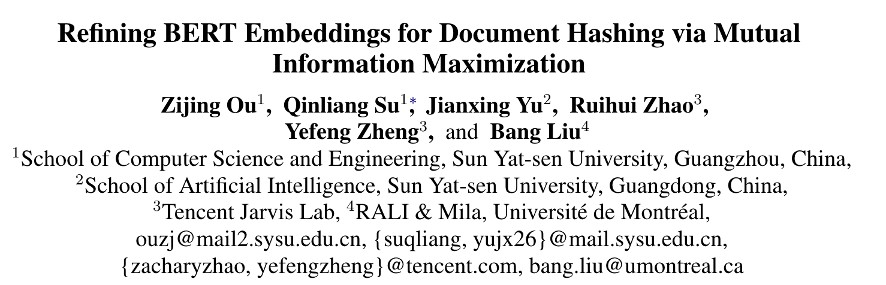
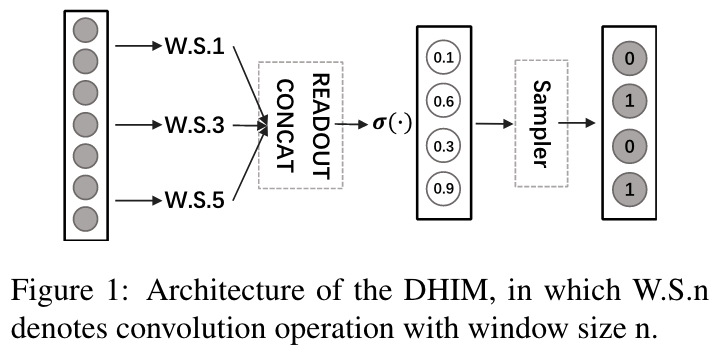
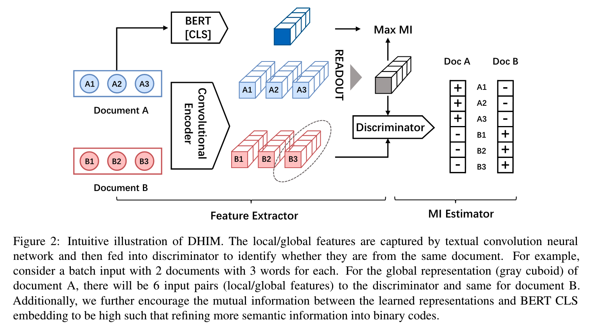
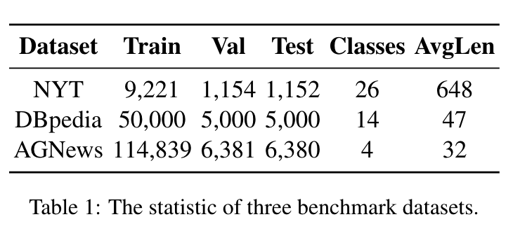
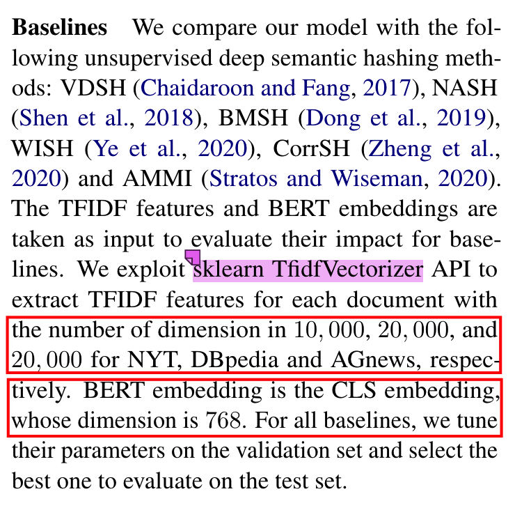
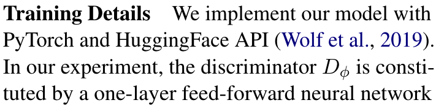
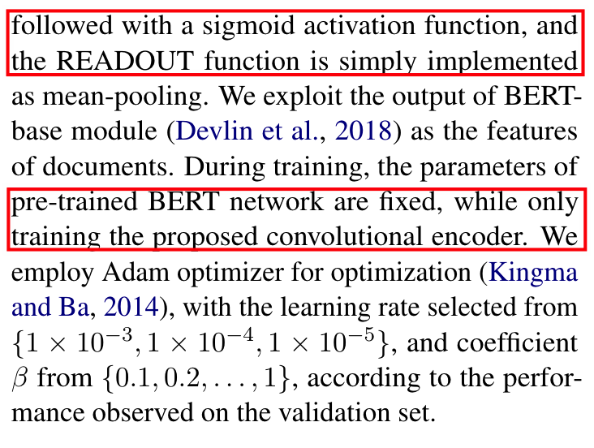
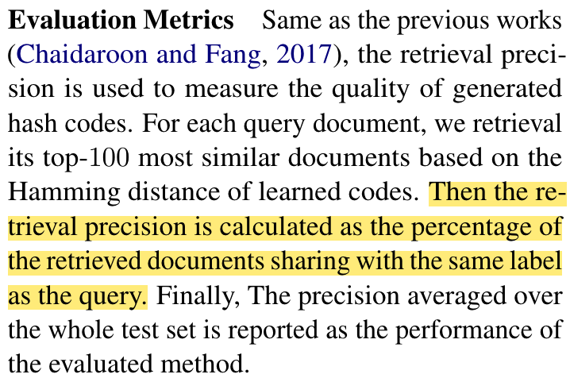
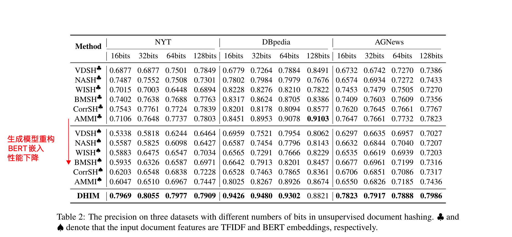

# 《Refining BERT Embeddings for Document Hashing via Mutual Information Maximization》阅读笔记

原文链接：https://aclanthology.org/2021.findings-emnlp.203.pdf

源码链接：https://github.com/J-zin/DHIM

## 行文动机

大多数文本哈希方法都是基于BOW和TFIDF学得的，而这种特征**缺乏词序和依存关系的相关信息**。然而，由于BERT embedding在下游任务中的出色表现，本文决定抛弃“落后”的BOW和TFIDF特征，转而直接建模由BERT嵌入表征的文本。文中将使用BOW和TFIDF的使用归因于是逃避对于长依赖关系带来的挑战（其实这种基于统计的特征是带有原始检索的潜在意义的，比如关键词感知等）。

创新：引入了最大互信息原则来解决BERT嵌入中存在过于丰富的信息的问题。具体而言，BERT embedding 富含信息，其中只有一小部分和哈希有关，所以哈希码不太能在语义一致上和嵌入一致。文章指出，在2019年的一篇高引论文5900+《[Sentencebert: Sentence embeddings using siamese bertnetworks](https://aclanthology.org/D19-1410.pdf)》中就曾得出过结论，原始的BERT嵌入在余弦相似度，曼哈顿距离，欧几里得距离上的表现不尽如人意。本文受《[Learning deep representations by mutual information estimation and maximization](https://arxiv.org/pdf/1808.06670.pdf)》一文启发，通过最大互信息原则可以学得有目标区分度的表征，来**更多突出语义信息以及削弱其他无关的信息**。

## 基于对比方法引入BERT嵌入

基于BOW和TFIDF特征的文本哈希方法大都基于如下方式建模，给定一个由词序列表示的文档$\boldsymbol x=\{w_1, w_2,\cdots,w_{|x|}\}$：
$$
p(x, z)=\prod_{w_{i} \in x} p_{\theta}\left(w_{i} \mid z\right) p(z)
$$
其中
$$
p_{\theta}\left(w_{i} \mid z\right) \triangleq \frac{\exp \left(z^{T} E w_{i}+b_{i}\right)}{\sum_{j=1}^{|V|} \exp \left(z^{T} E w_{j}+b_{j}\right)}
$$
由于BERT嵌入和BOW特征的差异性，解码过程替换为一个条件高斯分布
$$
p_{\theta}(x|z) = \frac{1}{{(2\pi\sigma^2)}^{d/2}}e^{-\frac{||\mathcal B(x) - Wz||^2}{2\sigma^2}}
$$
其中$\mathcal B(x)$为BERT嵌入，$W$为可学习的模型参数（解码网络），$d$为BERT嵌入维数（768）。

## 本文方法——基于互信息最大化原则重构BERT嵌入

### 图像领域的互信息最大化方法

《[Learning deep representations by mutual information estimation and maximization](https://arxiv.org/pdf/1808.06670.pdf)》中通过最大化全局和局部表示之间的互信息来学习类别可区分的图像表示。该文第一次构造了对于图片的全局表示和众多的局部表示，它们都通过图像的卷积特征得到。既然有众多的局部表示，并且各自局部表示图像中的特定局部源。全局和局部表示的互信息使得全局表示更加关注全局语义，即所有局部语义信息的共性，而非局部表示之间的具体不同细节。

### 构建文本局部和全局表征

#### 局部表征

给定一篇文档，获取每一个词的嵌入表示，最终表示一篇文档为$X = \{e_1, . . . , e_T\}$，其中$e_i\in \mathbb R^d$表示第$i$个词的BERT嵌入表示， $T$表示文档总词数。将文档$X$输入文本卷积神经网络CNN，其中筛选器$W\in \mathbb R^{K\times n\times d}$， $n$和$K$表示筛选器的大小和数量。**这种方式能够为每个 n-gram 片段生成局部表征**，具体而言，第$i$个片段的局部表征如下计算，***表示卷积运算符**：


$$
h_i^{(n)}={\rm RELU}(W* e_{i:i+n-1})
$$


将其作用于所有的文本片段，则可以获得所有词对应位置的局部表征：


$$
H^{(n)}=\{h_1^{(n)},h_2^{(n)},\cdots,h_T^{(n)}\}
$$


#### 全局表征

将$H^{(n)}$ 传入$\rm READOUT$函数，即平均池化函数或者更复杂的自注意力机制，可以在不受文档长度的影响下获得文档的全局表征。
$$
H = {\rm READOUT}(\{h_i^{(n)}\}_{n\in\mathcal N})
$$

另外，为了进一步在全局表征中突出语义信息，提出采用三种不同切片方式的连接，即1-gram，3-gram，5-gram，最终的局部和全局表征可以如下计算：


$$
h_i = {\rm MLP(CONCAT}(\{h_i^{(n)}\}_{n\in\mathcal N})),\\
H = {\rm READOUT}(\{h_i\}_{i=1}^T),
$$


其中$\mathcal N$表示不同的窗口大小集合，在实验中$\mathcal N=\{1,3,5\}$如Figure 1所示。

### 基于最大化局部和全局表征的端到端的哈希

总体框架图如下

首先生成基于局部和全局表征的哈希码，通过采样如下伯努利分布得到：


$$
b_i\sim {\rm Bernoulli}(\sigma(h_i)),\\
B\sim {\rm Bernoulli(\sigma(H))},
$$


$b_i$ 和$B$表示局部和全局对应的哈希码。接下来最大化他们之间的互信息。
$$
\hat{\theta}=\arg \max_{\theta}\frac{1}{T}\sum^T_{i=1}I(b_i,B),
$$
$b_i$ 和$B$表示对于特定文档而言不是唯一对应的，这使得互信息难以评估。

最近，有许多方法被踢出用来估计互信息，如MINE，infoNCE，Jensen-Shannon divergence estimator (JSDE)，其中JSDE对负样本数量较不敏感，于是本文使用JSDE来估计互信息并优化它。具体而言，互信息可以通过最小化如下公式来估计：


$$
\begin{aligned}
\tilde{I_{\phi}}(b_i;B)=&-{\rm softplus}(-D_{\phi}(b_i,B))\\
					 &-\mathbb E_{\tilde{\mathbb P}}{\rm softplus}(-D_{\phi}(\tilde{b_i},B))
\end{aligned}
$$


其中$\tilde{b_i}$表示**从经验分布$\tilde{\mathbb P}=\mathbb P$生成的负样本**的第$i$个局部表征，在实际实验中负样本$\tilde{b_i}$是在局部表征中选取的或从batch的其他文档中选取的。$D_{\phi}(\cdot,\cdot)$是由神经网络实现的判别器。${\rm softplus}(x)\triangleq\log (1+e^x)$。

上述最大化互信息框架仅仅依赖BERT对单个单词的嵌入，忽略了BERT的CLS嵌入。因此，为了提高学得哈希码中的全局语义信息,添加一个正则化项来提高哈希码和CLS嵌入之间的互信息，最终的Loss如下：
$$
\tilde{\mathcal L}(\phi,\theta)=-\frac{1}{T}\sum^T_{i=1}\tilde{I_{\phi}}(b_i;B)-\beta(E,B),
$$
$\beta$ 是超参数，$E$表示二值化后的CLS嵌入， $\theta$是构造局部和全局二值码 $b_i$ 和$B$过程中涉及的模型参数。

### 实验部分

#### 数据集信息

#### 对比方法和细节

#### 评估方法

#### 总体结果

DHIM即本文模型，无类别标签监督的模型，相比基线模型有所提升，也印证了前文提到的胜澈给你模型的相关工作——单纯重构BERT嵌入哈希码面临的性能问题。

