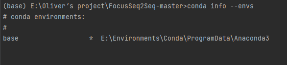

# 前言

在Python工程中，特别是对于要复现一些项目时、需要测试特定环境下程序表现时、同一个服务器上多人进行跑程序时需要自己的独立环境时等，我们可能需要用到特定版本的库，而这时，我们可以使用虚拟环境安装依赖。这样依赖，我们就不会影响到主环境，诶这样就

- 不用重复卸载重装主环境，
- 也不会使得主环境日渐臃肿；
- 还可以安装多版本python（如经典的pyenv 包管理软件便可以实现）；
- 如有需要直接删掉虚拟环境，然后建新的即可。

由于系统配置的不确定性，建议友友们在linux下食用。

# 环境管理途径介绍

环境需要用到的包可以写入requirements.txt文件里，如果是从另一个工程环境切换过来，可以在那个环境中运行

```python
pip freeze > requirements.txt
```

然后在需要配置的环境中运行如下命令进行安装大部分需要的包

```bash
cat requirements.txt | xargs -n 1 pip install
```

此方法会忽略报错进行pip包的安装，会出现包的缺损，后续可以自行补上。

## Conda

+ 查看我们当前conda里有的环境 ，三种方式都可👇🏻

```bash
conda info --envs

conda info -e

conda env list
```

输出如下👇🏻




+ 可以看到，我们目前只有一个base的基础环境。接下来我们试着查看一下该环境下的包列表👇🏻


### Conda创建虚拟环境

创建时指定 conda下的虚拟环境名字为env_name，python版本为3.6👇

```bash
conda create -n env_name python=3.6
```

或者，你也可以通过yml文件来构建自己想要的环境，比如你想要如下配置的环境（name指的是你的虚拟环境叫啥，与上条命令中的env_name效果一样）👇


那么，你则需要在当前目录创建一个yml后缀的文件，然后写入上图类似的你需要的环境内容，并运行如下命令👇

```bash
conda env create -f conda_env.yml
```

**再次查看conda下的环境列表**


可以看到创建了一个新的env_name环境。

### Conda激活虚拟环境

输入activate指令👇

```bash
conda activate env_name
```

可以看到


命令行前的括号内容已经改变(base)👉(env_name)，此时已经是基于该虚拟环境了。

然后呢，我们就可以进入这个环境乱装一通了，此处省略一万行操作……


好了，这个环境的使命已经结束了，我们再把它删掉👇

```bash
conda deactivate

conda remove -n env_name --all
```


## Python Virtualenv

这是一款python自带的虚拟环境管理方案，那么我们为啥不用conda呢？conda多好，自带包又多，多省事。问题就是，有些情况下我们不需要任何一个多余的包，在工程上即便是多余一个包也是对存储空间的浪费，conda内部我不是很清楚还封装了什么，但总是给人一种很健壮的感觉，怕麻烦的话推荐conda，但是有洁癖的人推荐自己逐步搭建相关依赖。现在介绍的这款就是官方给的，诶，干净。需要注意的是，如果你需要在多个python版本上建立虚拟环境，那么比较麻烦，下节会说，建议直接移步下一节的pyenv。（[Python Virtualenv官方文档#](https://virtualenv.pypa.io/en/latest/index.html)）

**此方案中虚拟环境的创建方式和conda差不多，这里介绍指定环境路径的方法，其中env_path为你要保存该虚拟环境的路径**

```bash
python -m venv env_path
```

然后可以激活此环境

```bas
source env_path/bin/activate
```

关闭环境

```ba
deactivate
```


## Pyenv

>推荐食用

Pyenv是一个开源的python环境管理软件（[源码链接](https://github.com/pyenv/pyenv)），它十分方便可以实现我所说的虚上加虚。诶？啥意思呢？如果我们把创建虚拟环境的**环境**称为**底座**，那么很显然，本地环境通常只能满足一两个python版本，那么我们在上一节的Python Virtualenv环境管理方案就只有一两个底座，它就是本机已经安装的python版本，当然，你也可以将多个不同版本的python装到不同的文件，然后加不同的启动命令比如python2.x和python3.x来使用，但这并不好管理，且较为麻烦。而且，就像之前说的，会使得对于有洁癖的友友很不好受，不能一揽全局。那么我们就可以使用Pyenv，创建虚拟环境，因为它可以用来安装不同版本的python，conda，miniconda等，写到这里博主忽然觉得Pyenv好像就是在套壳上述两种方法，但是便捷性提升很多，故我们就相当于创建了不同的底座，使用Pyenv来统一管理👇


### 安装

> Linux👇

```bas
curl -L https://github.com/pyenv/pyenv-installer/raw/master/bin/pyenv-installer | bash
```

```bas
echo 'export PATH="$HOME/.pyenv/bin:$PATH"' >> ~/.bashrc
```


> MacOS

```bash
brew update
brew install pyenv
```


> Windows

pyenv官方没有支持windows，推荐使用pyenv-win（[github地址](https://github.com/pyenv-win/pyenv-win#installation)）

1. **windows下推荐使用pip安装pyenv-win**

```ba
pip install pyenv-win --target %USERPROFILE%\.pyenv
```

2. 或者下载zip文件然后解压到`%USERPROFILE%\.pyenv\pyenv-win`下


### 食用方法

> 查看可以安装的相应版本的环境（一般只有数字的选项默认指python环境）

```bash
pyenv install -l
```

> 安装所需要的,如选择python3.6.15环境

```
pyenv install 3.6.15
```

>激活所需要的（此处可以直接激活前文中二级底座的虚拟环境）

```bas
pyenv activate 3.6.15
```

暂时将某个环境应用到所有目录的命令行下

```bash
pyenv global 3.6.15
```

> 进入某个目录时，命令行自动切换到对应环境的方法

- 在这个目录新建一个名为`.python-version`的文件
- 在其中写入你希望激活的环境名称

> 退出环境

```bash
pyenv source deactivate
```

> 删除环境（一级底座）

```bash
pyenv uninstall 3.6.15
```


#### 基于某个环境建立虚拟环境并取`虚拟环境名`

1. **可以先激活这个环境，然后在这个环境下创建，激活，退出，删除虚拟环境**
2. 也可以不激活，直接使用pyenv命令

> 在一级底座上创建虚拟环境

```bash
pyenv virtualenv 3.6.15 虚拟环境名
```

> 然后激活虚拟环境

```bash
pyenv activate 虚拟环境名
```

> 退出虚拟环境

```bash
pyenv deactivate 虚拟环境名
```

> 删除虚拟环境（二级底座）

```ba
pyenv virtualenv-delete 虚拟环境名
```


