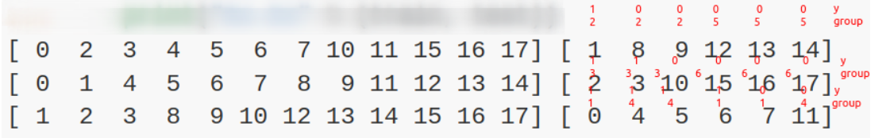

## 什么是K折交叉验证？

如果你有五个土豆，你想要教会一个小盆友，这些是土豆，好了，现在你拿出四个土豆让他逐一认识，最后拿出第五个土豆来测试他是否真正地认识了土豆，那么土豆奇形怪状，第五个土豆可以是五个中的任意一个，那么这就让我们拥有了五套方案来教会小朋友如何认识土豆，即用其中的四个做认识学习，剩下的一个作为测试学习成果。这就是一个五折交叉验证的结果，我们可以将每一种学习方案的学习效果（可以是孩子确信第五个土豆是土豆的置信度）加起来取平均来代表这个小盆友学习认识土豆能力的总体评分，从而减小对数据的bias。


## model_selection 实现交叉验证数据集划分

```python
# ====================================================
# Library
# ====================================================
import pandas as pd
from sklearn.model_selection import train_test_split, KFold, GroupKFold, StratifiedKFold, StratifiedGroupKFold 
```

### 简单的数据划分(不涉及多折)

```python
df = pd.DataFrame({"featrues": ["long", "high", "long", "short", "big", "small"], "labels": ["1", "1", "1", "0", "1", "0"]})
train, test = train_test_split(df, train_size=0.9, shuffle=True)
train
```

out:

> ```markdown
> 	featrues	labels
> 4	big	1
> 0	long	1
> 5	small	0
> 2	long	1
> 1	high	1
> ```


### KFold

#### list data

```python
X = ["a", "b", "c", "d"]
# n_splits=2 代表分成两折
kf = KFold(n_splits=2, shuffle=True, random_state=42)
for train, test in kf.split(X):
    print("%s %s" % (train, test))
```

out:

> ```
> [0 2] [1 3]
> [1 3] [0 2]
> ```

#### pd data

```python
df = pd.DataFrame({"featrues": ["long", "high", "long", "short", "big", "small"], "labels": ["1", "1", "1", "0", "1", "0"]})
print(df.head())
```

out:

> ```out
>   featrues labels
> 0     long      1
> 1     high      1
> 2     long      1
> 3    short      0
> 4      big      1
> ```

```python
kf = KFold(n_splits=4, shuffle=True, random_state=42)
for train, test in kf.split(df):
    print("%s %s" % (train, test))
```

out:

> ```out
> [2 3 4 5] [0 1]
> [0 1 3 4] [2 5]
> [0 1 2 3 5] [4]
> [0 1 2 4 5] [3]
> ```

```python
# 新建一列
df['fold'] = -1
# 给split的每一折用enumerate遍历编号，比如这里是0,1,2,3
for idx, (train, test) in enumerate(kf.split(df)):
    print(idx, train, test)
```

out:

> ```
> 0 [2 3 4 5] [0 1]
> 1 [0 1 3 4] [2 5]
> 2 [0 1 2 3 5] [4]
> 3 [0 1 2 4 5] [3]
> ```

为每一折的数据行打标记如下(完整示例)

```python
df = pd.DataFrame({"featrues": ["long", "high", "long", "short", "big", "small"], "labels": ["1", "1", "1", "0", "1", "0"]})
df['fold'] = -1
kf = KFold(n_splits=4, shuffle=True, random_state=42)
for idx, (train, test) in enumerate(kf.split(df)):
    df.loc[test,'fold'] = idx
print(df.head())
```

out:

> ```
>   featrues labels  fold
> 0     long      1     0
> 1     high      1     0
> 2     long      1     1
> 3    short      0     3
> 4      big      1     2
> ```

### StratifiedKFold

按标签比例来划分每一折的验证集和训练集，观察下列数据的标签，容易得到，在未划分数据集之前，标签比例为"1": "0" ---> 2:1

```python
df = pd.DataFrame({"featrues": ["long", "high", "long", "short", "big", "small"], "labels": ["1", "1", "1", "0", "1", "0"]}) 
df['fold'] = -1

skf = StratifiedKFold(n_splits=2)
for idx, (train, test) in enumerate(skf.split(X=df, y=df["labels"])):
    df.loc[test,'fold'] = idx
print(df)
```

out:

> ```
>   featrues labels  fold
> 0     long      1     0
> 1     high      1     0
> 2     long      1     1
> 3    short      0     0
> 4      big      1     1
> 5    small      0     1
> ```

可以看到，分折之后，第0折中，标签"1":"0" 也呈现为2:1的比例，第1折也是如此。


### GroupKFold

#### pd data

按照group列的值来分折，也就是说，group列内的值的种类需要大于等于n_splits的值。

```python
df = pd.DataFrame({"featrues": ["long", "high", "long", "short", "big", "small"], "labels": ["1", "2", "1", "0", "1", "0"]}) # label有三类值，可以用这个作为group列，也可以自己定义新建group列
df['fold'] = -1

gkf = GroupKFold(n_splits=2) # n_splits要满足 2 <= n_splits <= group列中的唯一值数量
for idx, (train, test) in enumerate(gkf.split(X=df, y=df["labels"], groups=df["labels"])):
    df.loc[test,'fold'] = idx
print(df.head())
```

out:

> ```
>   featrues labels  fold
> 0     long      1     0
> 1     high      2     1
> 2     long      1     0
> 3    short      0     1
> 4      big      1     0
> ```


### StratifiedGroupKFold

#### list data

此方法结合了StratifiedKFold和GroupKFold，在按group进行分折的同时尽量保证每一折分出的数据接近划分前的标签分布(自然，剩下的也是由其他折组成，也自然符合标签的数据分布)。

```python
from sklearn.model_selection import StratifiedGroupKFold
X = list(range(18))
y = [1] * 6 + [0] * 12
groups = [1, 2, 3, 3, 4, 4, 1, 1, 2, 2, 3, 4, 5, 5, 5, 6, 6, 6]
sgkf = StratifiedGroupKFold(n_splits=3)
for train, test in sgkf.split(X, y, groups=groups):
	print("%s %s" % (train, test))
```

out:

> 

实践说明。

在目前的实现中，大多数情况下不可能实现完全洗牌。当shuffle=True时，会发生以下情况。

所有的group都被打乱了。

使用稳定的排序法，按照类的标准偏差对组进行排序。

排序后的组被迭代，并分配给每一折。

这意味着只有具有相同的类分布标准差的组才会被打乱，这在每个组只有一个类时可能很有用。

该算法贪婪地将每个组分配到n_splits测试集中的一个，选择测试集，使各测试集的类分布差异最小。组的分配从类别频率方差最大的组到最小的组进行，也就是说，在一个或几个类别上达到峰值的大组被首先分配。

这种分法在某种意义上是次优的，它可能产生不平衡的分法，即使完美的分层是可能的。如果你在每个组中的类的分布相对接近，使用GroupKFold会更好。

#### pd data

```python
df = pd.DataFrame({"featrues": ["long", "high", "long", "short", "big", "small"], "labels": ["1", "1", "1", "0", "1", "0"]}) 
df['fold'] = -1

sgkf = StratifiedGroupKFold(n_splits=2)
for idx, (train, test) in enumerate(sgkf.split(X=df, y=df["labels"], groups=df["labels"])):
    df.loc[test,'fold'] = idx
print(df)
```

> ```
>   featrues labels  fold
> 0     long      1     0
> 1     high      1     0
> 2     long      1     0
> 3    short      0     1
> 4      big      1     0
> 5    small      0     1
> ```


更多详见[官方文档](https://scikit-learn.org/stable/modules/cross_validation.html#k-fold)
