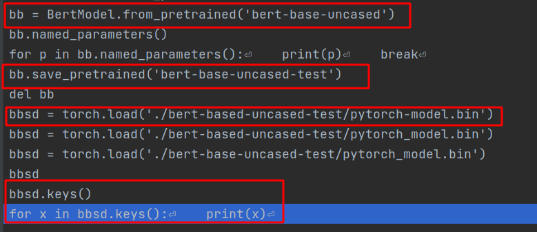
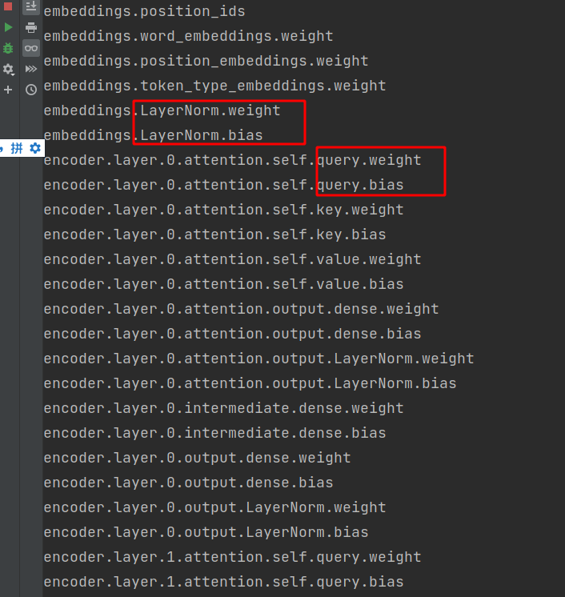
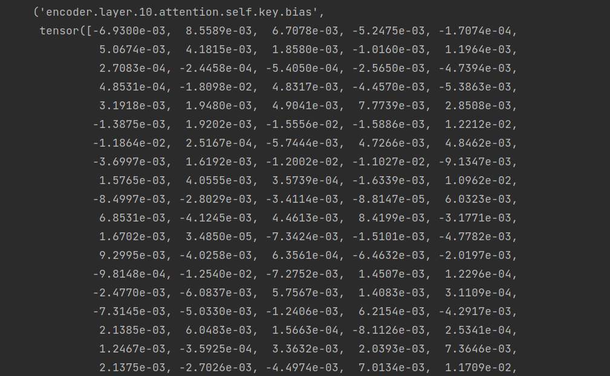

# 模型权重保存重载示例

```bash
# 自己定义的网络
## 方法一：只保存权重
encoder = BertModel.from_pretrained(bert_model_path)
model = EffiGlobalPointer(encoder, ENT_CLS_NUM, args.pointer_num).to(device)
torch.save(best_model.state_dict(), "data/model_data/best.pth")
prev_state_dict = torch.load('data/model_data/best.pth')
model.load_state_dict(prev_state_dict)
## 方法二：保存所有的
torch.save(best_model, "data/model_data/best.pt")
model = torch.load('data/model_data/best_state_dict.pt')

# BertModel内置方法
# 注意特定的模型种类需要使用不同的from_pretrained方法，否则某些权重可能不加载,具体查看模型类
model = BertModel()
model.save_pretrained('./output/bert_saved')
model = BertModel.from_pretrained()
```

查询方式



权重文件内部是这样的，熟悉的W和b。






# BERT

## huggingface官方示例

可以到https://github.com/huggingface/transformers/下的例子文件中寻找demo，由于官方更新速度快，具体路径请自行定位至examples文件夹~

以pytorch版本的masked language model为例

只需要运行以下脚本即可

```bash
python run_mlm.py \
    --model_name_or_path roberta-base \
    --dataset_name wikitext \
    --dataset_config_name wikitext-2-raw-v1 \
    --per_device_train_batch_size 8 \
    --per_device_eval_batch_size 8 \
    --do_train \
    --do_eval \
    --output_dir /tmp/test-mlm
```

其中 dataset_name为语料文件，可以是txt格式的,每行一个文本序列


# nezha

## 来源网络

```bash
import sys
import os
import csv
from transformers import BertTokenizer, WEIGHTS_NAME,TrainingArguments,BertForMaskedLM,BertConfig
import tokenizers
import torch
# from configuration_nezha import NeZhaConfig
from model.modeling_nezha import NeZhaForMaskedLM
from model.configuration_nezha import NeZhaConfig

os.environ["CUDA_VISIBLE_DEVICES"] = '0'

from transformers import (
CONFIG_MAPPING,
MODEL_FOR_MASKED_LM_MAPPING,
AutoConfig,
AutoModelForMaskedLM,
AutoTokenizer,
DataCollatorForLanguageModeling,
HfArgumentParser,
Trainer,
TrainingArguments,
set_seed,
LineByLineTextDataset,
BertTokenizerFast
)
model_path = '../nezha-base-www'

tokenizer = BertTokenizerFast.from_pretrained(model_path, do_lower_case=True)

config = NeZhaConfig.from_pretrained(model_path, num_labels=52)
model = NeZhaForMaskedLM.from_pretrained(model_path, config=config)

train_dataset=LineByLineTextDataset(tokenizer=tokenizer,file_path='../pretrain_unlabel_dataset/train_data/unlabeled_train_data.txt',block_size=128)
data_collator = DataCollatorForLanguageModeling(tokenizer=tokenizer, mlm=True, mlm_probability=0.15)

pretrain_batch_size=128
num_train_epochs=30
training_args = TrainingArguments(
output_dir='./pretrained_nezha',
overwrite_output_dir=True,
num_train_epochs=num_train_epochs,
learning_rate=6e-5,
per_device_train_batch_size=pretrain_batch_size,
save_total_limit=10,
logging_dir='./pretrained_nezha_log',
logging_steps=10000,
no_cuda=False)# save_steps=10000

trainer = Trainer(
model=model, args=training_args, data_collator=data_collator, train_dataset=train_dataset)

trainer.train()
trainer.save_model('./pretrained_nezha')

for i in range(100):
    torch.cuda.empty_cache()
```


