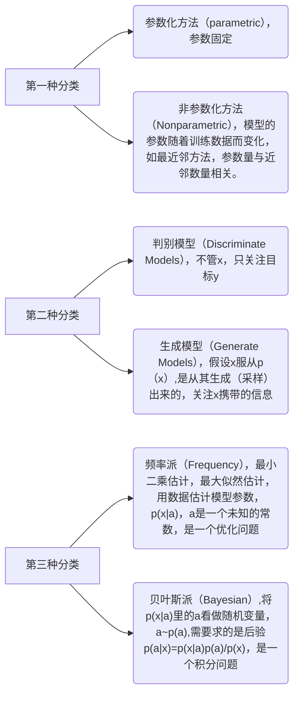
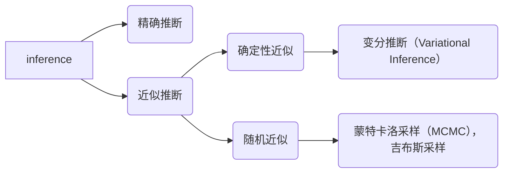
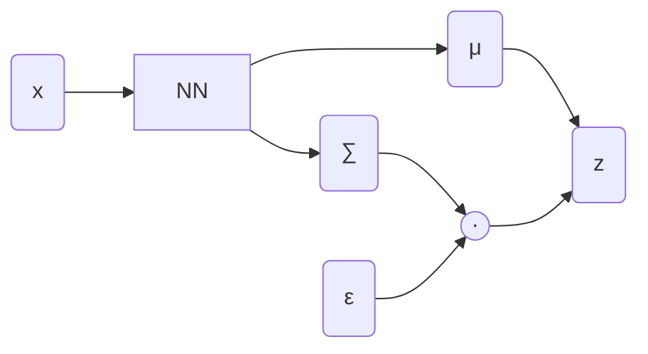

## 1.变分函数



### 微分（非严格）

$$
dy = f(x_1+dx)-f(x_1)
$$

$dy$是$y$的微分，也就是函数的微分，是指的$x$变化了一个极小值引起的因变量函数的变化。

### 泛函

泛函指的是，因变量为函数的函数。

| 函数                                           | 泛函                                                         |
| ---------------------------------------------- | ------------------------------------------------------------ |
| $f(x_0) = y_0$                                 | $\phi(f_{\theta_0}(x))=y_0$                                  |
| 当自变量为一个特定值，函数加工的结果对应特定值 | 当自变量为一个特定的函数（可以理解为特定的分布）如$y=x$，泛函加工为一个特定的值 |

### 变分（实质上是泛函的变分）

变分指的是，当自变量函数做出微小变化$y \rarr y + \delta y$时（可以理解为分布发生微小变化，如$y=x$变为$y=1.00001*x,y=x + 0.0001$），泛函的函数值变化了$\delta J$,这个变化值就是泛函的变分。

## 2.平均场理论 

$$
q(x)=\prod_iq(x_i)
$$

## 3.机器学习分类（研究方法）



### 贝叶斯派学习的过程

贝叶斯学习认为模型$p(x|\theta)$中的参数$\theta$不是一个确定的未知参数，而是一个随机变量，假设为$\theta 服从 p(\theta|\lambda)$，所以，需要通过贝叶斯定理求得后验$p(\theta|x)=\frac{p(x|\theta)p(\theta|\lambda)}{p(x)}$。

#### 贝叶斯推断（Inference）

需要计算$p(\theta|x)$的值，抽样很多样本，使用期望来近似，贝叶斯公式中$p(x|\theta)$是数据的似然和$p(\theta|\lambda)$ 是参数的先验分布，$p(x)$通过$\int_{\theta} p(x|\theta)p(\theta|\lambda)d\lambda$得到。



#### 贝叶斯决策

通过原有样本$X$来推断N个新的样本$\hat x$，即
$$
p(\hat x|X)=\int_\theta p(\hat x,\theta|X)d\theta
=\int_\theta p(\hat x|\theta)\cdot p(\theta|X)d\theta
=E_{\theta|X}[p(\hat x|\theta)]
$$


## 变分推断(Variational Inference)

使用ELBO来替代，含有隐变量的概率模型中，观测数据的对数概率$\log_{\theta} p(x)$

**参数设定**

$X$ :   Observed data

$Z$ :   latent variable + parameter

$(X,Z)$ :  complete data + parameter

由于$x$是观测数据，$q(z|x)$简写为$q(z)$

**根据贝叶斯定理**
$$
p(z|x) = \frac{p(x|z)p(z)}{p(x)} = \frac{p(x,z)}{p(x)}
$$
**移项取log**
$$
\log p(x)=\log \frac{p(x,z)}{p(z|x)}=\log \frac{\frac{p(x,z)}{q(z)}}{\frac {p(z|x)}{q(z)}}=\log \frac{p(x,z)}{q(z)} - \log \frac {p(z|x)}{q(z)}
$$
**左右两边对**$q(z)$**求进行积分**
$$
左边=\int_z q(z)\log p(x)dz = \log p(x)
$$

$$
右边=\int q(z)\log \frac{p(x,z)}{q(z)}dz - \int q(z) \log \frac {p(z|x)}{q(z)}dz
$$

$$
右边=\underbrace{\int q(z)\log \frac{p(x,z)}{q(z)}dz}_{ELBO(evidence\;lower\;bound)} + \underbrace{\int q(z) \log \frac {q(z)}{p(z|x)}}_{KL(q||p)}dz
$$

$$
右边=\underbrace{\mathcal{L}(q)}_{关于q的变分}+\underbrace{KL(q||p)}_{\geqslant 0}
$$

其中$\mathcal{L}(q)$是用来定义ELBO项的函数，用以说明其输入是一个$q$函数，$q$函数是我们随意找的一个概率密度函数，所以$\mathcal{L}(q)$是关于$q$的变分，变分推断来自于此。

 说明一下，当X固定时，右边的和固定，而由于KL散度的性质，$KL(q||p)$恒大于零，所以$\mathcal{L}(q)$最大就是$\log p(x)$。

转为变分推断的关键问题，后验$p(z|x)$无法求得，所以需要使用$q(z)$来近似它，即使得$q(z)\approx p(z|x)$。此时$KL(q||p)$最小，趋近于零。反过来思考，当找到一个$\tilde {q(z)}$使得变分$\mathcal{L}(q)$达到最大时，也能让$KL(q||p)$达到最小值，即使得$\tilde {q(z)}\approx p(z|x)$，形式化表达如下。
$$
\tilde {q(z)} = \mathop{\arg\max}_{q(z)}\ \ \mathcal{L}(q)\ \  \Rightarrow\ \  \tilde {q(z)}\approx p(z|x)
$$
平均场理论
$$
q(z) = \prod_{i=1}^{M}q(z_i)
$$

## 随机梯度变分推断 (Stochastic Gradient VI, SGVI)


$$
\log p_\theta(X) = \log \prod_{i=1}^N p_{\theta}(x^i)=\sum_{i=1}^N\log p_{\theta}(x^i)
$$

$$
\log p_{\theta}(x^i) = \underbrace{ELBO}_{\mathcal L(q)} + \underbrace{KL(q||p)}_{\geqslant 0}) \geqslant \mathcal L(q)
$$


需要求解的目标函数是
$$
\tilde {q(z)} = \mathop{\arg\min}_{q(z)}\ \ KL(q||p) =\mathop{\arg\max}_{q(z)}\ \ \mathcal{L}(q)
$$
假设$q(z)$的分布参数为$\phi$,则变分$\mathcal L(q)$可以写成$\mathcal L(\phi)$，即观测分布表示为
$$
\log p_{\theta}(x^i) = \underbrace{ELBO}_{\mathcal L(\phi)} + \underbrace{KL(q||p)}_{\geqslant 0}) \geqslant \mathcal L(\phi)
$$

$$
ELBO = E_{q_{\phi}(z)}[\log \frac{p_{\theta}(x^i,z)}{q_{\phi}(z)}]
$$


那么我们想要最大化$ELBO$时，$q(z)$分布的参数$\phi$形式化表达为
$$
\hat \phi =\mathop{\arg\max}_{\phi}  \ \mathcal L(\phi)
$$
使用梯度随机梯度上升策略，需要求得$\mathcal L(\phi)$对$\phi$的梯度如下。


$$
\begin{equation}
\begin{aligned}

\nabla_{\phi} \mathcal L(\phi) &= \nabla_{\phi}E_{q_{\phi}}[\log p_{\theta}(x^i,z)-\log q_{\phi}(z)] \\
&=\nabla_{\phi}\int q_{\phi}[\log p_{\theta}(x^i,z)-\log q_{\phi}(z)]dz \\
&=\int \nabla_{\phi}q_{\phi}\cdot[\log p_{\theta}(x^i,z)-\log q_{\phi}(z)]dz + 
\int q_{\phi}\nabla_{\phi}[\log p_{\theta}(x^i,z)-\log q_{\phi}(z)]dz \\

&=\int q_{\phi}\cdot\nabla_{\phi}\log q_{\phi}\cdot[\log p_{\theta}(x^i,z)-\log q_{\phi}(z)]dz + 0 \\

&=E_{q_{\phi}}[\nabla_{\phi}\log q_{\phi}\cdot[\log p_{\theta}(x^i,z)-\log q_{\phi}(z)]

\end{aligned}
\end{equation}
$$


如果使用蒙特卡罗的方式，梯度$\nabla_{\phi} \mathcal L(\phi)$，即期望$E_{q_{\phi}}[\nabla_{\phi}\log q_{\phi}\cdot[\log p_{\theta}(x^i,z)-\log q_{\phi}(z)]$可以通过从$q_{\phi}(z)中采样L个z$得到，即
$$
z^{(l)} \backsim q_{\phi}(z),\quad l=1,2,\cdots,L \\
\nabla_{\phi} \mathcal L(\phi)\approx \frac{1}{L}\sum_{l=1}^L \nabla_{\phi}\log q_{\phi}(z^i)\cdot[\log p_{\theta}(x^i,z)-\log q_{\phi}(z)]
$$
而$E_{q_{\phi}}[\underbrace{\nabla_{\phi}\log q_{\phi}}_{high\  variance}\cdot[\log p_{\theta}(x^i,z)-\log q_{\phi}(z)]$在采样时，由于log函数的性质，当$q_{\phi}(z)\ \rightarrow \ 0$时，其中的$\nabla_{\phi}\log q_{\phi}$项会带来高方差问题。这导致了采样需要的样本量巨大，且误差较大，甚至可以认为无法采样。因此，无法采用蒙特卡洛方式来近似梯度$\nabla_{\phi} \mathcal L(\phi)$。

故现在需要降低梯度表达的方差，即Variance Reduction问题。使用重参数化技巧（Reparameterization Trick）。

### Reparameterization Trick

目的是将随机变量$z$和$\phi$的关系解耦，将$z$的随机成分转移到$\epsilon$。

假设$z=g_{\phi}(\epsilon,x^i)$ ，$\epsilon \backsim p(\epsilon)$，$z\backsim q_{\phi}(z|x^i)$，则由于$\int q_{\phi}(z|x^i)dz = \int p(\epsilon)d\epsilon = 1$，可以得出$|q_{\phi}(z|x^i)dz|=|p(\epsilon)\cdot d\epsilon|$。

故梯度可以进行如下表达


$$
\begin{equation}
\begin{aligned}

\nabla_{\phi} \mathcal L(\phi) &= \nabla_{\phi}\underline{E_{q_{\phi}}}[\log p_{\theta}(x^i,z)-\log q_{\phi}(z)] \\

&=\nabla_{\phi}\int[\log p_{\theta}(x^i,z)-\log q_{\phi}(z)]\underline{q_{\phi}dz} \\

&=\nabla_{\phi}\int[\log p_{\theta}(x^i,z)-\log q_{\phi}(z)]\underline{p(\epsilon)d\epsilon} \\

&=\nabla_{\phi}\underline{E_{p(\epsilon)}}[\log p_{\theta}(x^i,z)-\log q_{\phi}(z)] \\

&=E_{p(\epsilon)}[\nabla_{\phi}(\log p_{\theta}(x^i,z)-\log q_{\phi}(z))] \\

带入z=g_{\phi}(\epsilon,x^i)得， \\

&=E_{p(\epsilon)}[\nabla_z(\log p_{\theta}(x^i,z)-\log q_{\phi}(z))\cdot \underline{\nabla_{\phi}z}] \\

&=E_{p(\epsilon)}[\nabla_z(\log p_{\theta}(x^i,z)-\log q_{\phi}(z))\cdot \underline{\nabla_{\phi}g_{\phi}(\epsilon,x^i)}]


\end{aligned}
\end{equation}
$$


此时，便可以采用蒙特卡罗采样来近似梯度$\nabla_{\phi} \mathcal L(\phi)$，期望即是均值。

假设进行$L$次采样，$\epsilon^{(l)}\sim p(\epsilon),\ \ l=1,2,\cdots,L$。


$$
\nabla_{\phi} \mathcal L(\phi) \approx \widetilde {\nabla_{\phi} \mathcal L(\phi)}=

\frac{1}{L} \sum_{l=1}^L\nabla_z(\log p_{\theta}(x^i,z)-\log q_{\phi}(z))\cdot \nabla_{\phi}g_{\phi}(\epsilon^{(l)},x^i)
$$


SGVI训练过程如下


$$
\phi^{(t+1)} \leftarrow \phi^{(t)} + \lambda^{(t)} \cdot \widetilde {\nabla_{\phi} \mathcal L(\phi)}f
$$


## 变分自编码器VAE

#### 问题场景

假设数据集$X=\{x^{(i)}\}^N_{i=1}$服从$N$ i.i.d.。该集合中的数据由某些随机过程生成而来，过程中含有无法观测的连续随机变量$\bf z$。这个随机过程包含两个步骤，首先，从先验分布$p_{\theta ^*}(\bf z)$中生成一个$\bf z^{(i)}$。步骤二是从条件分布$p_{\theta ^*}(\bf x |\bf z)$中采样$\bf x^{(i)}$。假设$p_{\theta ^*}(\bf z)$和$p_{\theta ^*}(\bf x |\bf z)$来自$p_{\theta}(\bf z)$和$p_{\theta}(\bf x |\bf z)$的参数家族，并且他们的表达在提及$\theta$和$z$时都是可微的。这个过程的许多部分都是对我们不可见的：不论是真实的参数$\theta ^*$还是隐变量$z^{(i)}$都是未知的。

隐变量模型 Latent Variable Model

```mermaid
graph TB
z--"生成(Decoder)"-->x
x--"推断(Encoder)"-->z
```

GMM 混合高斯模型，有限个高斯模型混合$z$~Categorical Dist

VAE 无限个（infinite）高斯模型混合: $z \sim N(0,\bf I) $，$x|z \sim N(\mu_{\theta}(z),\sum_{\theta}(z))$，得到如下建模，
$$
p_{\theta}(x) = \int_zp_{\theta}(x,z)dz \ = \ \int_z p(z)\cdot p_{\theta}(x|z)dz
$$
其中$p_{\theta}(x)$为intractable。

如果需要使用VAE生成一个样本，先从$p(z)$中采样一个$z^i$，然后使用$p_{\theta}(x|z)$（实际采用一个神经网络来逼近，即Decoder）来得到$x^i $。

由变分推断可知
$$
\log p(x) = ELBO + KL(q_{\phi}(z|x)||p_{\theta}(z|x))
$$
优化目标如下


$$
\begin{equation}
\begin{aligned}

<\hat \theta,\hat \phi> &= \mathop{\arg\min}_{<\theta, \phi>}\ KL(q_{\phi}(z|x)||p_{\theta}(z|x)) \\

&=\mathop{\arg\max}_{<\theta, \phi>}\ ELBO \\

&=\mathop{\arg\max}_{<\theta, \phi>}\ E_{q_{\phi}(z|x)}[\log p_{\theta}(x,z)]+H[q_{\phi}] \\

&=\mathop{\arg\max}_{<\theta, \phi>}\ E_{q_{\phi}(z|x)}[\log p_{\theta}(x,z)-\log q_{\phi}(z|x)] \\

&=\mathop{\arg\max}_{<\theta, \phi>}\ E_{q_{\phi}(z|x)}[\log p_{\theta}(x|z)+\log p(z)-\log q_{\phi}(z|x)] \\

&=\mathop{\arg\max}_{<\theta, \phi>}\ E_{q_{\phi}(z|x)}[\log p_{\theta}(x|z)]+\int q_{\phi}(z|x)\frac{\log p(z)}{\log q_{\phi}(z|x)}dz \\

&=\mathop{\arg\max}_{<\theta, \phi>}\underbrace{\ E_{q_{\phi}(z|x)}[\log p_{\theta}(x|z)]}_{真正的目标函数}-\underbrace{KL(q_{\phi}(z|x)||p(z))}_{看做正则化项，使编码器不坍缩}


\end{aligned}
\end{equation}
$$


 使用SGVI进行训练，重参数化技巧可以如下实现




$\epsilon$可以看做采样的噪声，$\epsilon \backsim N(0,\bf I)$。假设$z|x \backsim N(\mu_{\phi}(x),\Sigma_{\phi}(x))$则


$$
z=\mu_{\phi}(x)+\Sigma_{\phi}^{\frac{1}{2}}(x)\cdot \epsilon
$$



## 参考资料

https://www.bilibili.com/video/BV1DW41167vr?p=1&vd_source=309d79182a0075ce59fbfe1a028281fd

https://www.bilibili.com/video/BV1G34y1t7Dy/?p=2&spm_id_from=pageDriver&vd_source=309d79182a0075ce59fbfe1a028281fd

https://zhuanlan.zhihu.com/p/345597656
