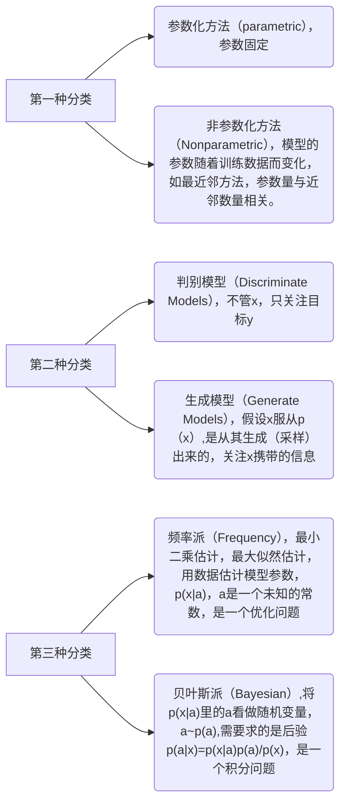
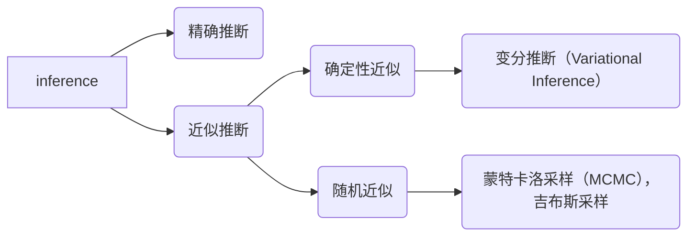

## 1.变分函数

### 微分（非严格）

$$
dy = f(x_1+dx)-f(x_1)
$$

$dy$是$y$的微分，也就是函数的微分，是指的$x$变化了一个极小值引起的因变量函数的变化。

### 泛函

泛函指的是，因变量为函数的函数。

| 函数                                           | 泛函                                                         |
| ---------------------------------------------- | ------------------------------------------------------------ |
| $f(x_0) = y_0$                                 | $\phi(f_{\theta_0}(x))=y_0$                                  |
| 当自变量为一个特定值，函数加工的结果对应特定值 | 当自变量为一个特定的函数（可以理解为特定的分布）如$y=x$，泛函加工为一个特定的值 |

### 变分（实质上是泛函的变分）

变分指的是，当自变量函数做出微小变化$y \rarr y + \delta y$时（可以理解为分布发生微小变化，如$y=x$变为$y=1.00001*x,y=x + 0.0001$），泛函的函数值变化了$\delta J$,这个变化值就是泛函的变分。

## 2.平均场理论 

$$
q(x)=\sum_iq(x_i)
$$

## 3.机器学习分类（研究方法）

### 贝叶斯派学习的过程

贝叶斯学习认为模型$p(x|\theta)$中的参数$\theta$不是一个确定的未知参数，而是一个随机变量，假设为$\theta 服从 p(\theta|\lambda)$，所以，需要通过贝叶斯定理求得后验$p(\theta|x)=\frac{p(x|\theta)p(\theta|\lambda)}{p(x)}$。

#### 贝叶斯推断（Inference）

需要计算$p(\theta|x)$的值，抽样很多样本，使用期望来近似，贝叶斯公式中$p(x|\theta)$是数据的似然和$p(\theta|\lambda)$ 是参数的先验分布，$p(x)$通过$\int_{\theta} p(x|\theta)p(\theta|\lambda)d\lambda$得到。

#### 贝叶斯决策

通过原有样本$X$来推断N个新的样本$\hat x$，即
$$
p(\hat x|X)=\int_\theta p(\hat x,\theta|X)d\theta
=\int_\theta p(\hat x|\theta)\cdot p(\theta|X)d\theta
=E_{\theta|X}[p(\hat x|\theta)]
$$

## 变分推断

参数设定

$X$ :   Observed data

$Z$ :   latent variable + parameter

$(X,Z)$ :  complete data

 

## 参考资料

https://www.bilibili.com/video/BV1DW41167vr?p=1&vd_source=309d79182a0075ce59fbfe1a028281fd

https://www.bilibili.com/video/BV1G34y1t7Dy/?p=2&spm_id_from=pageDriver&vd_source=309d79182a0075ce59fbfe1a028281fd
