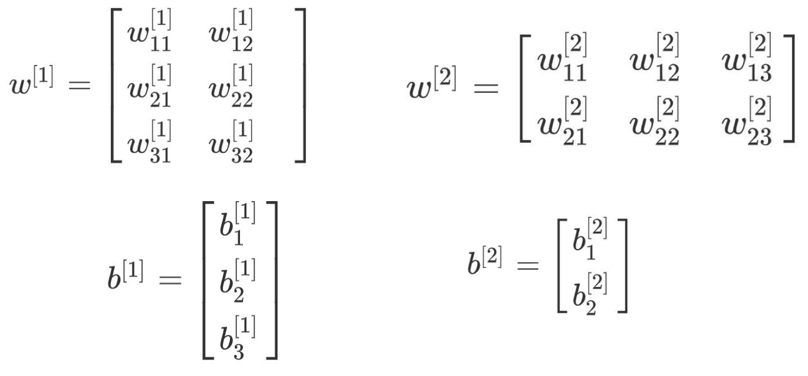
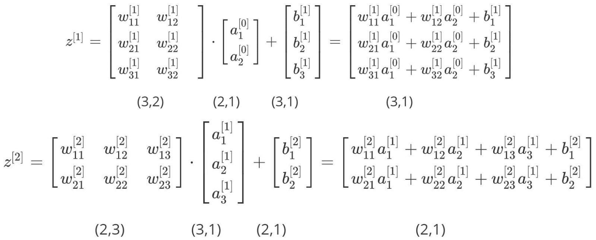
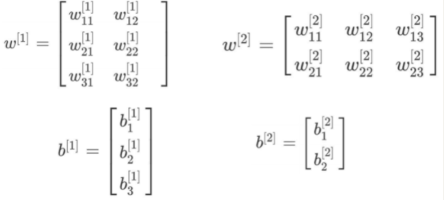
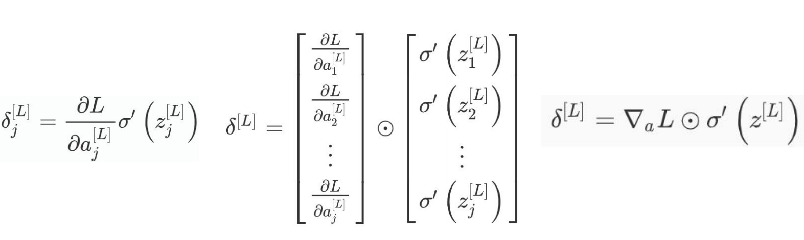
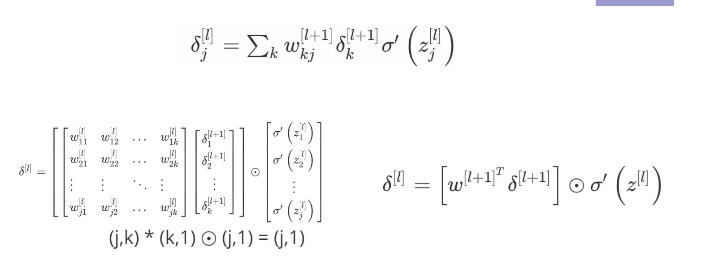
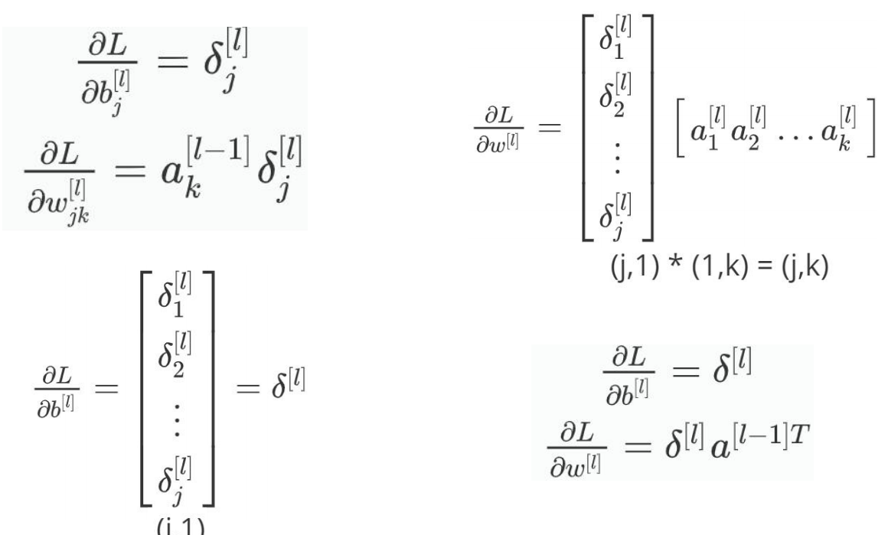
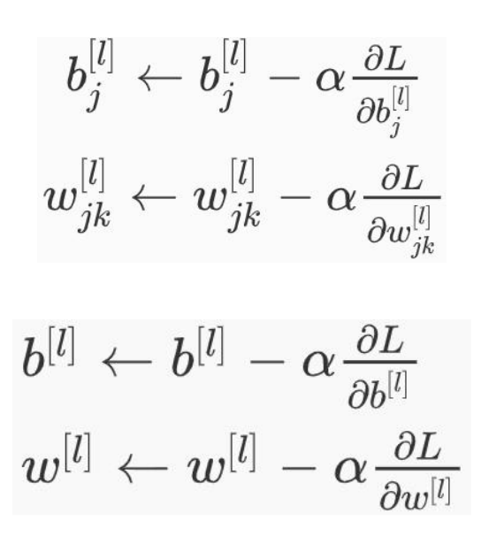

# 反向传播算法

作为一位机器学习领域的博主，第一篇博客肯定要从反向传播算法开始啦~

## 简介

​	来自[维基百科](https://zh.wikipedia.org/wiki/%E5%8F%8D%E5%90%91%E4%BC%A0%E6%92%AD%E7%AE%97%E6%B3%95#cite_note-Alpaydin2010-10)

​	首先是反向传播算法的历史沿用👇

​	[弗拉基米尔·瓦普尼克](https://zh.wikipedia.org/wiki/弗拉基米尔·瓦普尼克)引用（Bryson, A.E.; W.F. Denham; S.E. Dreyfus. Optimal programming problems with inequality constraints. I: Necessary conditions for extremal solutions. AIAA J. 1, 11 (1963) 2544-2550）在他的书《支持向量机》中首次发表反向传播算法。在1969年[Arthur E. Bryson](https://zh.wikipedia.org/w/index.php?title=Arthur_E._Bryson&action=edit&redlink=1)和[何毓琦](https://zh.wikipedia.org/wiki/何毓琦)将其描述为多级动态系统优化方法。直到1974年以后在神经网络的背景下应用，并由[Paul Werbos](https://zh.wikipedia.org/w/index.php?title=Paul_Werbos&action=edit&redlink=1)[[7\]](https://zh.wikipedia.org/wiki/反向传播算法#cite_note-9)、[David E. Rumelhart](https://zh.wikipedia.org/w/index.php?title=David_E._Rumelhart&action=edit&redlink=1)、[杰弗里·辛顿](https://zh.wikipedia.org/wiki/杰弗里·辛顿)和[Ronald J. Williams](https://zh.wikipedia.org/w/index.php?title=Ronald_J._Williams&action=edit&redlink=1)[[1\]](https://zh.wikipedia.org/wiki/反向传播算法#cite_note-Rumelhart1986-1)[[8\]](https://zh.wikipedia.org/wiki/反向传播算法#cite_note-Alpaydin2010-10)的著作，它才获得认可，并引发了一场人工神经网络的研究领域的“文艺复兴”。在21世纪初人们对其失去兴趣，但在2010年后又拥有了兴趣，如今可以通过[GPU](https://zh.wikipedia.org/wiki/圖形處理器)等大型现代运算器件用于训练更大的网络。例如在2013年，顶级语音识别器现在使用反向传播算法训练神经网络。

​	那么反向传播算法是啥？👇

​	**反向传播**（英语：Backpropagation，缩写为**BP**）是“误差反向传播”的简称，是一种与[最优化方法](https://zh.wikipedia.org/wiki/最优化)（如[梯度下降法](https://zh.wikipedia.org/wiki/梯度下降法)）结合使用的，用来训练[人工神经网络](https://zh.wikipedia.org/wiki/人工神经网络)的常见方法。该方法对网络中所有权重计算[损失函数](https://zh.wikipedia.org/wiki/损失函数)的梯度。这个梯度会回馈给最佳化方法，用来更新权值以最小化损失函数。

## 前向传播推导

### a. 了解矩阵乘法

假设👇



$$
\textbf{A} =

\begin{bmatrix}
1 & 2 \\
3 & 4 \\
\end{bmatrix}
\quad
\textbf{B}=\left[
    \begin{matrix}
	-1 & -2 \\
	-3 & -4 \\
    \end{matrix}
\right]
$$



**点积**（通常省略  ·   符号）计算如下👇


$$
\textbf{AB} =
\left[
	\begin{matrix}
	1 \times(-1) + 2\times(-3) & 1\times (-2) +2\times(-4)\\
	3 \times(-1) + 4\times(-3) & 3\times(-2) +4 \times(-4)
	\end{matrix}
\right]=
\left[
	\begin{matrix}
	-7 & -10\\
	-15& -22
	\end{matrix}
\right]
$$



**逐元素乘法**如下👇


$$
\textbf{A}\odot\textbf{B} =
\left[
	\begin{matrix}
	1 \times(-1)& 2\times(-2)\\
	3 \times(-3)& 4 \times(-4)
	\end{matrix}
\right]=
\left[
	\begin{matrix}
	-1 & -4\\
	-9& -16
	\end{matrix}
\right]
$$



### b. 了解连式法则

如果将复合函数f(g(x))对x求导，需要使用链式法则，
$$
\frac{\partial f(g(x))}{\partial x} = \frac{\partial f(g(x))}{\partial g(x)} \frac{\partial g(x)}{\partial x}
$$

举个栗子，
$$
\frac{\partial e^{-x}}{\partial x} = \frac{\partial e^{-x}}{\partial (-x)} \frac{\partial (-x)}{\partial x}=e^{-x}\cdot(-1) = -e^{-x}
$$
这也是神经网络根据结果来更新前面n层参数的基础。

### c.了解神经网络

如下图所示，这是一个神经网络👇

可以看到，这个神经网络的隐藏层（除了第一层输入层和最后一层输出层之外都是隐藏层）与所有上一层的神经元都连接了，我们一般称这样的层为全连接层。可以看到，图中的神经网络较为复杂，接下来，我们对网络进行拆解至最小单元。

先看看最基本的**神经元**是如何进行内部计算的。👇

******

可以看到，其实不难，每个神经元接受到来自上一层的每一个输入（即上一层需要连接的输出乘以（上一层至当前层的权重矩阵）得到的$w_{j_i}^{[l]}$）值，并将这些值求和，然后加上本神经元的Bias，经过激活函数$\sigma$得到此神经元的输出 $a_j^{[l]}$。

然后我们让神经元回归到神经网络中，看一下整个网络的前馈计算脉路👇

如上图所示，这就是一个基本的前馈神经网络计算过程。其中，$Z$代表的是本神经元的激活函数所接受的输入值，也就是本神经元接受的来自上一层各神经元的输出（如果不是全连接层，也有可能是上一层部分神经元的输出）乘以权重w，求和后，加上本神经元的Bias得到的值。

如果对这个过程不是特别了解，那我们以矩阵的形式写一次$Z$的计算范例。👇

对部分参数进行如下定义👇

于是，图中两个隐藏层$Z$的计算如下👇

可以表述成👇
$$
\textbf{Z}^{[l]}=w^{[l]}\cdot \textbf{A}^{[l-1]} +b^{[l]}
$$
那么，最后一层的输出呢就是我们需要的预测值，对于这一个预测值，我们希望它与真实值不要有过大的偏差，这个时候，我们便需要一个度量方法来衡量预测值与目标值的偏差程度。通常，我们将这个程度量化为损失函数的函数值Loss，那么这个损失函数如何去定义呢？这就牵扯到你所需要的预测是什么样的，它与实际值的关系是怎样的了，以后有机会出一篇文章梳理一些常用的损失函数。现在我们使用一个最简单的度量方法，也成为$L_1$度量，即绝对差值度量法，定义$(\hat{y},y)$为（网络预测值，真实值），那么函数$L(\hat{y},y)$可以定义如下👇
$$
L(\hat{y},y)=|\hat{y}-y|
$$
那么，他输出的函数值就是我们所需要的偏差度量。我们都知道，神经网络需要进行学习，学习的是什么呢？其实就是一个分布，希望在给出条件$x$下，能够给出相应的映射$y$，即网络能够通过映射计算去拟合数据中的分布$p(x)$。这个拟合过程，也就是缩小偏差度量，那么如何缩小偏差呢？这时便出现了我们的主角，反向传播算法，这是一个通过输出来反馈信息的算法，也是神经网络学习的根本所在，它的全名其实是误差反向传播，即通过误差回传，让模型的参数共同调整去减小这个误差。

那么误差我们熟悉，就是两个值之间的差值，而当我们将这个差值视为函数差值的时候，他就可以与函数求导挂钩，回顾一下求导法则👇
$$
f'(x)=\lim_{\Delta x \rightarrow0} \frac{\Delta y}{\Delta x}
$$
可以看到，通俗的说，有了导数，我们就可以知道要将偏差多少$y$调整回来，需要多少的$x$。

那么问题又来了，对于那么多的网络参数，我们怎么去调整呢？

答案就是，偏导数👇

$$
f_x'(x,y)=\frac{\partial f}{\partial x}
$$
偏导数是啥，偏导数就是有偏见的导数，只对特定的条件$x$感兴趣，也就是偏导的一方，而其他的视为常数，这样我们就能精准地对不同参数进行更新。

举个最简单的例子，设👇
$$
f(x,y)=xy
$$
那么如果对$x$偏导👇
$$
f_x(x,y)=y
$$
反之，若对$y$偏导👇
$$
f_y(x,y)=x
$$
那么，在神经网络中，偏导的概念就视为了梯度$\nabla$，为啥叫梯度呢？梯度$\nabla$的本意是一个向量（矢量），表示某一函数在该点处的方向导数沿着该方向取得最大值，那么如果在某一个变量上需要对误差产生最大的影响，则需要沿着梯度$\nabla$的方向，也就是偏导的方向。

$$
w:=w-a \frac{\partial J(w)}{\partial w}
$$
图中是目标函数对变量$w$的梯度$\nabla$，可以看到，梯度$\nabla$在图线上表现为切线，很容易知道在这个方向上能够对目标函数的值带来最大的影响，那么变量$w$在当前时刻沿着这个方向变化便能为缩小误差做出最大贡献。

如果拓展到矩阵则容易得到矩阵梯度$\nabla$矩阵，也就是每个元素的梯度啦。👇


$$
\nabla_{\textbf{A}}f(\textbf{A})=
\begin{bmatrix}
\frac{\partial f(A)}{\partial A_{11}} & \frac{\partial f(A)}{\partial A_{12}} & \cdots & \frac{\partial f(A)}{\partial A_{13}} \\
\frac{\partial f(A)}{\partial A_{21}} & \frac{\partial f(A)}{\partial A_{12}} & \cdots & \frac{\partial f(A)}{\partial A_{23}} \\
\vdots & \vdots & \ddots & \vdots \\
\frac{\partial f(A)}{\partial A_{m1}} & \frac{\partial f(A)}{\partial A_{m2}} & \cdots & \frac{\partial f(A)}{\partial A_{m3}} \\
\end{bmatrix}
$$

$$
(\nabla_{\textbf{A}}f(\textbf{A}))_{ij}=\frac{\textbf A}{\partial A_{ij}}
$$



## 误差反向传播

为误差对神经元输入的值（激活前）$z$    做如下假设👇

那么对于输出层👇

对于隐藏层👇

更新步👇

图解反向传播过程，首先是输出层👇

误差梯度传向第一个隐藏层👇

👇

👇

👇

👇

👇

以此类推，反向传播的过程就结束啦~

