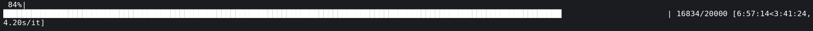
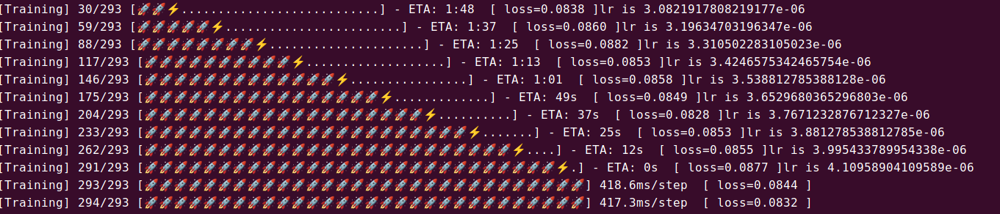

### 远古的我(远古时期没有截图)：

[00:00:00 < 9999:9999:9999]


### 之前的我




### 现在的我




#### Processbar实现

```python
class ProgressBar(object):
    '''
    super progress bar
    Example:
        >>> pbar = ProgressBar(n_total=30,desc='Training')
        >>> step = 2
        >>> pbar(step=step,info={'loss':20})
    '''

    def __init__(self, n_total, width=30, desc='Training',num_epochs = None):

        self.width = width
        self.n_total = n_total
        self.desc = desc
        self.start_time = time.time()
        self.num_epochs = num_epochs

    def reset(self):
        """Method to reset internal variables."""
        self.start_time = time.time()

    def _time_info(self, now, current):
        time_per_unit = (now - self.start_time) / current
        if current < self.n_total:
            eta = time_per_unit * (self.n_total - current)
            if eta > 3600:
                eta_format = ('%d:%02d:%02d' %
                              (eta // 3600, (eta % 3600) // 60, eta % 60))
            elif eta > 60:
                eta_format = '%d:%02d' % (eta // 60, eta % 60)
            else:
                eta_format = '%ds' % eta
            time_info = f' - ETA: {eta_format}'
        else:
            if time_per_unit >= 1:
                time_info = f' {time_per_unit:.1f}s/step'
            elif time_per_unit >= 1e-3:
                time_info = f' {time_per_unit * 1e3:.1f}ms/step'
            else:
                time_info = f' {time_per_unit * 1e6:.1f}us/step'
        return time_info

    def _bar(self, now, current):

        # ⚡ ❓ 
        # you can define your own symbol here ^ ^
        # finished symbol
        f_symbol = emoji.emojize(':rocket:')
        # running symbol
        r_symbol = emoji.emojize('⚡')

        recv_per = current / self.n_total
        bar = f'[{self.desc}] {current}/{self.n_total} ['
        if recv_per >= 1: recv_per = 1
        prog_width = int(self.width * recv_per)
        if prog_width > 0:
            bar += f_symbol * (prog_width - 1)
            if current < self.n_total:
                bar += r_symbol
            else:
                bar += f_symbol
        bar += '.' * (self.width - prog_width)
        bar += ']'
        return bar

    def epoch_start(self,current_epoch):
        sys.stdout.write("\n")
        if (current_epoch is not None) and (self.num_epochs is not None):
            sys.stdout.write(f"Epoch: {current_epoch}/{self.num_epochs}")
            sys.stdout.write("\n")

    def __call__(self, step, info={}):
        now = time.time()
        current = step + 1
        bar = self._bar(now, current)
        show_bar = f"\r{bar}" + self._time_info(now, current)
        if len(info) != 0:
            show_bar = f'{show_bar} ' + " [" + "-".join(
                [f' {key}={value:.4f} ' for key, value in info.items()]) + "]"
        if current >= self.n_total:
            show_bar += '\n'
        sys.stdout.write(show_bar)
        sys.stdout.flush()
```


### 常用emoji分享

佬分享传送门 https://www.94rg.com/article/1881

| 较为常用                                                     |
| :----------------------------------------------------------- |
| 🌹🍀🍎💰📱🌙🍁🍂🍃🌷💎🔪🔫🏀⚽⚡👄👍🔥                                          |
| emoji表情                                                    |
| 😀😁😂😃😄😅😆😉😊😋😎😍😘😗😙😚☺😇😐😑😶😏😣😥😮😯😪😫😴😌😛😜😝😒😓😔😕😲😷😖😞😟😤😢😭😦😧😨😬😰😱😳😵😡😠      |
| emoji人物                                                    |
| 👦👧👨👩👴👵👶👱👮👲👳👷👸💂🎅👰👼💆💇🙍🙎🙅🙆💁🙋🙇🙌🙏👤👥🚶🏃👯💃👫👬👭💏💑👪                     |
| emoji手势                                                    |
| 💪👈👉☝👆👇✌✋👌👍👎✊👊👋👏👐✍                                            |
| emoji日常                                                    |
| 👣👀👂👃👅👄💋👓👔👕👖👗👘👙👚👛👜👝🎒💼👞👟👠👡👢👑👒🎩🎓💄💅💍🌂                            |
| emoji手机                                                    |
| 📱📲📶📳📴☎📞📟📠                                                    |
| emoji公共                                                    |
| ♻🏧🚮🚰♿🚹🚺🚻🚼🚾⚠🚸⛔🚫🚳🚭🚯🚱🚷🔞💈                                        |
| emoji动物                                                    |
| 🙈🙉🙊🐵🐒🐶🐕🐩🐺🐱😺😸😹😻😼😽🙀😿😾🐈🐯🐅🐆🐴🐎🐮🐂🐃🐄🐷🐖🐗🐽🐏🐑🐐🐪🐫🐘🐭🐁🐀🐹🐰🐇🐻🐨🐼🐾🐔🐓🐣🐤🐥🐦🐧🐸🐊🐢🐍🐲🐉🐳🐋🐬🐟🐠🐡🐙🐚🐌🐛🐜🐝🐞🦋 |
| emoji植物                                                    |
| 💐🌸💮🌹🌺🌻🌼🌷🌱🌲🌳🌴🌵🌾🌿🍀🍁🍂🍃                                          |
| emoji自然                                                    |
| 🌍🌎🌏🌐🌑🌒🌓🌔🌕🌖🌗🌘🌙🌚🌛🌜☀🌝🌞⭐🌟🌠☁⛅☔⚡❄🔥💧🌊                               |
| emoji饮食                                                    |
| 🍇🍈🍉🍊🍋🍌🍍🍎🍏🍐🍑🍒🍓🍅🍆🌽🍄🌰🍞🍖🍗🍔🍟🍕🍳🍲🍱🍘🍙🍚🍛🍜🍝🍠🍢🍣🍤🍥🍡🍦🍧🍨🍩🍪🎂🍰🍫🍬🍭🍮🍯🍼☕🍵🍶🍷🍸🍹🍺🍻🍴 |
| emoji文体                                                    |
| 🎪🎭🎨🎰🚣🛀🎫🏆⚽⚾🏀🏈🏉🎾🎱🎳⛳🎣🎽🎿🏂🏄🏇🏊🚴🚵🎯🎮🎲🎷🎸🎺🎻🎬                           |
| emoji恐怖                                                    |
| 😈👿👹👺💀☠👻👽👾💣                                                   |
| emoji旅游                                                    |
| 🌋🗻🏠🏡🏢🏣🏤🏥🏦🏨🏩🏪🏫🏬🏭🏯🏰💒🗼🗽⛪⛲🌁🌃🌆🌇🌉🌌🎠🎡🎢🚂🚃🚄🚅🚆🚇🚈🚉🚊🚝🚞🚋🚌🚍🚎🚏🚐🚑🚒🚓🚔🚕🚖🚗🚘🚚🚛🚜🚲⛽🚨🚥🚦🚧⚓⛵🚤🚢✈💺🚁🚟🚠🚡🚀🎑🗿🛂🛃🛄🛅 |
| emoji物品                                                    |
| 💌💎🔪💈🚪🚽🚿🛁⌛⏳⌚⏰🎈🎉🎊🎎🎏🎐🎀🎁📯📻📱📲☎📞📟📠🔋🔌💻💽💾💿📀🎥📺📷📹📼🔍🔎🔬🔭📡💡🔦🏮📔📕📖📗📘📙📚📓📃📜📄📰📑🔖💰💴💵💶💷💸💳✉📧📨📩📤📥📦📫📪📬📭📮✏✒📝📁📂📅📆📇📈📉📊📋📌📍📎📏📐✂🔒🔓🔏🔐🔑🔨🔫🔧🔩🔗💉💊🚬🔮🚩🎌💦💨 |
| emoji标志                                                    |
| ♠♥♦♣🀄🎴🔇🔈🔉🔊📢📣💤💢💬💭♨🌀🔔🔕✡✝🔯📛🔰🔱⭕✅☑✔✖❌❎➕➖➗➰➿〽✳✴❇‼⁉❓❔❕❗©®™🎦🔅🔆💯🔠🔡🔢🔣🔤🅰🆎🅱🆑🆒🆓ℹ🆔Ⓜ🆕🆖🅾🆗🅿🆘🆙🆚🈁🈂🈷🈶🈯🉐🈹🈚🈲🉑🈸🈴🈳㊗㊙🈺🈵▪▫◻◼◽◾⬛⬜🔶🔷🔸🔹🔺🔻💠🔲🔳⚪⚫🔴🔵 |
| emoji生肖                                                    |
| 🐁🐂🐅🐇🐉🐍🐎🐐🐒🐓🐕🐖                                                 |
| emoji星座                                                    |
| ♈♉♊♋♌♍♎♏♐♑♒♓⛎                                                |
| emoji钟表                                                    |
| 🕛🕧🕐🕜🕑🕝🕒🕞🕓🕟🕔🕠🕕🕡🕖🕢🕗🕣🕘🕤🕙🕥🕚🕦⌛⏳⌚⏰⏱⏲🕰                              |
| emoji心形                                                    |
| 💘❤💓💔💕💖💗💙💚💛💜💝💞💟❣                                              |
| emoji花草                                                    |
| 💐🌸💮🌹🌺🌻🌼🌷🌱🌿🍀                                                  |
| emoji树叶                                                    |
| 🌿🍀🍁🍂🍃                                                        |
| emoji月亮                                                    |
| 🌑🌒🌓🌔🌕🌖🌗🌘🌙🌚🌛🌜🌝                                                |
| emoji水果                                                    |
| 🍇🍈🍉🍊🍋🍌🍍🍎🍏🍐🍑🍒🍓                                                |
| emoji钱币                                                    |
| 💴💵💶💷💰💸💳                                                      |
| emoji交通                                                    |
| 🚂🚃🚄🚅🚆🚇🚈🚉🚊🚝🚞🚋🚌🚍🚎🚏🚐🚑🚒🚓🚔🚕🚖🚗🚘🚚🚛🚜🚲⛽🚨🚥🚦🚧⚓⛵🚣🚤🚢✈💺🚁🚟🚠🚡🚀               |
| emoji建筑                                                    |
| 🏠🏡🏢🏣🏤🏥🏦🏨🏩🏪🏫🏬🏭🏯🏰💒🗼🗽⛪🌆🌇🌉                                       |
| emoji办公                                                    |
| 📱📲☎📞📟📠🔋🔌💻💽💾💿📀🎥📺📷📹📼🔍🔎🔬🔭📡📔📕📖📗📘📙📚📓📃📜📄📰📑🔖💳✉📧📨📩📤📥📦📫📪📬📭📮✏✒📝📁📂📅📆📇📈📉📊📋📌📍📎📏📐✂🔒🔓🔏🔐🔑 |
| emoji箭头                                                    |
| ⬆↗➡↘⬇↙⬅↖↕↔↩↪⤴⤵🔃🔄🔙🔚🔛🔜🔝                                        |
