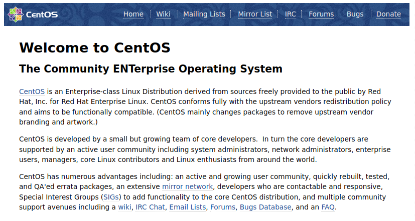
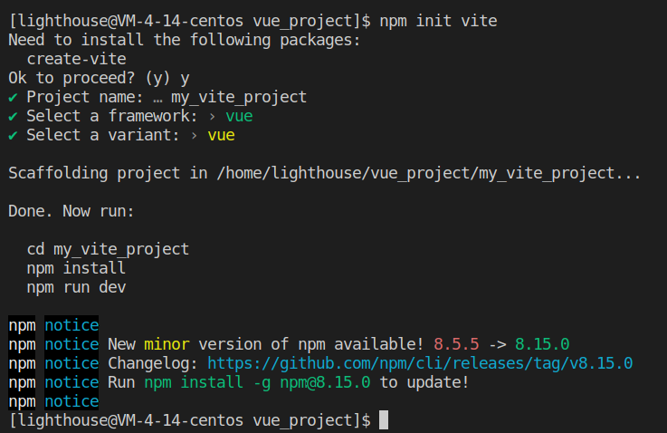
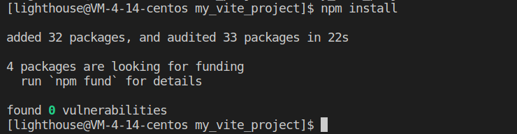
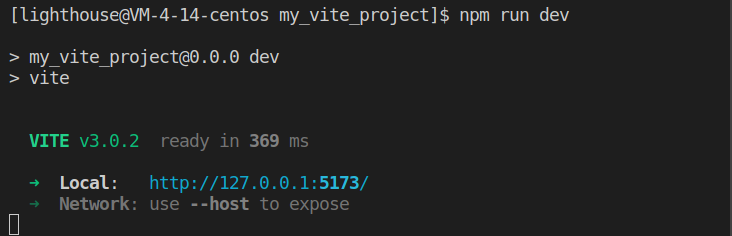
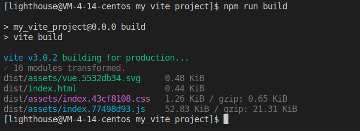
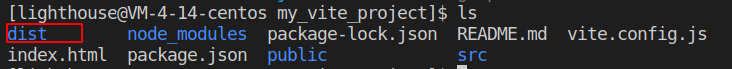
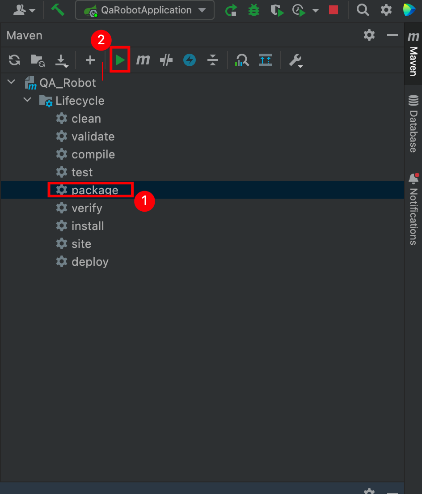

## 前言

本项目为个人实践项目，按实验室老师要求将项目部署上云服务器，主要实现基本的网站结构和api交互，使用nginx进行反向代理，提供web服务，后端使用spring架构。

开发环境如下，

云服务器 Ubuntu

本地 vscode，MacOS，idea

## Nginx配置

版本 Nginx Open Source

官方文档 https://docs.nginx.com/nginx/admin-guide/installing-nginx/installing-nginx-open-source/

>  一键安装

```bash
sudo apt install -y nginx
```

> 手动安装方法（https://blog.csdn.net/lsygood/article/details/）（不推荐）

大致说下做法

先安装依赖

```bash
apt install -y gcc pcre pcre-devel zlib zlib-devel openssl openssl-devel
```

到这下一个nginx压缩包 http://nginx.org/

解压之后进入该文件夹

然后

```bash
# 执行命令
./configure
# 执行make命令
make
# 执行make install命令
make install
#进入nginx启动目录启动
./nginx
```

> 查看版本

```bash
sudo nginx -v
```

```
out:
nginx version: nginx/1.20.1
```


> 修改/etc/nginx 下的nginx.conf文件，手动安装的在conf文件夹下面

```
    server {
        listen       9000; # 改为你想要的端口号
        listen       [::]:9000; # 改为你想要的端口号
        server_name  _;
        root         /usr/share/nginx/html;

        # Load configuration files for the default server block.
        include /etc/nginx/default.d/*.conf;

        error_page 404 /404.html;
        location = /404.html {
        }

        error_page 500 502 503 504 /50x.html;
        location = /50x.html {
        }
    }
```

> 重启nginx

```bash
sudo nginx -s reload
```

> 打开浏览器访问http://浏览器ip:9000（你设置的端口号）



不是无法访问就行，这个页面对应配置文件里root变量对应文件夹下的哪个index.html里的内容。


> 其他命令（调试使用）

```bash
# 干掉所有的nginx进程
killall -9 nginx
# 查看所有监听端口的进程
netstat -nltp
# 查看所有进程
ps -aux
```

## 创建Vite项目

注：如果本地已有vite项目，请在vite项目环境下直接创建dist即可。

具体操作如下

```bash

# 第一步
## 删除node_modules文件夹和package-lock.json文件

# 第二步
## 安装依赖(需要安装nodejs)
npm install --unsafe-perm --registry=https://registry.npm.taobao.org

# 第三步
## 启动项目(需要知道可执行的东西有哪些，在package.json里有声明serve)
npm run serve
```

使用vue编写前端页面

> 创建vite项目

```bash
npm init vite
```

一路回车并按如下选择



创建成功

> 进入vite项目中安装依赖

```bash
cd my_vite_project/
npm install
```



安装完成……

> 启动vite项目

```bash
npm run dev
```



点击链接


出现如上页面，证明访问成功


> 创建dist

```bash
npm run build
```



创建成功之后在my_vite_project 目录下会产生一个dist目录,



后续我们将nginx的root路径指向这个目录即可。

> 修改/etc/nginx 下的nginx.conf文件，手动安装的在conf文件夹下面

```conf
……
# 更改nginx的user为有权限访问vite项目的用户
user lighthouse; # 改为你的用户名
……
# server部分
server {
        listen       9000;
        listen       [::]:9000;
        server_name  _;
        root         /home/lighthouse/vue_project/my_vite_project/dist; # 修改这个路径为你项目地址的dist目录
        try_files $uri $uri/ /index.html # 加上这句便可以在网址后面接目录

        # Load configuration files for the default server block.
        include /etc/nginx/default.d/*.conf;

        error_page 404 /404.html;
        location = /404.html {
        }

        error_page 500 502 503 504 /50x.html;
        location = /50x.html {
        }
    }
……
```


> 重启nginx

```bash
sudo nginx -s reload
```

## Mysql配置

如果没有mysql，到官网下载https://www.mysql.com/，然后按说明安装即可

### 有mysql，密码未知

如果有mysql（云服务器一般自带mysql），不知道密码的话，按照以下步骤

> 到mysql的安装目录下，找到my.cnf文件，一般是/etc/mysql，可以用whereis mysql命令查找，添加如下配置

```conf
[mysqld]
skip-grant-tables
```

> 重启mysql服务

```bash
sudo service mysql restart
```

> 进入mysql，输入以下指令回车即可，以root登录

```bash
mysql -uroot -p
```

> 修改root密码为   kkk_123

#### 此处有坑，mysql 8.0版本以下

```sql
mysql> USE mysql;
mysql> UPDATE user SET authentication_string=password('Kkk_123') WHERE User='root';
mysql> flush privileges;
mysql> quit

```

>  重启mysql服务

```bash
sudo service mysql restart
```

#### 8.0及以上

**此处有坑，host搞清楚，是'localhost'还是'%'，查user表**

```sql
mysql> select User,Host from user;
+------------------+-----------+
| User             | Host      |
+------------------+-----------+
| root             | %         |
| debian-sys-maint | localhost |
| mysql.infoschema | localhost |
| mysql.session    | localhost |
| mysql.sys        | localhost |
+------------------+-----------+
5 rows in set (0.00 sec)
```

> 首先置空密码

```sql
mysql> USE mysql;
mysql> UPDATE user SET authentication_string='' where USE='root';
```

> 然后到mysql的安装目录下，找到my.cnf文件，一般是/etc/mysql，可以用whereis mysql命令查找，将刚刚指定的跳过验证注释掉

```conf
#[mysqld]
#skip-grant-tables
```

>  重启mysql服务

```bash
sudo service mysql restart
```

> 由于密码时空，所以也可以直接进入mysql

```bash
sudo mysql -uroot
```

> 重置密码为Kkk_123

```sql
mysql> alter user 'root'@'%' identified by 'Kkk_123';
```

>  重启mysql服务

```bash
sudo service mysql restart
```

> 用刚刚的密码登录mysql

```bash
sudo mysql -uroot -pKkk_123
```

成功。


## 后端配置


使用idea将写好的项目打一个jar包



在项目文件的target文件夹中找到生成的jar包，并运行。


配置完成。
