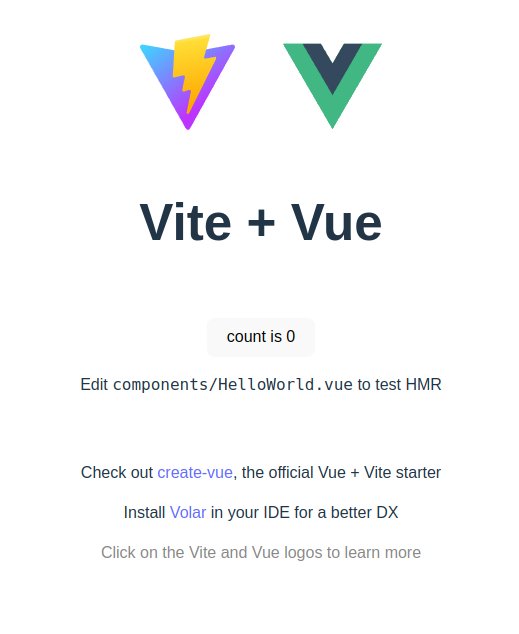

## 前言

本项目为个人实践项目，按实验室老师要求将项目部署上云服务器，主要实现基本的网站结构和api交互，使用nginx进行反向代理，tomcat提供web服务，后端使用spring架构。

开发环境如下，

云服务器 Centos7.6

本地 vscode, MacOS

## Nginx配置

版本 Nginx Open Source

官方文档 https://docs.nginx.com/nginx/admin-guide/installing-nginx/installing-nginx-open-source/

>  一键安装

```bash
sudo yum install -y nginx
```

```bash
sudo nginx -v
```

```
out:
nginx version: nginx/1.20.1
```


> 修改/etc/nginx 下的nginx.conf文件

```
    server {
        listen       9000; # 改为你想要的端口号
        listen       [::]:9000; # 改为你想要的端口号
        server_name  _;
        root         /usr/share/nginx/html;

        # Load configuration files for the default server block.
        include /etc/nginx/default.d/*.conf;

        error_page 404 /404.html;
        location = /404.html {
        }

        error_page 500 502 503 504 /50x.html;
        location = /50x.html {
        }
    }
```

> 重启nginx

```bash
sudo nginx -s reload
```

> 打开浏览器访问http://浏览器ip:9000（你设置的端口号）


不是无法访问就行，这个页面对应配置文件里root变量对应文件夹下的哪个index.html里的内容。


> 其他命令（调试使用）

```bash
# 干掉所有的nginx进程
killall -9 nginx
# 查看所有监听端口的进程
netstat -nltp
# 查看所有进程
ps -aux
```

## 创建Vite项目

注：如果本地已有vite项目，请在vite项目环境下直接创建dist即可。

具体操作如下

```bash

# 第一步
## 删除node_modules文件夹和package-lock.json文件

# 第二步
## 安装依赖(需要安装nodejs)
npm install --unsafe-perm --registry=https://registry.npm.taobao.org

# 第三步
## 启动项目(需要知道可执行的东西有哪些，在package.json里有声明serve)
npm run serve
```

使用vue编写前端页面

> 创建vite项目

```bash
npm init vite
```

一路回车并按如下选择


创建成功

> 进入vite项目中安装依赖

```bash
cd my_vite_project/
npm install
```


安装完成……

> 启动vite项目

```bash
npm run dev
```


点击链接



出现如上页面，证明访问成功


> 创建dist

```bash
npm run build
```


创建成功之后在my_vite_project 目录下会产生一个dist目录,


后续我们将nginx的root路径指向这个目录即可。

> 修改/etc/nginx 下的nginx.conf文件

```conf
……
# 更改nginx的user为有权限访问vite项目的用户
user lighthouse; # 改为你的用户名
……
# server部分
server {
        listen       9000;
        listen       [::]:9000;
        server_name  _;
        root         /home/lighthouse/vue_project/my_vite_project/dist; # 修改这个路径为你项目地址的dist目录

        # Load configuration files for the default server block.
        include /etc/nginx/default.d/*.conf;

        error_page 404 /404.html;
        location = /404.html {
        }

        error_page 500 502 503 504 /50x.html;
        location = /50x.html {
        }
    }
……
```


> 重启nginx

```bash
sudo nginx -s reload
```

