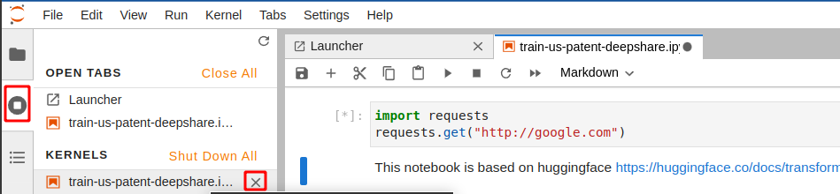

Jupyter 已经被人们广泛使用来作为生产力工具，由于其能够步运行和可视化等，带来了良好的教学和交互体验。

## Jupyter Lab

### 设置代理

#### 方法一（便捷指数1）

不难知道，直接在jupyter的开头写上这句有效。

```python
import os
os.environ['HTTP_PROXY']="http://127.0.0.1:7890"
os.environ['HTTPS_PROXY']="http://127.0.0.1:7890"
import requests
requests.get("http://google.com")
```

> ```
> <Response [200]>
> ```

ok，正常访问。

#### 方法二（便捷指数2）

此方法设置完成后需要重新启动jupyter程序。

将这几行代码写入jupyter对应的配置文件。

```bash
vi ~/.jupyter/jupyter_lab_config.py 
```

```python
import os
os.environ['HTTP_PROXY']="http://127.0.0.1:7890"
os.environ['HTTPS_PROXY']="http://127.0.0.1:7890"
```

#### 方法三（便捷指数3）

[来源](https://www.jayakumar.org/linux/how-to-configure-httphttps-proxy-for-ipython-notebook-server/)

找了很多实现方法，以下方法有效。

因为jupyter是基于ipython模式的，所以在ipython的启动文件中创建如下文件，前缀越小代表优先级越高。

```bash
vi ~/.ipython/profile_default/startup/00-first.py
```

向其中写入

```yaml
import os
os.environ['HTTP_PROXY']="http://127.0.0.1:7890"
os.environ['HTTPS_PROXY']="http://127.0.0.1:7890"
```

然后重新运行notebook，注意要把kernel关掉重开，否则不会执行此文件。



然后每次启动notebook之前就会运行这个文件。

### 将ipynb文件输出为其他格式文件

#### Html

```bash
jupyter nbconvert --to html notebook.ipynb
```

只展示markdown，适用于生成数据分析报告

```bash
jupyter nbconvert --to html --no-input data_analy_4.ipynb
```

#### Markdown

```bash
jupyter nbconvert --to markdown notebook.ipynb
```

#### PDF

```bash
jupyter nbconvert --to pdf notebook.ipynb
```

