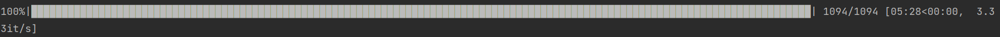
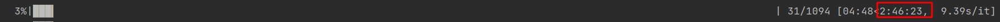

今天是2022年5月19日，忙碌了一上午的小弟激动地开始train了，结果，本来五分钟一轮的乖儿子，





变成了两个多小时，What？！！儿子感冒了吗？

查看儿子占用情况。

```bash
nvidia-smi
```

> ```
> Failed to initialize NVML: Driver/library version mismatch
> ```

What？！！看看儿子的内核版本

```bash
 cat /proc/driver/nvidia/version
```

>```
>NVRM version: NVIDIA UNIX x86_64 Kernel Module  510.60.02  Wed Mar 16 11:24:05 UTC 2022
>GCC version:  gcc version 11.2.0 (Ubuntu 11.2.0-7ubuntu2) 
>```

看看儿子翻滚日记

```bash
cat /var/log/dpkg.log | grep nvidia
```

> ```
> 2022-05-19 06:04:29 upgrade nvidia-driver-510:amd64 510.60.02-0ubuntu0.21.10.2 510.73.05-0ubuntu0.21.10.1
> 2022-05-19 06:04:29 status half-configured nvidia-driver-510:amd64 510.60.02-0ubuntu0.21.10.2
> 2022-05-19 06:04:29 status unpacked nvidia-driver-510:amd64 510.60.02-0ubuntu0.21.10.2
> 2022-05-19 06:04:29 status half-installed nvidia-driver-510:amd64 510.60.02-0ubuntu0.21.10.2
> 2022-05-19 06:04:29 status unpacked nvidia-driver-510:amd64 510.73.05-0ubuntu0.21.10.1
> 2022-05-19 06:04:29 upgrade libnvidia-gl-510:amd64 510.60.02-0ubuntu0.21.10.2 510.73.05-0ubuntu0.21.10.1
> 2022-05-19 06:04:29 status half-configured libnvidia-gl-510:amd64 510.60.02-0ubuntu0.21.10.2
> 2022-05-19 06:04:29 status unpacked libnvidia-gl-510:amd64 510.60.02-0ubuntu0.21.10.2
> 2022-05-19 06:04:29 status half-configured libnvidia-gl-510:i386 510.60.02-0ubuntu0.21.10.2
> 2022-05-19 06:04:29 status half-installed libnvidia-gl-510:amd64 510.60.02-0ubuntu0.21.10.2
> 2022-05-19 06:04:30 status unpacked libnvidia-gl-510:amd64 510.73.05-0ubuntu0.21.10.1
> 2022-05-19 06:04:30 upgrade libnvidia-gl-510:i386 510.60.02-0ubuntu0.21.10.2 510.73.05-0ubuntu0.21.10.1
> 2022-05-19 06:04:30 status unpacked libnvidia-gl-510:i386 510.60.02-0ubuntu0.21.10.2
> 2022-05-19 06:04:30 status half-installed libnvidia-gl-510:i386 510.60.02-0ubuntu0.21.10.2
> 2022-05-19 06:04:31 status unpacked libnvidia-gl-510:i386 510.73.05-0ubuntu0.21.10.1
> 2022-05-19 06:04:31 upgrade nvidia-dkms-510:amd64 510.60.02-0ubuntu0.21.10.2 510.73.05-0ubuntu0.21.10.1
> 2022-05-19 06:04:31 status half-configured nvidia-dkms-510:amd64 510.60.02-0ubuntu0.21.10.2
> 2022-05-19 06:04:41 status unpacked nvidia-dkms-510:amd64 510.60.02-0ubuntu0.21.10.2
> 2022-05-19 06:04:41 status half-installed nvidia-dkms-510:amd64 510.60.02-0ubuntu0.21.10.2
> 2022-05-19 06:04:41 status unpacked nvidia-dkms-510:amd64 510.73.05-0ubuntu0.21.10.1
> 2022-05-19 06:04:41 upgrade nvidia-kernel-source-510:amd64 510.60.02-0ubuntu0.21.10.2 510.73.05-0ubuntu0.21.10.1
> 2022-05-19 06:04:41 status half-configured nvidia-kernel-source-510:amd64 510.60.02-0ubuntu0.21.10.2
> 2022-05-19 06:04:41 status unpacked nvidia-kernel-source-510:amd64 510.60.02-0ubuntu0.21.10.2
> 2022-05-19 06:04:41 status half-installed nvidia-kernel-source-510:amd64 510.60.02-0ubuntu0.21.10.2
> 2022-05-19 06:04:41 status unpacked nvidia-kernel-source-510:amd64 510.73.05-0ubuntu0.21.10.1
> 2022-05-19 06:04:41 upgrade nvidia-kernel-common-510:amd64 510.60.02-0ubuntu0.21.10.2 510.73.05-0ubuntu0.21.10.1
> 2022-05-19 06:04:41 status half-configured nvidia-kernel-common-510:amd64 510.60.02-0ubuntu0.21.10.2
> 2022-05-19 06:04:41 status unpacked nvidia-kernel-common-510:amd64 510.60.02-0ubuntu0.21.10.2
> 2022-05-19 06:04:41 status half-installed nvidia-kernel-common-510:amd64 510.60.02-0ubuntu0.21.10.2
> 2022-05-19 06:04:41 status unpacked nvidia-kernel-common-510:amd64 510.73.05-0ubuntu0.21.10.1
> 2022-05-19 06:04:41 upgrade libnvidia-decode-510:i386 510.60.02-0ubuntu0.21.10.2 510.73.05-0ubuntu0.21.10.1
> 2022-05-19 06:04:41 status half-configured libnvidia-decode-510:i386 510.60.02-0ubuntu0.21.10.2
> 2022-05-19 06:04:41 status unpacked libnvidia-decode-510:i386 510.60.02-0ubuntu0.21.10.2
> 2022-05-19 06:04:41 status half-configured libnvidia-decode-510:amd64 510.60.02-0ubuntu0.21.10.2
> 2022-05-19 06:04:41 status half-installed libnvidia-decode-510:i386 510.60.02-0ubuntu0.21.10.2
> 2022-05-19 06:04:41 status unpacked libnvidia-decode-510:i386 510.73.05-0ubuntu0.21.10.1
> 2022-05-19 06:04:41 upgrade libnvidia-decode-510:amd64 510.60.02-0ubuntu0.21.10.2 510.73.05-0ubuntu0.21.10.1
> 2022-05-19 06:04:41 status unpacked libnvidia-decode-510:amd64 510.60.02-0ubuntu0.21.10.2
> 2022-05-19 06:04:41 status half-installed libnvidia-decode-510:amd64 510.60.02-0ubuntu0.21.10.2
> 2022-05-19 06:04:42 status unpacked libnvidia-decode-510:amd64 510.73.05-0ubuntu0.21.10.1
> 2022-05-19 06:04:42 upgrade libnvidia-compute-510:amd64 510.60.02-0ubuntu0.21.10.2 510.73.05-0ubuntu0.21.10.1
> 2022-05-19 06:04:42 status half-configured libnvidia-compute-510:amd64 510.60.02-0ubuntu0.21.10.2
> 2022-05-19 06:04:42 status unpacked libnvidia-compute-510:amd64 510.60.02-0ubuntu0.21.10.2
> 2022-05-19 06:04:42 status half-configured libnvidia-compute-510:i386 510.60.02-0ubuntu0.21.10.2
> 2022-05-19 06:04:42 status half-installed libnvidia-compute-510:amd64 510.60.02-0ubuntu0.21.10.2
> 2022-05-19 06:04:42 status unpacked libnvidia-compute-510:amd64 510.73.05-0ubuntu0.21.10.1
> 2022-05-19 06:04:42 upgrade libnvidia-compute-510:i386 510.60.02-0ubuntu0.21.10.2 510.73.05-0ubuntu0.21.10.1
> 2022-05-19 06:04:42 status unpacked libnvidia-compute-510:i386 510.60.02-0ubuntu0.21.10.2
> 2022-05-19 06:04:42 status half-installed libnvidia-compute-510:i386 510.60.02-0ubuntu0.21.10.2
> 2022-05-19 06:04:42 status unpacked libnvidia-compute-510:i386 510.73.05-0ubuntu0.21.10.1
> 2022-05-19 06:04:42 upgrade libnvidia-extra-510:amd64 510.60.02-0ubuntu0.21.10.2 510.73.05-0ubuntu0.21.10.1
> 2022-05-19 06:04:42 status half-configured libnvidia-extra-510:amd64 510.60.02-0ubuntu0.21.10.2
> 2022-05-19 06:04:42 status unpacked libnvidia-extra-510:amd64 510.60.02-0ubuntu0.21.10.2
> 2022-05-19 06:04:42 status half-installed libnvidia-extra-510:amd64 510.60.02-0ubuntu0.21.10.2
> 2022-05-19 06:04:42 status unpacked libnvidia-extra-510:amd64 510.73.05-0ubuntu0.21.10.1
> 2022-05-19 06:04:43 upgrade nvidia-compute-utils-510:amd64 510.60.02-0ubuntu0.21.10.2 510.73.05-0ubuntu0.21.10.1
> 2022-05-19 06:04:43 status half-configured nvidia-compute-utils-510:amd64 510.60.02-0ubuntu0.21.10.2
> 2022-05-19 06:04:43 status unpacked nvidia-compute-utils-510:amd64 510.60.02-0ubuntu0.21.10.2
> 2022-05-19 06:04:43 status half-installed nvidia-compute-utils-510:amd64 510.60.02-0ubuntu0.21.10.2
> 2022-05-19 06:04:43 status unpacked nvidia-compute-utils-510:amd64 510.73.05-0ubuntu0.21.10.1
> 2022-05-19 06:04:43 upgrade libnvidia-encode-510:amd64 510.60.02-0ubuntu0.21.10.2 510.73.05-0ubuntu0.21.10.1
> 2022-05-19 06:04:43 status half-configured libnvidia-encode-510:amd64 510.60.02-0ubuntu0.21.10.2
> 2022-05-19 06:04:43 status unpacked libnvidia-encode-510:amd64 510.60.02-0ubuntu0.21.10.2
> 2022-05-19 06:04:43 status half-configured libnvidia-encode-510:i386 510.60.02-0ubuntu0.21.10.2
> 2022-05-19 06:04:43 status half-installed libnvidia-encode-510:amd64 510.60.02-0ubuntu0.21.10.2
> 2022-05-19 06:04:43 status unpacked libnvidia-encode-510:amd64 510.73.05-0ubuntu0.21.10.1
> 2022-05-19 06:04:43 upgrade libnvidia-encode-510:i386 510.60.02-0ubuntu0.21.10.2 510.73.05-0ubuntu0.21.10.1
> 2022-05-19 06:04:43 status unpacked libnvidia-encode-510:i386 510.60.02-0ubuntu0.21.10.2
> 2022-05-19 06:04:43 status half-installed libnvidia-encode-510:i386 510.60.02-0ubuntu0.21.10.2
> 2022-05-19 06:04:43 status unpacked libnvidia-encode-510:i386 510.73.05-0ubuntu0.21.10.1
> 2022-05-19 06:04:43 upgrade nvidia-utils-510:amd64 510.60.02-0ubuntu0.21.10.2 510.73.05-0ubuntu0.21.10.1
> 2022-05-19 06:04:43 status half-configured nvidia-utils-510:amd64 510.60.02-0ubuntu0.21.10.2
> 2022-05-19 06:04:43 status unpacked nvidia-utils-510:amd64 510.60.02-0ubuntu0.21.10.2
> 2022-05-19 06:04:43 status half-installed nvidia-utils-510:amd64 510.60.02-0ubuntu0.21.10.2
> 2022-05-19 06:04:43 status unpacked nvidia-utils-510:amd64 510.73.05-0ubuntu0.21.10.1
> 2022-05-19 06:04:43 upgrade xserver-xorg-video-nvidia-510:amd64 510.60.02-0ubuntu0.21.10.2 510.73.05-0ubuntu0.21.10.1
> 2022-05-19 06:04:43 status half-configured xserver-xorg-video-nvidia-510:amd64 510.60.02-0ubuntu0.21.10.2
> 2022-05-19 06:04:43 status unpacked xserver-xorg-video-nvidia-510:amd64 510.60.02-0ubuntu0.21.10.2
> 2022-05-19 06:04:43 status half-installed xserver-xorg-video-nvidia-510:amd64 510.60.02-0ubuntu0.21.10.2
> 2022-05-19 06:04:43 status unpacked xserver-xorg-video-nvidia-510:amd64 510.73.05-0ubuntu0.21.10.1
> 2022-05-19 06:04:43 upgrade libnvidia-fbc1-510:amd64 510.60.02-0ubuntu0.21.10.2 510.73.05-0ubuntu0.21.10.1
> 2022-05-19 06:04:43 status half-configured libnvidia-fbc1-510:amd64 510.60.02-0ubuntu0.21.10.2
> 2022-05-19 06:04:43 status unpacked libnvidia-fbc1-510:amd64 510.60.02-0ubuntu0.21.10.2
> 2022-05-19 06:04:43 status half-configured libnvidia-fbc1-510:i386 510.60.02-0ubuntu0.21.10.2
> 2022-05-19 06:04:43 status half-installed libnvidia-fbc1-510:amd64 510.60.02-0ubuntu0.21.10.2
> 2022-05-19 06:04:43 status unpacked libnvidia-fbc1-510:amd64 510.73.05-0ubuntu0.21.10.1
> 2022-05-19 06:04:43 upgrade libnvidia-fbc1-510:i386 510.60.02-0ubuntu0.21.10.2 510.73.05-0ubuntu0.21.10.1
> 2022-05-19 06:04:43 status unpacked libnvidia-fbc1-510:i386 510.60.02-0ubuntu0.21.10.2
> 2022-05-19 06:04:43 status half-installed libnvidia-fbc1-510:i386 510.60.02-0ubuntu0.21.10.2
> 2022-05-19 06:04:43 status unpacked libnvidia-fbc1-510:i386 510.73.05-0ubuntu0.21.10.1
> 2022-05-19 06:04:43 upgrade libnvidia-cfg1-510:amd64 510.60.02-0ubuntu0.21.10.2 510.73.05-0ubuntu0.21.10.1
> 2022-05-19 06:04:43 status half-configured libnvidia-cfg1-510:amd64 510.60.02-0ubuntu0.21.10.2
> 2022-05-19 06:04:43 status unpacked libnvidia-cfg1-510:amd64 510.60.02-0ubuntu0.21.10.2
> 2022-05-19 06:04:43 status half-installed libnvidia-cfg1-510:amd64 510.60.02-0ubuntu0.21.10.2
> 2022-05-19 06:04:43 status unpacked libnvidia-cfg1-510:amd64 510.73.05-0ubuntu0.21.10.1
> 2022-05-19 06:04:43 configure libnvidia-compute-510:amd64 510.73.05-0ubuntu0.21.10.1 <none>
> 2022-05-19 06:04:43 status unpacked libnvidia-compute-510:amd64 510.73.05-0ubuntu0.21.10.1
> 2022-05-19 06:04:43 status half-configured libnvidia-compute-510:amd64 510.73.05-0ubuntu0.21.10.1
> 2022-05-19 06:04:43 status installed libnvidia-compute-510:amd64 510.73.05-0ubuntu0.21.10.1
> 2022-05-19 06:04:43 configure libnvidia-compute-510:i386 510.73.05-0ubuntu0.21.10.1 <none>
> 2022-05-19 06:04:43 status unpacked libnvidia-compute-510:i386 510.73.05-0ubuntu0.21.10.1
> 2022-05-19 06:04:43 status half-configured libnvidia-compute-510:i386 510.73.05-0ubuntu0.21.10.1
> 2022-05-19 06:04:43 status installed libnvidia-compute-510:i386 510.73.05-0ubuntu0.21.10.1
> 2022-05-19 06:04:43 configure libnvidia-gl-510:amd64 510.73.05-0ubuntu0.21.10.1 <none>
> 2022-05-19 06:04:43 status unpacked libnvidia-gl-510:amd64 510.73.05-0ubuntu0.21.10.1
> 2022-05-19 06:04:43 status half-configured libnvidia-gl-510:amd64 510.73.05-0ubuntu0.21.10.1
> 2022-05-19 06:04:43 status installed libnvidia-gl-510:amd64 510.73.05-0ubuntu0.21.10.1
> 2022-05-19 06:04:43 configure libnvidia-gl-510:i386 510.73.05-0ubuntu0.21.10.1 <none>
> 2022-05-19 06:04:43 status unpacked libnvidia-gl-510:i386 510.73.05-0ubuntu0.21.10.1
> 2022-05-19 06:04:43 status half-configured libnvidia-gl-510:i386 510.73.05-0ubuntu0.21.10.1
> 2022-05-19 06:04:43 status installed libnvidia-gl-510:i386 510.73.05-0ubuntu0.21.10.1
> 2022-05-19 06:04:43 configure nvidia-kernel-source-510:amd64 510.73.05-0ubuntu0.21.10.1 <none>
> 2022-05-19 06:04:43 status unpacked nvidia-kernel-source-510:amd64 510.73.05-0ubuntu0.21.10.1
> 2022-05-19 06:04:43 status half-configured nvidia-kernel-source-510:amd64 510.73.05-0ubuntu0.21.10.1
> 2022-05-19 06:04:43 status installed nvidia-kernel-source-510:amd64 510.73.05-0ubuntu0.21.10.1
> 2022-05-19 06:04:43 configure nvidia-utils-510:amd64 510.73.05-0ubuntu0.21.10.1 <none>
> 2022-05-19 06:04:43 status unpacked nvidia-utils-510:amd64 510.73.05-0ubuntu0.21.10.1
> 2022-05-19 06:04:43 status half-configured nvidia-utils-510:amd64 510.73.05-0ubuntu0.21.10.1
> 2022-05-19 06:04:43 status installed nvidia-utils-510:amd64 510.73.05-0ubuntu0.21.10.1
> 2022-05-19 06:04:43 configure libnvidia-cfg1-510:amd64 510.73.05-0ubuntu0.21.10.1 <none>
> 2022-05-19 06:04:43 status unpacked libnvidia-cfg1-510:amd64 510.73.05-0ubuntu0.21.10.1
> 2022-05-19 06:04:43 status half-configured libnvidia-cfg1-510:amd64 510.73.05-0ubuntu0.21.10.1
> 2022-05-19 06:04:43 status installed libnvidia-cfg1-510:amd64 510.73.05-0ubuntu0.21.10.1
> 2022-05-19 06:04:43 configure libnvidia-fbc1-510:amd64 510.73.05-0ubuntu0.21.10.1 <none>
> 2022-05-19 06:04:43 status unpacked libnvidia-fbc1-510:amd64 510.73.05-0ubuntu0.21.10.1
> 2022-05-19 06:04:43 status half-configured libnvidia-fbc1-510:amd64 510.73.05-0ubuntu0.21.10.1
> 2022-05-19 06:04:43 status installed libnvidia-fbc1-510:amd64 510.73.05-0ubuntu0.21.10.1
> 2022-05-19 06:04:43 configure libnvidia-fbc1-510:i386 510.73.05-0ubuntu0.21.10.1 <none>
> 2022-05-19 06:04:43 status unpacked libnvidia-fbc1-510:i386 510.73.05-0ubuntu0.21.10.1
> 2022-05-19 06:04:43 status half-configured libnvidia-fbc1-510:i386 510.73.05-0ubuntu0.21.10.1
> 2022-05-19 06:04:43 status installed libnvidia-fbc1-510:i386 510.73.05-0ubuntu0.21.10.1
> 2022-05-19 06:04:43 configure nvidia-compute-utils-510:amd64 510.73.05-0ubuntu0.21.10.1 <none>
> 2022-05-19 06:04:43 status unpacked nvidia-compute-utils-510:amd64 510.73.05-0ubuntu0.21.10.1
> 2022-05-19 06:04:43 status half-configured nvidia-compute-utils-510:amd64 510.73.05-0ubuntu0.21.10.1
> 2022-05-19 06:04:43 status installed nvidia-compute-utils-510:amd64 510.73.05-0ubuntu0.21.10.1
> 2022-05-19 06:04:43 configure libnvidia-extra-510:amd64 510.73.05-0ubuntu0.21.10.1 <none>
> 2022-05-19 06:04:43 status unpacked libnvidia-extra-510:amd64 510.73.05-0ubuntu0.21.10.1
> 2022-05-19 06:04:43 status half-configured libnvidia-extra-510:amd64 510.73.05-0ubuntu0.21.10.1
> 2022-05-19 06:04:43 status installed libnvidia-extra-510:amd64 510.73.05-0ubuntu0.21.10.1
> 2022-05-19 06:04:43 configure libnvidia-decode-510:amd64 510.73.05-0ubuntu0.21.10.1 <none>
> 2022-05-19 06:04:43 status unpacked libnvidia-decode-510:amd64 510.73.05-0ubuntu0.21.10.1
> 2022-05-19 06:04:43 status half-configured libnvidia-decode-510:amd64 510.73.05-0ubuntu0.21.10.1
> 2022-05-19 06:04:43 status installed libnvidia-decode-510:amd64 510.73.05-0ubuntu0.21.10.1
> 2022-05-19 06:04:43 configure libnvidia-decode-510:i386 510.73.05-0ubuntu0.21.10.1 <none>
> 2022-05-19 06:04:43 status unpacked libnvidia-decode-510:i386 510.73.05-0ubuntu0.21.10.1
> 2022-05-19 06:04:43 status half-configured libnvidia-decode-510:i386 510.73.05-0ubuntu0.21.10.1
> 2022-05-19 06:04:43 status installed libnvidia-decode-510:i386 510.73.05-0ubuntu0.21.10.1
> 2022-05-19 06:04:43 configure nvidia-kernel-common-510:amd64 510.73.05-0ubuntu0.21.10.1 <none>
> 2022-05-19 06:04:43 status unpacked nvidia-kernel-common-510:amd64 510.73.05-0ubuntu0.21.10.1
> 2022-05-19 06:04:43 status half-configured nvidia-kernel-common-510:amd64 510.73.05-0ubuntu0.21.10.1
> 2022-05-19 06:04:44 status installed nvidia-kernel-common-510:amd64 510.73.05-0ubuntu0.21.10.1
> 2022-05-19 06:04:44 configure xserver-xorg-video-nvidia-510:amd64 510.73.05-0ubuntu0.21.10.1 <none>
> 2022-05-19 06:04:44 status unpacked xserver-xorg-video-nvidia-510:amd64 510.73.05-0ubuntu0.21.10.1
> 2022-05-19 06:04:44 status half-configured xserver-xorg-video-nvidia-510:amd64 510.73.05-0ubuntu0.21.10.1
> 2022-05-19 06:04:44 status installed xserver-xorg-video-nvidia-510:amd64 510.73.05-0ubuntu0.21.10.1
> 2022-05-19 06:04:44 configure nvidia-dkms-510:amd64 510.73.05-0ubuntu0.21.10.1 <none>
> 2022-05-19 06:04:44 status unpacked nvidia-dkms-510:amd64 510.73.05-0ubuntu0.21.10.1
> 2022-05-19 06:04:44 status half-configured nvidia-dkms-510:amd64 510.73.05-0ubuntu0.21.10.1
> 2022-05-19 06:04:58 status installed nvidia-dkms-510:amd64 510.73.05-0ubuntu0.21.10.1
> 2022-05-19 06:04:58 configure libnvidia-encode-510:amd64 510.73.05-0ubuntu0.21.10.1 <none>
> 2022-05-19 06:04:58 status unpacked libnvidia-encode-510:amd64 510.73.05-0ubuntu0.21.10.1
> 2022-05-19 06:04:58 status half-configured libnvidia-encode-510:amd64 510.73.05-0ubuntu0.21.10.1
> 2022-05-19 06:04:58 status installed libnvidia-encode-510:amd64 510.73.05-0ubuntu0.21.10.1
> 2022-05-19 06:04:58 configure libnvidia-encode-510:i386 510.73.05-0ubuntu0.21.10.1 <none>
> 2022-05-19 06:04:58 status unpacked libnvidia-encode-510:i386 510.73.05-0ubuntu0.21.10.1
> 2022-05-19 06:04:58 status half-configured libnvidia-encode-510:i386 510.73.05-0ubuntu0.21.10.1
> 2022-05-19 06:04:58 status installed libnvidia-encode-510:i386 510.73.05-0ubuntu0.21.10.1
> 2022-05-19 06:04:58 configure nvidia-driver-510:amd64 510.73.05-0ubuntu0.21.10.1 <none>
> 2022-05-19 06:04:58 status unpacked nvidia-driver-510:amd64 510.73.05-0ubuntu0.21.10.1
> 2022-05-19 06:04:58 status half-configured nvidia-driver-510:amd64 510.73.05-0ubuntu0.21.10.1
> 2022-05-19 06:04:58 status installed nvidia-driver-510:amd64 510.73.05-0ubuntu0.21.10.1
> 2022-05-19 06:05:27 upgrade nvidia-kernel-source-495:amd64 510.60.02-0ubuntu0.21.10.2 510.73.05-0ubuntu0.21.10.1
> 2022-05-19 06:05:27 status half-configured nvidia-kernel-source-495:amd64 510.60.02-0ubuntu0.21.10.2
> 2022-05-19 06:05:27 status unpacked nvidia-kernel-source-495:amd64 510.60.02-0ubuntu0.21.10.2
> 2022-05-19 06:05:27 status half-installed nvidia-kernel-source-495:amd64 510.60.02-0ubuntu0.21.10.2
> 2022-05-19 06:05:27 status unpacked nvidia-kernel-source-495:amd64 510.73.05-0ubuntu0.21.10.1
> 2022-05-19 06:05:27 configure nvidia-kernel-source-495:amd64 510.73.05-0ubuntu0.21.10.1 <none>
> 2022-05-19 06:05:27 status unpacked nvidia-kernel-source-495:amd64 510.73.05-0ubuntu0.21.10.1
> 2022-05-19 06:05:27 status half-configured nvidia-kernel-source-495:amd64 510.73.05-0ubuntu0.21.10.1
> 2022-05-19 06:05:27 status installed nvidia-kernel-source-495:amd64 510.73.05-0ubuntu0.21.10.1
> 2022-05-19 06:05:32 upgrade nvidia-dkms-495:amd64 510.60.02-0ubuntu0.21.10.2 510.73.05-0ubuntu0.21.10.1
> 2022-05-19 06:05:32 status half-configured nvidia-dkms-495:amd64 510.60.02-0ubuntu0.21.10.2
> 2022-05-19 06:05:32 status unpacked nvidia-dkms-495:amd64 510.60.02-0ubuntu0.21.10.2
> 2022-05-19 06:05:32 status half-installed nvidia-dkms-495:amd64 510.60.02-0ubuntu0.21.10.2
> 2022-05-19 06:05:32 status unpacked nvidia-dkms-495:amd64 510.73.05-0ubuntu0.21.10.1
> 2022-05-19 06:05:32 configure nvidia-dkms-495:amd64 510.73.05-0ubuntu0.21.10.1 <none>
> 2022-05-19 06:05:32 status unpacked nvidia-dkms-495:amd64 510.73.05-0ubuntu0.21.10.1
> 2022-05-19 06:05:32 status half-configured nvidia-dkms-495:amd64 510.73.05-0ubuntu0.21.10.1
> 2022-05-19 06:05:32 status installed nvidia-dkms-495:amd64 510.73.05-0ubuntu0.21.10.1
> 2022-05-19 06:05:41 upgrade nvidia-utils-495:amd64 510.60.02-0ubuntu0.21.10.2 510.73.05-0ubuntu0.21.10.1
> 2022-05-19 06:05:41 status half-configured nvidia-utils-495:amd64 510.60.02-0ubuntu0.21.10.2
> 2022-05-19 06:05:41 status unpacked nvidia-utils-495:amd64 510.60.02-0ubuntu0.21.10.2
> 2022-05-19 06:05:41 status half-installed nvidia-utils-495:amd64 510.60.02-0ubuntu0.21.10.2
> 2022-05-19 06:05:41 status unpacked nvidia-utils-495:amd64 510.73.05-0ubuntu0.21.10.1
> 2022-05-19 06:05:41 configure nvidia-utils-495:amd64 510.73.05-0ubuntu0.21.10.1 <none>
> 2022-05-19 06:05:41 status unpacked nvidia-utils-495:amd64 510.73.05-0ubuntu0.21.10.1
> 2022-05-19 06:05:41 status half-configured nvidia-utils-495:amd64 510.73.05-0ubuntu0.21.10.1
> 2022-05-19 06:05:41 status installed nvidia-utils-495:amd64 510.73.05-0ubuntu0.21.10.1
> 2022-05-19 06:05:43 upgrade xserver-xorg-video-nvidia-495:amd64 510.60.02-0ubuntu0.21.10.2 510.73.05-0ubuntu0.21.10.1
> 2022-05-19 06:05:43 status half-configured xserver-xorg-video-nvidia-495:amd64 510.60.02-0ubuntu0.21.10.2
> 2022-05-19 06:05:43 status unpacked xserver-xorg-video-nvidia-495:amd64 510.60.02-0ubuntu0.21.10.2
> 2022-05-19 06:05:43 status half-installed xserver-xorg-video-nvidia-495:amd64 510.60.02-0ubuntu0.21.10.2
> 2022-05-19 06:05:43 status unpacked xserver-xorg-video-nvidia-495:amd64 510.73.05-0ubuntu0.21.10.1
> 2022-05-19 06:05:43 configure xserver-xorg-video-nvidia-495:amd64 510.73.05-0ubuntu0.21.10.1 <none>
> 2022-05-19 06:05:43 status unpacked xserver-xorg-video-nvidia-495:amd64 510.73.05-0ubuntu0.21.10.1
> 2022-05-19 06:05:43 status half-configured xserver-xorg-video-nvidia-495:amd64 510.73.05-0ubuntu0.21.10.1
> 2022-05-19 06:05:43 status installed xserver-xorg-video-nvidia-495:amd64 510.73.05-0ubuntu0.21.10.1
> 2022-05-19 06:05:46 upgrade libnvidia-fbc1-495:amd64 510.60.02-0ubuntu0.21.10.2 510.73.05-0ubuntu0.21.10.1
> 2022-05-19 06:05:46 status half-configured libnvidia-fbc1-495:amd64 510.60.02-0ubuntu0.21.10.2
> 2022-05-19 06:05:46 status unpacked libnvidia-fbc1-495:amd64 510.60.02-0ubuntu0.21.10.2
> 2022-05-19 06:05:46 status half-installed libnvidia-fbc1-495:amd64 510.60.02-0ubuntu0.21.10.2
> 2022-05-19 06:05:46 status unpacked libnvidia-fbc1-495:amd64 510.73.05-0ubuntu0.21.10.1
> 2022-05-19 06:05:46 configure libnvidia-fbc1-495:amd64 510.73.05-0ubuntu0.21.10.1 <none>
> 2022-05-19 06:05:46 status unpacked libnvidia-fbc1-495:amd64 510.73.05-0ubuntu0.21.10.1
> 2022-05-19 06:05:46 status half-configured libnvidia-fbc1-495:amd64 510.73.05-0ubuntu0.21.10.1
> 2022-05-19 06:05:46 status installed libnvidia-fbc1-495:amd64 510.73.05-0ubuntu0.21.10.1
> 2022-05-19 06:05:48 upgrade libnvidia-gl-495:amd64 510.60.02-0ubuntu0.21.10.2 510.73.05-0ubuntu0.21.10.1
> 2022-05-19 06:05:48 status half-configured libnvidia-gl-495:amd64 510.60.02-0ubuntu0.21.10.2
> 2022-05-19 06:05:48 status unpacked libnvidia-gl-495:amd64 510.60.02-0ubuntu0.21.10.2
> 2022-05-19 06:05:48 status half-installed libnvidia-gl-495:amd64 510.60.02-0ubuntu0.21.10.2
> 2022-05-19 06:05:48 status unpacked libnvidia-gl-495:amd64 510.73.05-0ubuntu0.21.10.1
> 2022-05-19 06:05:48 configure libnvidia-gl-495:amd64 510.73.05-0ubuntu0.21.10.1 <none>
> 2022-05-19 06:05:48 status unpacked libnvidia-gl-495:amd64 510.73.05-0ubuntu0.21.10.1
> 2022-05-19 06:05:48 status half-configured libnvidia-gl-495:amd64 510.73.05-0ubuntu0.21.10.1
> 2022-05-19 06:05:48 status installed libnvidia-gl-495:amd64 510.73.05-0ubuntu0.21.10.1
> 2022-05-19 06:05:51 upgrade libnvidia-encode-495:amd64 510.60.02-0ubuntu0.21.10.2 510.73.05-0ubuntu0.21.10.1
> 2022-05-19 06:05:51 status half-configured libnvidia-encode-495:amd64 510.60.02-0ubuntu0.21.10.2
> 2022-05-19 06:05:51 status unpacked libnvidia-encode-495:amd64 510.60.02-0ubuntu0.21.10.2
> 2022-05-19 06:05:51 status half-installed libnvidia-encode-495:amd64 510.60.02-0ubuntu0.21.10.2
> 2022-05-19 06:05:51 status unpacked libnvidia-encode-495:amd64 510.73.05-0ubuntu0.21.10.1
> 2022-05-19 06:05:51 configure libnvidia-encode-495:amd64 510.73.05-0ubuntu0.21.10.1 <none>
> 2022-05-19 06:05:51 status unpacked libnvidia-encode-495:amd64 510.73.05-0ubuntu0.21.10.1
> 2022-05-19 06:05:51 status half-configured libnvidia-encode-495:amd64 510.73.05-0ubuntu0.21.10.1
> 2022-05-19 06:05:51 status installed libnvidia-encode-495:amd64 510.73.05-0ubuntu0.21.10.1
> 2022-05-19 06:05:53 upgrade libnvidia-compute-495:amd64 510.60.02-0ubuntu0.21.10.2 510.73.05-0ubuntu0.21.10.1
> 2022-05-19 06:05:53 status half-configured libnvidia-compute-495:amd64 510.60.02-0ubuntu0.21.10.2
> 2022-05-19 06:05:53 status unpacked libnvidia-compute-495:amd64 510.60.02-0ubuntu0.21.10.2
> 2022-05-19 06:05:53 status half-installed libnvidia-compute-495:amd64 510.60.02-0ubuntu0.21.10.2
> 2022-05-19 06:05:53 status unpacked libnvidia-compute-495:amd64 510.73.05-0ubuntu0.21.10.1
> 2022-05-19 06:05:53 configure libnvidia-compute-495:amd64 510.73.05-0ubuntu0.21.10.1 <none>
> 2022-05-19 06:05:53 status unpacked libnvidia-compute-495:amd64 510.73.05-0ubuntu0.21.10.1
> 2022-05-19 06:05:53 status half-configured libnvidia-compute-495:amd64 510.73.05-0ubuntu0.21.10.1
> 2022-05-19 06:05:53 status installed libnvidia-compute-495:amd64 510.73.05-0ubuntu0.21.10.1
> 2022-05-19 06:05:55 upgrade libnvidia-decode-495:amd64 510.60.02-0ubuntu0.21.10.2 510.73.05-0ubuntu0.21.10.1
> 2022-05-19 06:05:55 status half-configured libnvidia-decode-495:amd64 510.60.02-0ubuntu0.21.10.2
> 2022-05-19 06:05:55 status unpacked libnvidia-decode-495:amd64 510.60.02-0ubuntu0.21.10.2
> 2022-05-19 06:05:55 status half-installed libnvidia-decode-495:amd64 510.60.02-0ubuntu0.21.10.2
> 2022-05-19 06:05:55 status unpacked libnvidia-decode-495:amd64 510.73.05-0ubuntu0.21.10.1
> 2022-05-19 06:05:55 configure libnvidia-decode-495:amd64 510.73.05-0ubuntu0.21.10.1 <none>
> 2022-05-19 06:05:55 status unpacked libnvidia-decode-495:amd64 510.73.05-0ubuntu0.21.10.1
> 2022-05-19 06:05:55 status half-configured libnvidia-decode-495:amd64 510.73.05-0ubuntu0.21.10.1
> 2022-05-19 06:05:55 status installed libnvidia-decode-495:amd64 510.73.05-0ubuntu0.21.10.1
> 2022-05-19 06:05:58 upgrade nvidia-kernel-common-495:amd64 510.60.02-0ubuntu0.21.10.2 510.73.05-0ubuntu0.21.10.1
> 2022-05-19 06:05:58 status half-configured nvidia-kernel-common-495:amd64 510.60.02-0ubuntu0.21.10.2
> 2022-05-19 06:05:58 status unpacked nvidia-kernel-common-495:amd64 510.60.02-0ubuntu0.21.10.2
> 2022-05-19 06:05:58 status half-installed nvidia-kernel-common-495:amd64 510.60.02-0ubuntu0.21.10.2
> 2022-05-19 06:05:58 status unpacked nvidia-kernel-common-495:amd64 510.73.05-0ubuntu0.21.10.1
> 2022-05-19 06:05:58 configure nvidia-kernel-common-495:amd64 510.73.05-0ubuntu0.21.10.1 <none>
> 2022-05-19 06:05:58 status unpacked nvidia-kernel-common-495:amd64 510.73.05-0ubuntu0.21.10.1
> 2022-05-19 06:05:58 status half-configured nvidia-kernel-common-495:amd64 510.73.05-0ubuntu0.21.10.1
> 2022-05-19 06:05:58 status installed nvidia-kernel-common-495:amd64 510.73.05-0ubuntu0.21.10.1
> 2022-05-19 06:06:03 upgrade nvidia-driver-495:amd64 510.60.02-0ubuntu0.21.10.2 510.73.05-0ubuntu0.21.10.1
> 2022-05-19 06:06:03 status half-configured nvidia-driver-495:amd64 510.60.02-0ubuntu0.21.10.2
> 2022-05-19 06:06:03 status unpacked nvidia-driver-495:amd64 510.60.02-0ubuntu0.21.10.2
> 2022-05-19 06:06:03 status half-installed nvidia-driver-495:amd64 510.60.02-0ubuntu0.21.10.2
> 2022-05-19 06:06:03 status unpacked nvidia-driver-495:amd64 510.73.05-0ubuntu0.21.10.1
> 2022-05-19 06:06:03 configure nvidia-driver-495:amd64 510.73.05-0ubuntu0.21.10.1 <none>
> 2022-05-19 06:06:03 status unpacked nvidia-driver-495:amd64 510.73.05-0ubuntu0.21.10.1
> 2022-05-19 06:06:03 status half-configured nvidia-driver-495:amd64 510.73.05-0ubuntu0.21.10.1
> 2022-05-19 06:06:03 status installed nvidia-driver-495:amd64 510.73.05-0ubuntu0.21.10.1
> 2022-05-19 06:06:05 upgrade nvidia-compute-utils-495:amd64 510.60.02-0ubuntu0.21.10.2 510.73.05-0ubuntu0.21.10.1
> 2022-05-19 06:06:05 status half-configured nvidia-compute-utils-495:amd64 510.60.02-0ubuntu0.21.10.2
> 2022-05-19 06:06:05 status unpacked nvidia-compute-utils-495:amd64 510.60.02-0ubuntu0.21.10.2
> 2022-05-19 06:06:05 status half-installed nvidia-compute-utils-495:amd64 510.60.02-0ubuntu0.21.10.2
> 2022-05-19 06:06:05 status unpacked nvidia-compute-utils-495:amd64 510.73.05-0ubuntu0.21.10.1
> 2022-05-19 06:06:05 configure nvidia-compute-utils-495:amd64 510.73.05-0ubuntu0.21.10.1 <none>
> 2022-05-19 06:06:05 status unpacked nvidia-compute-utils-495:amd64 510.73.05-0ubuntu0.21.10.1
> 2022-05-19 06:06:05 status half-configured nvidia-compute-utils-495:amd64 510.73.05-0ubuntu0.21.10.1
> 2022-05-19 06:06:05 status installed nvidia-compute-utils-495:amd64 510.73.05-0ubuntu0.21.10.1
> 2022-05-19 06:06:10 upgrade libnvidia-common-495:all 510.60.02-0ubuntu0.21.10.2 510.73.05-0ubuntu0.21.10.1
> 2022-05-19 06:06:10 status half-configured libnvidia-common-495:all 510.60.02-0ubuntu0.21.10.2
> 2022-05-19 06:06:10 status unpacked libnvidia-common-495:all 510.60.02-0ubuntu0.21.10.2
> 2022-05-19 06:06:10 status half-installed libnvidia-common-495:all 510.60.02-0ubuntu0.21.10.2
> 2022-05-19 06:06:10 status unpacked libnvidia-common-495:all 510.73.05-0ubuntu0.21.10.1
> 2022-05-19 06:06:10 configure libnvidia-common-495:all 510.73.05-0ubuntu0.21.10.1 <none>
> 2022-05-19 06:06:10 status unpacked libnvidia-common-495:all 510.73.05-0ubuntu0.21.10.1
> 2022-05-19 06:06:10 status half-configured libnvidia-common-495:all 510.73.05-0ubuntu0.21.10.1
> 2022-05-19 06:06:10 status installed libnvidia-common-495:all 510.73.05-0ubuntu0.21.10.1
> 2022-05-19 06:06:13 upgrade libnvidia-common-510:all 510.60.02-0ubuntu0.21.10.2 510.73.05-0ubuntu0.21.10.1
> 2022-05-19 06:06:13 status half-configured libnvidia-common-510:all 510.60.02-0ubuntu0.21.10.2
> 2022-05-19 06:06:13 status unpacked libnvidia-common-510:all 510.60.02-0ubuntu0.21.10.2
> 2022-05-19 06:06:13 status half-installed libnvidia-common-510:all 510.60.02-0ubuntu0.21.10.2
> 2022-05-19 06:06:13 status unpacked libnvidia-common-510:all 510.73.05-0ubuntu0.21.10.1
> 2022-05-19 06:06:13 configure libnvidia-common-510:all 510.73.05-0ubuntu0.21.10.1 <none>
> 2022-05-19 06:06:13 status unpacked libnvidia-common-510:all 510.73.05-0ubuntu0.21.10.1
> 2022-05-19 06:06:13 status half-configured libnvidia-common-510:all 510.73.05-0ubuntu0.21.10.1
> 2022-05-19 06:06:13 status installed libnvidia-common-510:all 510.73.05-0ubuntu0.21.10.1
> ```

好儿子，凌晨六点起来翻滚，听我说谢谢你。

现有驱动列表

```bash
sudo dpkg --list | grep nvidia-*
```

>```
>ii  libnvidia-cfg1-510:amd64                   510.73.05-0ubuntu0.21.10.1                 amd64        NVIDIA binary OpenGL/GLX configuration library
>ii  libnvidia-common-495                       510.73.05-0ubuntu0.21.10.1                 all          Transitional package for libnvidia-common-510
>ii  libnvidia-common-510                       510.73.05-0ubuntu0.21.10.1                 all          Shared files used by the NVIDIA libraries
>ii  libnvidia-compute-495:amd64                510.73.05-0ubuntu0.21.10.1                 amd64        Transitional package for libnvidia-compute-510
>ii  libnvidia-compute-510:amd64                510.73.05-0ubuntu0.21.10.1                 amd64        NVIDIA libcompute package
>ii  libnvidia-compute-510:i386                 510.73.05-0ubuntu0.21.10.1                 i386         NVIDIA libcompute package
>ii  libnvidia-decode-495:amd64                 510.73.05-0ubuntu0.21.10.1                 amd64        Transitional package for libnvidia-decode-510
>ii  libnvidia-decode-510:amd64                 510.73.05-0ubuntu0.21.10.1                 amd64        NVIDIA Video Decoding runtime libraries
>ii  libnvidia-decode-510:i386                  510.73.05-0ubuntu0.21.10.1                 i386         NVIDIA Video Decoding runtime libraries
>ii  libnvidia-egl-wayland1:amd64               1:1.1.7-2build1                            amd64        Wayland EGL External Platform library -- shared library
>ii  libnvidia-encode-495:amd64                 510.73.05-0ubuntu0.21.10.1                 amd64        Transitional package for libnvidia-encode-510
>ii  libnvidia-encode-510:amd64                 510.73.05-0ubuntu0.21.10.1                 amd64        NVENC Video Encoding runtime library
>ii  libnvidia-encode-510:i386                  510.73.05-0ubuntu0.21.10.1                 i386         NVENC Video Encoding runtime library
>ii  libnvidia-extra-510:amd64                  510.73.05-0ubuntu0.21.10.1                 amd64        Extra libraries for the NVIDIA driver
>ii  libnvidia-fbc1-495:amd64                   510.73.05-0ubuntu0.21.10.1                 amd64        Transitional package for libnvidia-fbc1-510
>ii  libnvidia-fbc1-510:amd64                   510.73.05-0ubuntu0.21.10.1                 amd64        NVIDIA OpenGL-based Framebuffer Capture runtime library
>ii  libnvidia-fbc1-510:i386                    510.73.05-0ubuntu0.21.10.1                 i386         NVIDIA OpenGL-based Framebuffer Capture runtime library
>ii  libnvidia-gl-495:amd64                     510.73.05-0ubuntu0.21.10.1                 amd64        Transitional package for libnvidia-gl-510
>ii  libnvidia-gl-510:amd64                     510.73.05-0ubuntu0.21.10.1                 amd64        NVIDIA OpenGL/GLX/EGL/GLES GLVND libraries and Vulkan ICD
>ii  libnvidia-gl-510:i386                      510.73.05-0ubuntu0.21.10.1                 i386         NVIDIA OpenGL/GLX/EGL/GLES GLVND libraries and Vulkan ICD
>ii  nvidia-compute-utils-495:amd64             510.73.05-0ubuntu0.21.10.1                 amd64        Transitional package for nvidia-compute-utils-510
>ii  nvidia-compute-utils-510                   510.73.05-0ubuntu0.21.10.1                 amd64        NVIDIA compute utilities
>ii  nvidia-dkms-495                            510.73.05-0ubuntu0.21.10.1                 amd64        Transitional package for nvidia-dkms-510
>ii  nvidia-dkms-510                            510.73.05-0ubuntu0.21.10.1                 amd64        NVIDIA DKMS package
>ii  nvidia-driver-495                          510.73.05-0ubuntu0.21.10.1                 amd64        Transitional package for nvidia-driver-510
>ii  nvidia-driver-510                          510.73.05-0ubuntu0.21.10.1                 amd64        NVIDIA driver metapackage
>ii  nvidia-kernel-common-495:amd64             510.73.05-0ubuntu0.21.10.1                 amd64        Transitional package for nvidia-kernel-common-510
>ii  nvidia-kernel-common-510                   510.73.05-0ubuntu0.21.10.1                 amd64        Shared files used with the kernel module
>ii  nvidia-kernel-source-495                   510.73.05-0ubuntu0.21.10.1                 amd64        Transitional package for nvidia-kernel-source-510
>ii  nvidia-kernel-source-510                   510.73.05-0ubuntu0.21.10.1                 amd64        NVIDIA kernel source package
>ii  nvidia-modprobe                            495.29.05-0ubuntu1                         amd64        Load the NVIDIA kernel driver and create device files
>ii  nvidia-prime                               0.8.17.1                                   all          Tools to enable NVIDIA's Prime
>ii  nvidia-settings                            495.29.05-0ubuntu1                         amd64        Tool for configuring the NVIDIA graphics driver
>ii  nvidia-utils-495:amd64                     510.73.05-0ubuntu0.21.10.1                 amd64        Transitional package for nvidia-utils-510
>ii  nvidia-utils-510                           510.73.05-0ubuntu0.21.10.1                 amd64        NVIDIA driver support binaries
>ii  screen-resolution-extra                    0.18.1                                     all          Extension for the nvidia-settings control panel
>ii  xserver-xorg-video-nvidia-495:amd64        510.73.05-0ubuntu0.21.10.1                 amd64        Transitional package for xserver-xorg-video-nvidia-510
>ii  xserver-xorg-video-nvidia-510              510.73.05-0ubuntu0.21.10.1                 amd64        NVIDIA binary Xorg driver
>
>```

儿子翻滚到了510版本的家，到了小区21.10.1版本，而我们家现在已经是，诶？怎么我家就是

```bash
lsb_release -a
```

> ```
> Distributor ID:	Ubuntu
> Description:	Ubuntu 21.10
> Release:	21.10
> Codename:	impish
> ```

god,please!

==请先保存自己所有的工作，再进行下一步！！！==

```
reboot
```

```bash
nvidia-smi
```

>```
>Thu May 19 10:09:21 2022       
>+-----------------------------------------------------------------------------+
>| NVIDIA-SMI 510.73.05    Driver Version: 510.73.05    CUDA Version: 11.6     |
>|-------------------------------+----------------------+----------------------+
>| GPU  Name        Persistence-M| Bus-Id        Disp.A | Volatile Uncorr. ECC |
>| Fan  Temp  Perf  Pwr:Usage/Cap|         Memory-Usage | GPU-Util  Compute M. |
>|                               |                      |               MIG M. |
>|===============================+======================+======================|
>|   0  NVIDIA GeForce ...  Off  | 00000000:01:00.0  On |                  N/A |
>| 30%   35C    P8    31W / 350W |    227MiB / 24576MiB |      0%      Default |
>|                               |                      |                  N/A |
>+-------------------------------+----------------------+----------------------+
>                                                                               
>+-----------------------------------------------------------------------------+
>| Processes:                                                                  |
>|  GPU   GI   CI        PID   Type   Process name                  GPU Memory |
>|        ID   ID                                                   Usage      |
>|=============================================================================|
>|    0   N/A  N/A      1968      G   /usr/lib/xorg/Xorg                128MiB |
>|    0   N/A  N/A      2224      G   /usr/bin/gnome-shell               69MiB |
>|    0   N/A  N/A      3254      G   ...AAAAAAAAA= --shared-files       27MiB |
>+-----------------------------------------------------------------------------+
>```

剧终
