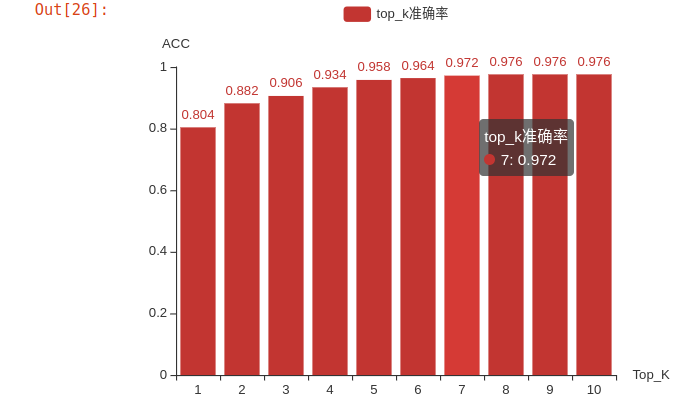
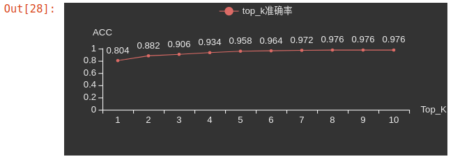
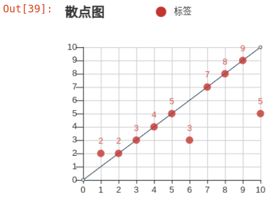

## 简介

pyecharts 的呈现十分美观，尽量搭配jupyternotebook使用，jupyterlab上的显示尚有瑕疵。在使用中，可以将jupyternotebook转为html来静态保存pyecharts的图像，做可视化分析，神秘代码如下

```bash
jupyter nbconvert --to html --no-input data_analy_4.ipynb
```

会生成一个data_analy_4.html，它里面仅仅包含md和输出部分，code部分会被隐藏。

## 使用

作为python的第三方库使用即可，pip install pyecharts

## 图例(基于pyecharts1.9.1)

```python
# =============
# Library
# =============
from pyecharts.charts import Bar,Line,Tab, Grid,Scatter
from pyecharts import options as opts
from pyecharts.globals import ThemeType
```


### 直方图



>  神秘代码

```python
x_data = [1, 2, 3, 4, 5, 6, 7, 8, 9, 10]
y_data = [0.804, 0.882, 0.906, 0.934, 0.958, 0.964, 0.972, 0.976, 0.976, 0.976]

bar = (
    Bar(init_opts=opts.InitOpts(width='400px', height='400px', theme=ThemeType.DARK))
    .add_xaxis(x_data,)
    .add_yaxis("top_k准确率", y_data)
    .set_global_opts(
        xaxis_opts=opts.AxisOpts(
                        name='Top_K'
                    ),
        yaxis_opts=opts.AxisOpts(
                        name='ACC'
                    ),
    )
)

bar.render_notebook()
```

### 折线图



>  神秘代码

```python
x_data = [1, 2, 3, 4, 5, 6, 7, 8, 9, 10]
# 需要注意pyecharts的折线图中x轴的数据需要转为str类型，否则图像会出现偏移
x_data = [str(x) for x in x_data]
y_data = [0.804, 0.882, 0.906, 0.934, 0.958, 0.964, 0.972, 0.976, 0.976, 0.976]

line = (
    Line(init_opts=opts.InitOpts(width='400px', height='400px', theme=ThemeType.DARK))
    .add_xaxis(x_data,)
    .add_yaxis("top_k准确率", y_data, is_smooth=False, is_symbol_show=True)
    .set_global_opts(
        xaxis_opts=opts.AxisOpts(
                        name='Top_K'
                    ),
        yaxis_opts=opts.AxisOpts(
                        name='ACC'
                    ),
    )
)

line.render_notebook()
```

### 散点图



> 神秘代码

```python
x_lis = [1, 2, 3, 4, 5, 6, 7, 8, 9, 10]
y_lis = [2, 2, 3, 4, 5, 3, 7, 8, 9, 5]

# 设置散点图
s=Scatter(init_opts=opts.InitOpts(
                width="300px",
                height="300px"
                )
         )

s.add_xaxis(x_lis)
s.add_yaxis("标签",y_lis, label_opts=opts.LabelOpts(is_show=True))
# max_interval 指定坐标轴间隔
s.set_global_opts(
    title_opts=opts.TitleOpts(title="散点图"),
    xaxis_opts=opts.AxisOpts(
            type_='value',
            splitline_opts=opts.SplitLineOpts(is_show=True),
            max_interval=1
            
    ),
    yaxis_opts=opts.AxisOpts(
            splitline_opts=opts.SplitLineOpts(is_show=True),
            axistick_opts=opts.AxisTickOpts(is_show=True,length=10),
            max_interval=1
    ),
)

# 设置参考线
line1 = (
    Line()
    .add_xaxis([0,10])
    .add_yaxis(
        "",
        list([0,10]),
        label_opts=opts.LabelOpts(is_show=False),
    )
    .set_global_opts(
        xaxis_opts=opts.AxisOpts(
            type_='value',
        )
    )
)

# 设置overlap
overlap_1 = s.overlap(line1)
grid = (
    Grid(init_opts=opts.InitOpts(width="300px", height="300px"))
    .add(
        overlap_1, grid_opts=opts.GridOpts(), is_control_axis_index=True
    )
    .render_notebook()
    
)

grid
```

