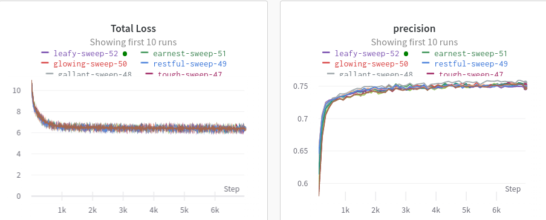

## 安装

```bash
pip install wandb
```


## 记录实验结果

```python
import wandb
import argparse
parser.add_argument("--train_batch_size", default=100, type=int)
parser.add_argument("--test_batch_size", default=100, type=int)
parser.add_argument("--num_epochs", default=60, type=int)
parser.add_argument("-lr", "--learning_rate", default=0.0005, type=float)
args = parser.parse_args()
# 设置随机种子
seed_everthing(2022)
# 初始化wandb
wandb.init(project="project_name", entity="dp0d")
# 记录超参
wandb.config.update(vars(args)) # vars将args转为字典类型
...
# 选择你要记录的指标
wandb.log({"Total Loss": total_loss.item()})
wandb.log({"precision": pre})
...
```




## 超参搜索

```python
import wandb
import argparse

parser.add_argument("--train_batch_size", default=100, type=int)
parser.add_argument("--test_batch_size", default=100, type=int)
parser.add_argument("--num_epochs", default=60, type=int)
parser.add_argument("-lr", "--learning_rate", default=0.0005, type=float)
parser.add_argument("--m1", default=0.01, type=float, help="margin 1")
parser.add_argument("--m2", default=0.01, type=float, help="margin 2")
parser.add_argument("--do_sweep", default=1, type=bool, help="do sweep")
args = parser.parse_args()

# 设置随机种子
seed_everthing(2022)
# 数据准备可以放外面
...
train_dataloader = DataLoader(
            train_data,
            batch_size=args.train_batch_size,
            shuffle=True,
        )
...


# 一定把每次必须进行的主流程放在main()里边
def main():
  seed_everthing(2022) # 注意一定要在主流程函数里面再设置一遍随机种子
  # 初始化wandb
	wandb.init(project="project_name", entity="dp0d")
  # 关键步骤，将需要搜索的超参重新赋值
  if args.do_sweep:
    args.m1 = wandb.config.m1
    args.m2 = wandb.config.m2
  model = Mymodel(args)
  model.to(device)
  optimizer = torch.optim.Adam(model.parameters(), lr=args.learning_rate)
  ...
  wandb.log({"precision": pre})
  ...
  
 
if args.do_sweep:
  	sweep_config = {
	      'method': 'bayes',       # bayes方法会根据高斯方法自动搜索超参
        'name': 'sweep__2022',
        'metric': {'goal': 'maximize', 'name': 'precision'},
        'parameters':
        {
            'm1': {
                'min': 0.005,
                'max': 0.015
                   },
            'm2': {
                'min': 0.005,
                'max': 0.015
            },
         
        }
    }
    # Initialize sweep by passing in config. (Optional) Provide a name of the project.
    sweep_id = wandb.sweep(sweep=sweep_config, project='project_name')
    # Start sweep job through main function.
    wandb.agent(sweep_id, function=main, count=200)   # 指定搜索次数为200和入口函数为main
else:
  main()
```

#### sweep的其他配置方法

```python
sweep_config_1 = {
'method': 'bayes',       # bayes方法会根据高斯方法自动搜索超参
'name': 'sweep__2022',
'metric': {'goal': 'maximize', 'name': 'precision'},
'parameters':
        {
        'm1': {
        'values': [0.005,0.006]
        },
        'm2': {
        'values': [0.005,0.001,0.0015]
        },
}
}

sweep_config_2 = {
'method': 'grid',       # 网格法会检索列表里的所有超参组合
'name': 'sweep__2022',
'metric': {'goal': 'maximize', 'name': 'precision'},
'parameters':
        {
        'm1': {
        'values': [0.005,0.006]
        },
        'm2': {
        'values': [0.005,0.001,0.0015]
        },
}
}

sweep_config_2 = {
'method': 'random',       # 随机法会随机检索列表里的所有超参组合（可能会重复）（不建议使用）
'name': 'sweep__2022',
'metric': {'goal': 'maximize', 'name': 'precision'},
'parameters':
        {
        'm1': {
        'values': [0.005,0.006]
        },
        'm2': {
        'values': [0.005,0.001,0.0015]
        },
}
}

```

> 在另一台机器上启动超参搜索

```python
...
...
# 其他部分代码不动
	  # 这行id注掉
    # sweep_id = wandb.sweep(sweep=sweep_config, project='project_name')
    # 去wandb创建sweep的主页获取id填到下面，如获取的是 sr0cogu1
    wandb.agent(sweep_id='dp0d/project_name/sr0cogu1', function=main, count=200)   # 指定搜索次数为200和入口函数为main
else:
  main()
```

