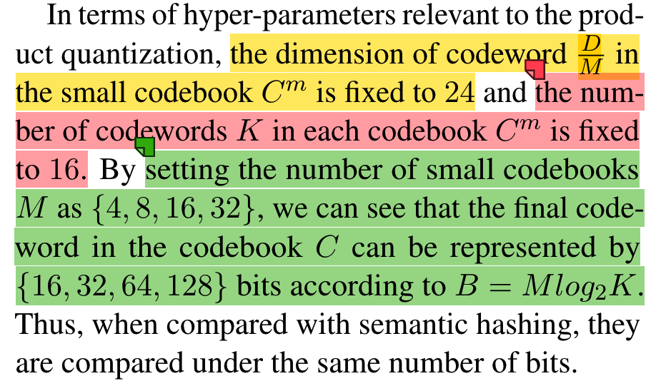
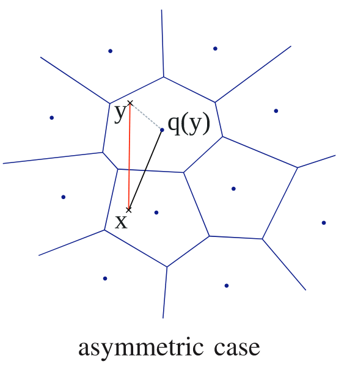
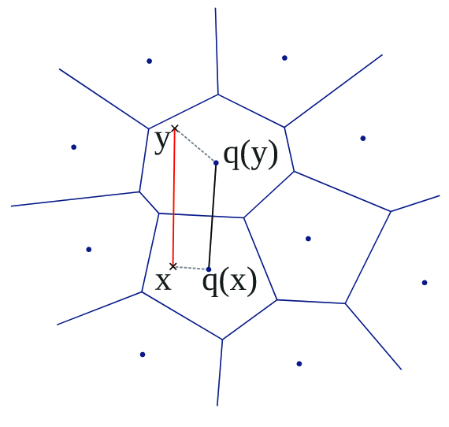
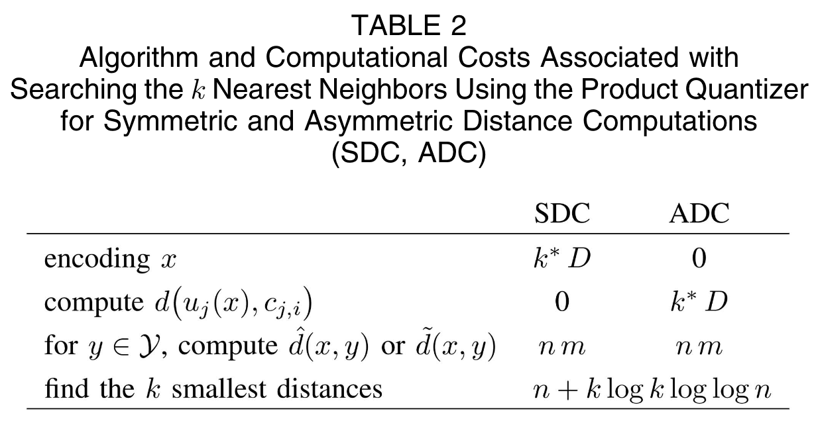
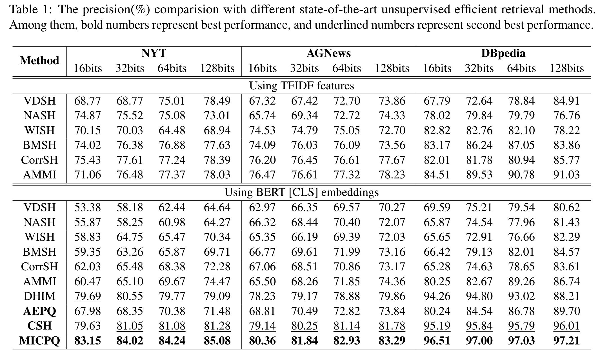
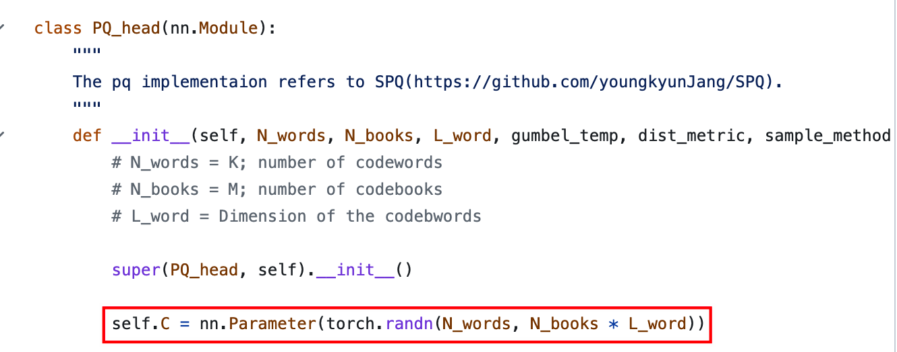
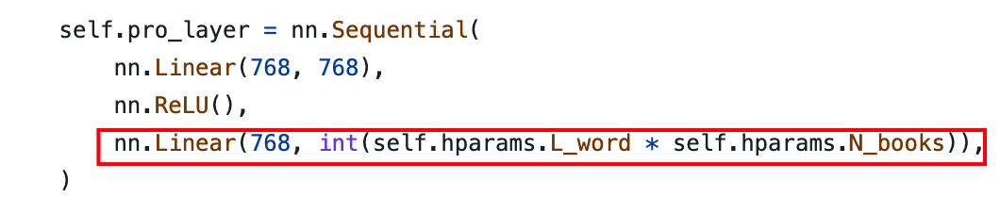
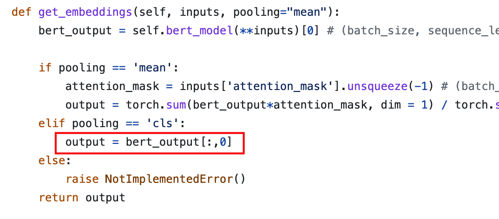
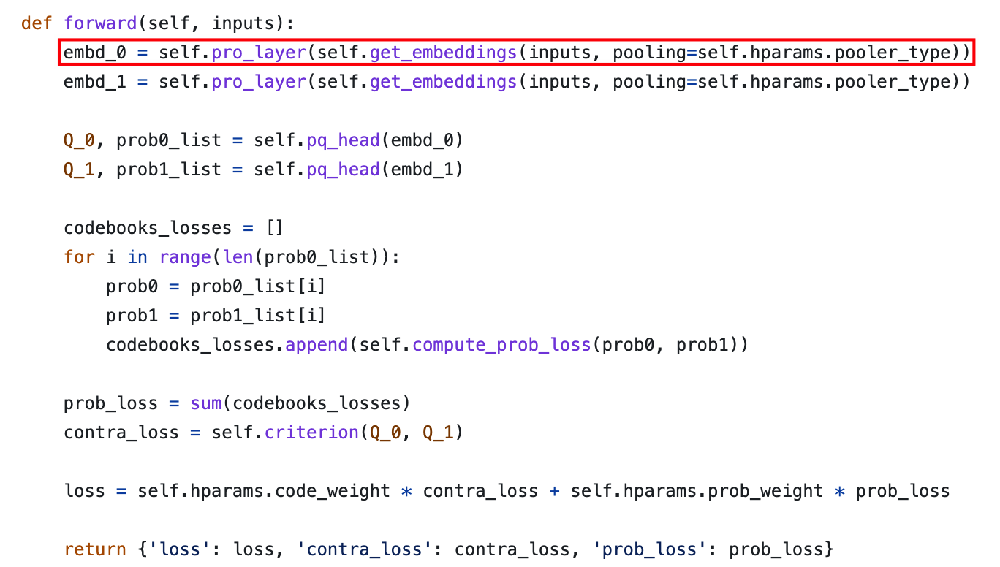

原文链接：[https://aclanthology.org/2022.emnlp-main.54.pdf](https://aclanthology.org/2022.emnlp-main.54.pdf)

源码链接：[https://github.com/zexuanqiu/MICPQ](https://github.com/zexuanqiu/MICPQ)

## 行文动机

1. 现有文本哈希方法大都建立在统计特征上如TF-IDF，CBOW等，但是它们缺乏语序信息以及长依赖关系，较为传统和落后（某些方面还是有优势的（文章角度不同））。
2. 尽管预训练语言模型在下游任务中的应用提升巨大，但是其中如原始的BERT嵌入已经被报道出在语义相似性上的表现不尽如人意，甚至不如Glove等静态嵌入（[Reimers and Gurevych, 2019](https://aclanthology.org/D19-1410.pdf)，6088+cite）。这是因为"anisotropy"（各向异性）现象（[Li et al., 2020](https://aclanthology.org/2020.emnlp-main.733.pdf)，383+cite），说白了就是含有的信息太多，语义相似性只占很小一部分。因此如何有效利用BERT嵌入中的相关信息十分关键。
3. 汉明距离度量在现有方法中仅有少数一些取值存在（这与语义哈希，以及哈希码的低维特性以及构建方式有关，即各个维度独立且二值）。近期，计算机视觉领域提出了一种可替代的方法——使用乘积量化的方法来解决这个问题（[Jégou et al., 2011](https://ieeexplore.ieee.org/abstract/document/5432202); [Jang and Cho, 2021](https://openaccess.thecvf.com/content/ICCV2021/papers/Jang_Self-Supervised_Product_Quantization_for_Deep_Unsupervised_Image_Retrieval_ICCV_2021_paper.pdf); [Wang et al., 2021](https://doi.org/10.1609/aaai.v36i3.20147)）。

## 背景知识 

### 向量量化（Vector Quantization）

[Jégou et al., 2011](https://ieeexplore.ieee.org/abstract/document/5432202)

量化是一种破坏性过程，已在信息论中得到广泛研究([R.M.GrayandD.L.Neuho, 1998](https://doi.org/10.1109/18.720541) )

量化器quantizer是一个能将 $D$  维向量 $\boldsymbol x \in\mathbb R^D$ 映射到向量$q(\boldsymbol x) \in \mathcal C=\{\boldsymbol c_i;i\in\mathcal I\}$的映射函数$q$，其中$\mathcal C$是码本$codebook$。码本中的所有向量$\boldsymbol c_i$都称为质心向量$centroids$，**它们和$\boldsymbol x$等维**。一个由所有指向同一个质心向量$\boldsymbol c_i$的原始向量组成的集合定义为沃罗诺伊单元Voronoi cell $\mathcal V_i$：


$$
\mathcal V_i \triangleq\{\boldsymbol x\in\mathbb R^D|q(x)=\boldsymbol c_i\}
$$


通过极大似然损失来优化映射函数$q(x)$：


$$
\operatorname{MSE}(q)=\mathbb{E}_{X}\left[d(q(x), x)^{2}\right]=\int p(x) d(q(x), x)^{2} d x
$$


积分使用蒙特卡罗估计，$d(\cdot)$为欧几里得距离。

优化条件——洛伊德最优条件Lloyd optimality conditions（对应K-means算法，K-means算法仅找到量化误差方面的局部最优值）。

> 条件一，量化器需要能够将特定向量$\boldsymbol x$映射到离其欧几里德距离最小的质心（即聚类中心）$\boldsymbol c_i$：


$$
q(x)=\arg \min_{\boldsymbol c_i \in \mathcal C} d(\boldsymbol x, \boldsymbol c_i)
$$



> 条件二，对于每个簇$i$，其质心$\boldsymbol c_i$（即聚类中心）必须等于该簇中所有数据点的平均值。


$$
\boldsymbol c_i = \mathbb E_X[\boldsymbol x|i] = \int_{\mathcal V_i}p(\boldsymbol x) \boldsymbol x d\boldsymbol x
$$


使用的另一个需要满足的条件是均方失真$\xi(q,\boldsymbol c_i)$，由基于质心来重构沃罗诺伊单元内的向量的过程得到。设$p_i=\mathbb P(q(x)=\boldsymbol c_i)$，均方失真如下计算


$$
\xi(q,\boldsymbol c_i)=\frac{1}{p_i}\int_{\mathcal V_i} d(\boldsymbol x,q(\boldsymbol x))^2p(\boldsymbol x)d\boldsymbol x
$$


**公式含义**：

+ 在各个沃罗诺伊单元空间中，向量量化后要尽量与原向量保持欧几里德距离近似
+ 当一个向量越不确定属于本单元时，他所引入的失真度越大。

此种方式的损失函数可以转为如下形式，即各单元中的量化向量和原始向量的极大似然之和


$$
{\rm MSE}(q) =\sum_{i\in \mathcal I}p_i\xi(q,\boldsymbol c_i)
$$


如果没有特殊处理，索引存储的内存消耗是$\log_2^K$。因此使用 2 的幂作为 k是很方便的，因为量化器生成的代码存储在二进制存储器中。

为什么索引内存消耗是$\log_2^K$呢？在K-means算法中，我们需要为每个数据点分配一个索引值，以指示该数据点属于哪个簇。在二进制编码中，每一位可以表示两个状态，0或1。因此，用n位二进制编码可以表示2^n 个不同的状态。在这种情况下，我们有K个簇，因此需要n位二进制编码，使得2^n >= K，两边取$\log_2$得n至少是$\log_2^K$位。

## 信息检索中的乘积量化

在传统的语义哈希中，哈希码的相似性差异范围很小，对于一个B位的哈希码，它的汉明距离仅仅局限于从-B到B，这对于丰富的相似度信息而言过于严格。

由背景知识可知，向量量化是将原向量向码本空间映射的过程，即等维映射，对于一个64比特的二进制码而言，它的码本大小可达$2^{64}$，规模巨大难以处理。

为了解决这个问题，[Jégou et al., 2011](https://ieeexplore.ieee.org/abstract/document/5432202)提出了另一种量化方式——乘积量化。码本$C$可以表示为$M$个小码本的笛卡尔积（Cartesian product）。


$$
C = C^1\times C^2\times \cdots\times C^M
$$


其中第$m$个小码本$C^m$有K个码词(质心)构成$\{\boldsymbol c_k^m|\boldsymbol c_k^m\in\mathbb R^{D/M}\}^K_{k=1}$，对于每个最终码词，乘积量化会选用所有小码本的码词中的词进行组合


$$
\boldsymbol c =\boldsymbol c^1 \circ \boldsymbol c^2 \cdots \circ  \boldsymbol c^M
$$


直观理解这个公式：假设有两个小码本$C^1=[[a,b],[a,c]], C^2=[[d,f][d,g]]$，那么他们的笛卡尔积就是


$$
C = [[a,b,d,f],[a,b,d,g],[a,c,d,f],[a,c,d,g]]
$$


对于每个码词（质心），内存占用为$M\log_2^K$，大小与$K$和$M$有关。得益于笛卡尔积，现在只需要存储$MK$个质心了，如果想要一个$2^{64}$大小的码本，那么仅需要设$M=32,K=4$即存储32个大小为$2^4$的小码本，即存储$2^{12}$个小码词（质心）。

## 端到端的联合重构和量化框架

### 一种Two-stage方法

为了获取保留语义的量化表示，可以（1）首先提升原始BERT嵌入中的语义信息，（2）然后量化BERT嵌入。假设原始BERT嵌入为$z(x)$，突出语义后的BERT嵌入为


$$
\tilde{z}(x) = g(z(x))
$$


映射函数$g(\cdot)$，可以是flow-based mapping（[Li et al., 2020](https://aclanthology.org/2020.emnlp-main.733.pdf)，383+cite）或者是[SimCSE](http://dx.doi.org/10.18653/v1/2021.emnlp-main.552)。然后对$\tilde{z}(x)$进行标准的乘积量化。

### 基于对比乘积量化实现的端到端的细化和量化方法

首先将原始BERT嵌入$z(x)$分成$M$节$z^m(x)\in \mathbb R^{D/M}, m=1,2,\cdots,M$。然后通过映射函数获得每一节的语义更为丰富的嵌入， $g_{\theta}^m(\cdot)$同时还完成了维数变换，让$\tilde{z}^m(x)$和$\boldsymbol c_{i}^m$等维。


$$
\tilde{z}^m(x) = g_{\theta}^m(z^m(x))
$$


将嵌入$\tilde{z}^m(x)$量化到从码词集合中$\{\boldsymbol c_{k^m}^m\}^K_{k^m=1}$根据**如下分布**随机选择得到的一个码词


$$
p({k^m}|x)=\frac{\exp(-||\tilde{z}^m(x) - \boldsymbol c_{k^m}^m||^2)}{\sum^K_{i=1}\exp(-||\tilde{z}^m(x) - \boldsymbol c_{i}^m||^2)}
$$


表示为$k^m \sim p(k^m|x)$。子码本m提供的最终量化向量的第m个的量化表示（可以是向量）


$$
h^m(x) = C^m\cdot {\rm one\_hot}(k^m)
$$


所以对$x$完整的量化结果为


$$
h(x) = h^1(x)  \circ h^2(x)  \circ  \cdots  \circ h^M(x)
$$


这里量化表示$h(x)$依赖于随机值$k^m \sim p(k^m|x)$，所以$h(x)$本身也是随机的。

接下来对于每一个文档$x$，都进行两次输入BERT（两次Dropout 掩码不同）得到两个嵌入$h^{(1)}(x)和 h^{(2)}(x)  $。

然后定义对比学习的Loss为


$$
\mathcal L_{cl} = -\frac{1}{|\mathcal B|}\sum_{x\in\mathcal B}(\ell ^{(1)}(x) + \ell ^{(2)}(x))
$$


其中$\mathcal B$为minibatch中的训练文档，且$\ell ^{(i)}(x)$定义为


$$
\ell ^{(i)}(x)\triangleq\log\frac{\mathcal S(h^{(1)}(x),h^{(2)}(x)}{\mathcal S(h^{(1)}(x),h^{(2)}(x))+\sum_{t\in\mathcal B\setminus x;n=1,2}\mathcal S(h^{(i)}(x),h^{(n)}(t))}
$$


公式解释：二次编码的两个嵌入近，离其他样本编码的嵌入远。$\mathcal S(h_1,h_2)$定义为


$$
\mathcal S(h_1, h_2) \triangleq\exp(sim(h_1,h_2)/\tau_{cl})
$$


其中$sim(h_1,h_2)$为余弦相似度$\frac{h_1^Th_2}{||h_1||||h_2||}$。

在上述量化过程中可知，量化表示$h(x)$ 依赖$x$的每一个分节对应的码词采样过程 $k^m\sim p(k^m|x)$。因此对于一个给定文档而言，量化过程不确定的。因此不直接优化随机对比损失$\mathcal L_{cl}$，而是最小化它的期望。


$$
\overline{{{\mathcal{L}}}}_{c l}=-\frac{1}{\left|{\mathcal{B}}\right|}\sum_{x\in{\mathcal{B}}}\left(\overline{{{\ell}}}^{(1)}(x)+\overline{{{\ell}}}^{(2)}(x)\right)
$$


其中${\overline{{{\ell}}}}^{(i)}(x)$代表${{{\ell}}}^{(i)}(x)$期望，涉及码词采样过程$k^{m}\,\sim\,p(k^{m}|x)\;\mathrm{for}\; m=\,1,2,\cdot\cdot\,.\,.\,\,,M$。


$$
\bar{\ell}^{(i)}(x)=\mathbb{E}_{k^{1}, k^{2}, \cdots, k^{M}}\left[\ell^{(i)}(x)\right]
$$


显然这不太可能推出${\overline{{{\ell}}}}^{(i)}(x)$的解析式期望解析式，使得$\overline{{{\mathcal{L}}}}_{c l}$的优化无法进行。为了解决这个问题，使用Gumbel-Softmax重参数化技巧来估计采样过程


$$
k^m\sim p({k^m}|x)=\frac{\exp(-||\tilde{z}^m(x) - \boldsymbol c_{k^m}^m||^2)}{\sum^K_{i=1}\exp(-||\tilde{z}^m(x) - \boldsymbol c_{i}^m||^2)}
$$

转为⬇️

$$
k^m=\arg\max_i\left[-||\tilde{z}^m(x)-c_i^m||^2+\xi_i\right]
$$



因此，第m个量化维度为


$$
\widetilde h^{m}(\mathcal{x})\stackrel{\rightarrow}{\rightarrow}\subset\mathcal{C}^{m}\cdot\mathcal{v}
$$


其中$v\in\mathbb R^K$为概率向量（原来应该是one-hot）其中第$k$个元素为


$$
v_{k}=\frac{\exp \left(-\frac{\left\|\tilde{z}^{m}(x)-c_{k}^{m}\right\|^{2}+\xi_{k}}{\tau}\right)}{\sum_{i=1}^{K} \exp \left(-\frac{\left\|\tilde{z}^{m}(x)-c_{i}^{m}\right\|^{2}+\xi_{i}}{\tau}\right)}
$$


当$\tau$趋近于0，$\widetilde h^{m}(\mathcal{x})$会趋近于  $ h^{m}(\mathcal{x})$，基于上述估计方法，则有如下公式。


$$
\bar{\ell}^{(i)}(x) \approx \log \frac{\mathcal{S}\left(\widetilde{h}_{x}^{(1)}, \widetilde{h}_{x}^{(2)}\right)}{\mathcal{S}\left(\widetilde{h}_{x}^{(1)}, \widetilde{h}_{x}^{(2)}\right)+\sum_{\substack{t \in \mathcal{B} \backslash x \\ n=1,2}} \mathcal{S}\left(\widetilde{h}_{x}^{(i)}, \widetilde{h}_{t}^{(n)}\right)}
$$


### 引入互信息增强表征能力

可以看到，码词的作用类似于聚类中心，而聚类算法如Kmeans容易陷入局部最优，因此局部最优也容易作用在码词上。最近有研究表明最大化数据和聚类群体之间的互信息可以带来更佳的聚类效果。于是提出最大化原始文档$x$和分配给它的码词（即索引）之间的互信息来增强码词的表征能力。

给定码词的条件分布$p(k^m|x)$，首先如下估计其边缘概率分布


$$
p(k^{m})\approx{\frac{1}{|\mathcal D|}}\sum_{x\in \mathcal D}p(k^{m}|x)
$$


其中$\mathcal D$表示训练集。根据定义，码词索引$k^m$的熵可以被估计为


$$
H(K^m) = -\sum_{k^m}^Kp(k^m)\log(p(k^m))
$$


类似的，给定$x$下的码词索引$k^m$的条件熵为


$$
H(K^m|X)=\frac{1}{\mathcal D}p(k^m|x)\log(p(k^m|x))
$$


如此可以计算码词索引$k^m$和数据$x$之间的互信息$I(X,K^m)=H(K^m)-H(K^m|X)$，实践中发现如下形式更佳


$$
I(X,K^m)=H(K^m)-\alpha H(K^m|X)
$$


$\alpha$是非负超参数，直观上，最大化互信息可以理解为对于给定文档$x$，鼓励只有一个码词高概率分配给它，并且总体上所有码词都被均匀使用。

因此总体的目标函数定义如下


$$
\mathcal L =\overline{{{\mathcal{L}}}}_{c l}-\lambda\sum_{m=1}^MI(X,K^m)
$$


## 模型训练

+ 在训练中，固定BERT的模型参数，即对于给定文档  $x$，在训练中量化前嵌入是固定的。
+ 码词维度固定为24，小码本中的码词数量固定为16，通过小码本数量$M=\{4,8,16,32\}$来控制量化后目标值位数为$\{16,32,64,128\}$依据$B=M\log_2 K$。注意，量化后的每一位都是一个24维的向量。
+ 

## 评估指标

[Jégou et al., 2011](https://ieeexplore.ieee.org/abstract/document/5432202)

### Asymmetric distance computation (ADC)

在非对称距离估计中，数据库中的向量$y$表示为$q(y)$，但是查询向量$x$不被编码。原始欧几里得距离$d(x,y)$被估计为$\tilde{d}\bigl(x,y\bigr)\ \triangleq d\bigl(x,q\bigl(y\bigr)\bigr)$


$$
\tilde{d}\bigl(x,y\bigr)\ = d\bigl(x,q\bigl(y\bigr)\bigr)=\sqrt{\sum_{j}d(u_{j}(x),~q_{j}(u_{j}(y)))^{2}}
$$


其中$u_{j}(x)$表示$x$的第$j$个分节。并且查询向量与各码本中的码词距离$d(u_j(x),c_{j,i})^2:j=1\cdots m,i=1\cdots k^*$需要在检索前就被计算好。时间复杂度为$mk^*$。

### Symmetric distance computation (SDC)

对称距离计算中查询向量$x$和$y$都需要表示为对应的质心（码词）$q(x)$ 和$q(y)$。欧几里德距离$d(x,y)$被估计为$\tilde{d}\bigl(x,y\bigr)\ \triangleq d\bigl(x,q\bigl(y\bigr)\bigr)$。即原始向量距离衡量用量化后的距离替代


$$
\tilde{d}\bigl(x,y\bigr)\ = d\bigl(q\bigl(x\bigr),q\bigl(y\bigr)\bigr)=\sqrt{\sum_{j}d(q_j\bigl(x\bigr),q_j\bigl(y\bigr)))^{2}}
$$


码词间距离$d(c_{j,i},c_{j,i^{'}})^2$可以通过查询表look-up table来存储，查表即可。

查询效率对比如下

本文中采用的是ADC方法，即非对称方法，注意如果检索到的文档具有相同的标签，则认为它们与查询相关。

## 总体结果

其中AEPQ是在本文基础上，让量化后的哈希码重构BERT嵌入。CSH是遵循NASH假设，二值码通过多元伯努利分布采样得到。

## ## 实现细节

### 码词初始化

## 原始嵌入维数转化及refine网络

​           and

​        and

