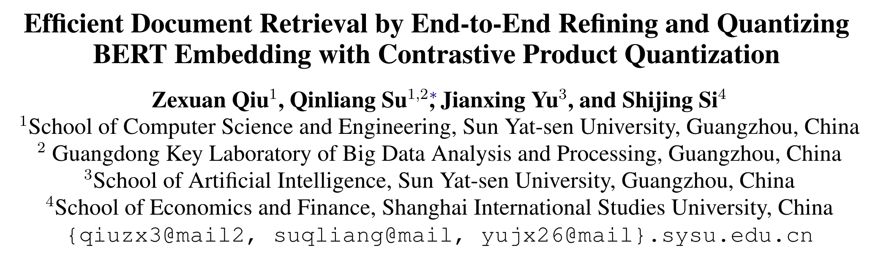





原文链接：https://aclanthology.org/2022.emnlp-main.54.pdf

源码链接：https://github.com/zexuanqiu/MICPQ

## 行文动机

1. 现有文本哈希方法大都建立在统计特征上如TF-IDF，CBOW等，但是它们缺乏语序信息以及长依赖关系，较为传统和落后（某些方面还是有优势的（文章角度不同））。
2. 尽管预训练语言模型在下游任务中的应用提升巨大，但是其中如原始的BERT嵌入已经被报道出在语义相似性上的表现不尽如人意，甚至不如Glove等静态嵌入（[Reimers and Gurevych, 2019](https://aclanthology.org/D19-1410.pdf)，6088+cite）。这是因为"anisotropy"（各向异性）现象（[Li et al., 2020](https://aclanthology.org/2020.emnlp-main.733.pdf)，383+cite），说白了就是含有的信息太多，语义相似性只占很小一部分。因此如何有效利用BERT嵌入中的相关信息十分关键。
3. 汉明距离度量在现有方法中仅有少数一些取值存在（这与语义哈希，以及哈希码的低维特性以及构建方式有关，即各个维度独立且二值）。近期，计算机视觉领域提出了一种可替代的方法名为乘积量化的方法来解决这个问题（[Jégou et al., 2011](https://ieeexplore.ieee.org/abstract/document/5432202); [Jang and Cho, 2021](https://openaccess.thecvf.com/content/ICCV2021/papers/Jang_Self-Supervised_Product_Quantization_for_Deep_Unsupervised_Image_Retrieval_ICCV_2021_paper.pdf); [Wang et al., 2021](https://doi.org/10.1609/aaai.v36i3.20147)）。基本思想就是尝试去量化嵌入的每一维度到量化后向量的取值集合（codebooks）（如果是传统01哈希码那么codebook={0,1}）的相关计算，这个相关计算为[笛卡尔积](https://baike.baidu.com/item/%E7%AC%9B%E5%8D%A1%E5%B0%94%E4%B9%98%E7%A7%AF/6323173)。

## 背景知识 信息检索中的乘积量化

