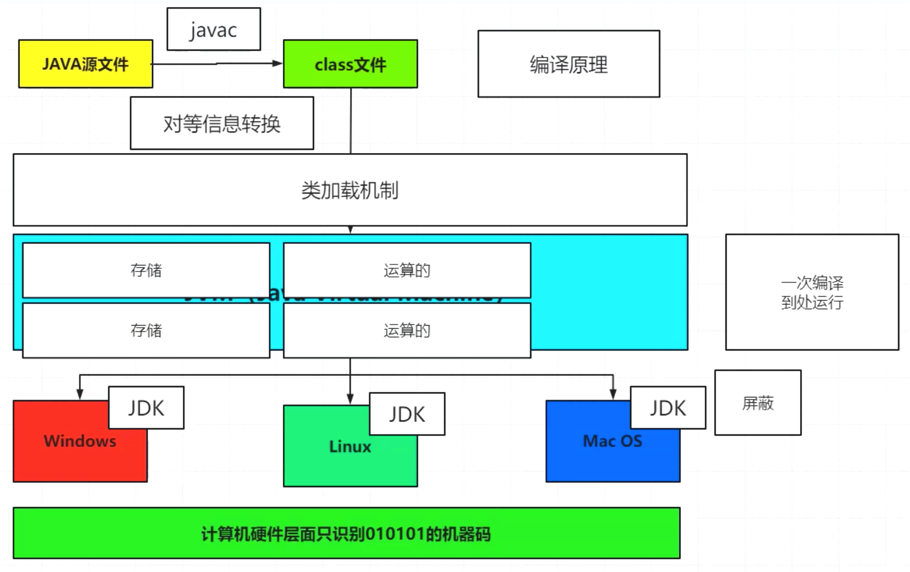
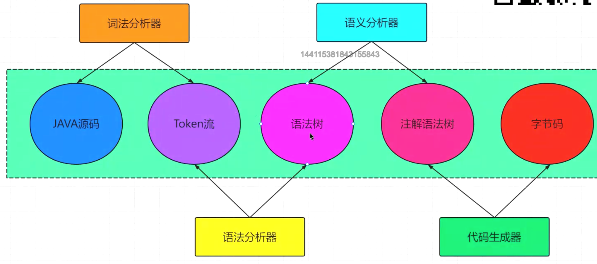
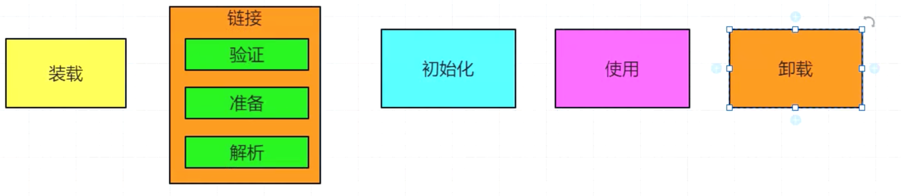
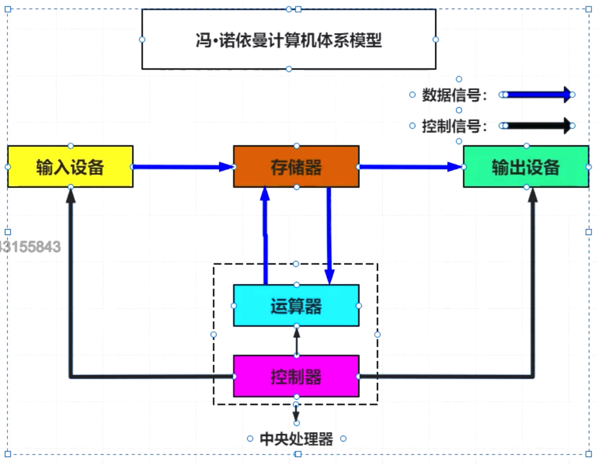
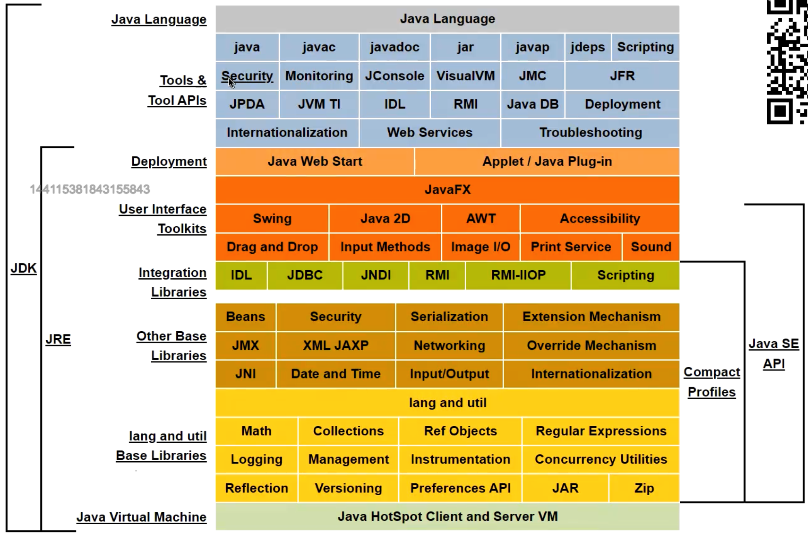

### 

#### 程序运行过程

#### 让你设计一个JAVAC编译器，你会如何设计？

先对.java文件进行Token分析，然后翻译成字节码文件。

#### 类的生命周期

常见的生命周期有对象的生命周期，**类的生命周期**，bin的生命周期。

装载：将class文件中我们需要的内容加载进JVM。

a)Class--->>字节流 --->>>寻找器（类加载器）

b)将这个字节流说代表的近态存储结构转换成方法取的运行时数据结构。

c)在java的堆中生成一个代表这个类的java.lang.class对象，作为方法区的访问入口。

2.链接

a)验证 文件及其内容正确性，文件格式，元数据，字节码，符号引用。

b)准备

c)解析

### JAVA套件相关信息，来自JAVA官网，JDK包含了JVM。

