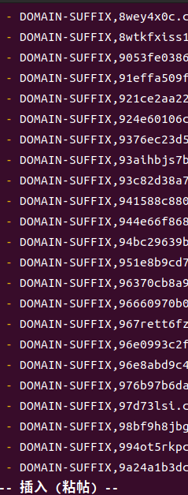
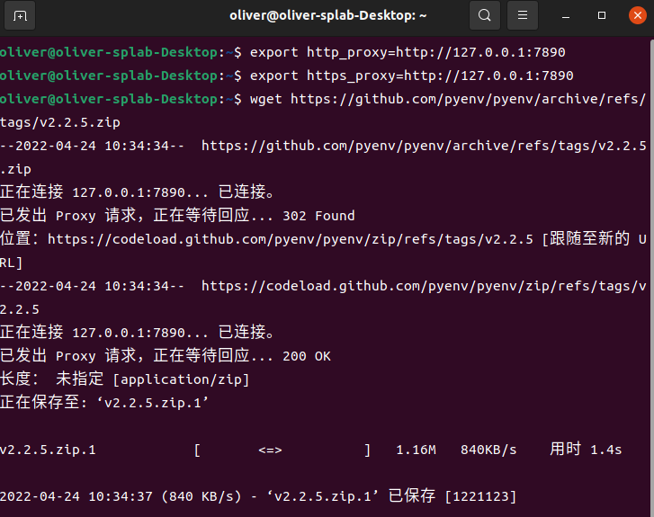

# 记一次Clash for Linux 的配置


室友帮忙弄的clash又不行了，今天打算自己修修（重装）这个梯子软件，记录一下。

现在的病情就是谷歌上不去，如下图所示。


clash的网页配置端口也上不去。


## 准备工具

首先我们要使用一台能够访问外网的机器来下载必要的文件，经典悖论，没错，上外网下clash用来上外网，不过github还是有几率能上去的。

到clash开源工具(go 写的)的repo地址下载最新的release，比如我本次下载的是版本。[传送门](https://github.com/Dreamacro/clash)

所使用的Linux系统是

```
lsb_release -a
```


## 开始安装

首先解压下载的release文件在你想要的目录。比如我的在家目录的clash文件夹下。

```bash
gunzip clash-linux-amd64-v1.10.0.gz
```

然后进行第一次运行clash

```bash
chmod +x clash-linux-amd64-v1.10.0(换成自己的clash版本)
```

```bash
./clash-linux-amd64-v1.10.0(换成自己的clash版本)
```


端口被占用了……

查看是哪个进程占用了端口并kill

```bash
sudo lsof -i tcp:7890
```

```bash
kill 11556(换成你自己找到的PID)
```


再试一次，ok启动了……


这个时候，我们可以在用户家目录的.config/文件夹下找到自动生成的clash文件夹


## 后续更新URL从这里开始

然后我们使用运营商给的订阅链接输入浏览器网址，把内容全部复制到config.yaml文件里


```bash
vi ~/.config/clash/config.yaml（不推荐直接复制粘贴网页内容，建议往后看）
```

这种方式非常慢，由于页面文本较长，长时间在粘贴……



果断关掉重来，我们将刚刚链接打开的网页右键另存为一个文件


然后重定向写入config.yaml文件，一秒钟搞定

```
cat ~/sub.txt > ~/.config/clash/config.yaml
```


### 改完config之后，后续更新URL的操作至此完成

写好了config文件之后，我们启动试试。**顺便先在对应目录下给clash的可执行文件改个名**

```
mv clash-linux-amd64-v1.10.0 clash

./clash
```


使用谷歌浏览器的端口代理插件设置网页代理端口为自己主机的7890如下


访问Google


OK正常

如果你想使用本机端口服务做代理然后在命令行进行访问，可以使用

```
export http_proxy=http://127.0.0.1:7890
export https_proxy=http://127.0.0.1:7890
```

```ba
# 随便使用命令行git上下载一个包试试
wget https://github.com/pyenv/pyenv/archive/refs/tags/v2.2.5.zip
```




好使

## 基本功能完成，后续设置开机启动。

将功能设置为一个service

增加system配置

```ba
sudo vi /etc/systemd/system/clash.service

```

写入以下内容

```ba
[Unit]
Description=Clash service
After=network.target

[Service]
Type=simple
User=oliver #换成你自己用户名
WorkingDirectory=**** # 你希望这个服务在哪个文件夹下运行
ExecStart=/home/oliver/clash/clash -d /home/oliver/.config/clash/   #换成你自己clash目录，注意，前半部分一定要连接到文件！不能只到目录
Restart=on-failure
RestartPreventExitStatus=23

[Install]
WantedBy=multi-user.target
```


```bash
sudo systemctl daemon-reload
```

```bash
sudo systemctl enable clash
```

```bash
sudo systemctl start clash
```

```bash
sudo systemctl status clash
```


OK，成功了，图中端口9090是UI的端口，意味着访问http://127.0.0.1:9090就能出现如下界面


### 配置定时更新订阅

创建config.yaml更新脚本

```bash
vi /home/oliver/.config/clash/get_clash_config.py
```

```python
import requests

# 订阅链接
url = 'https://xxxx.com'
head = {'User-Agent': "Mozilla/5.0 (Macintosh; Intel Mac OS X 10_9_3) AppleWebKit/537.75.14 (KHTML, like Gecko) Version/7.0.3 Safari/7046A194A"}
config_yaml_content = requests.get(url, headers=head).text

# 写入文件
config_yaml_path = '/home/oliver/.config/clash/config.yaml'
f = open(config_yaml_path, 'w', encoding='utf-8')

f.write(config_yaml_content)

f.close()
```


#### 每天更新

```bash
sudo vi /etc/cron.daily/clash.sh
```

向其中写入如下脚本

```python
#!/bin/bash

systemctl stop clash
python3 /home/oliver/.config/clash/get_clash_config.py
systemctl start clash

```

```bash
sudo chmod +x /etc/cron.daily/clash.sh
```


## 配置clash for windows 的linux版本，和我一样怕麻烦的跳到这里（2022年10月4日更新）

这标题有点绕，说白了就是你会得到clash的windows下的相同界面。


首先，你需要在clash for windows的项目地址下载安装包，地址是https://github.com/Fndroid/clash_for_windows_pkg/releases


根据cpu架构2选1

然后，解压后进入该文件夹，运行如下命令

```bash
./cfw
```

就能打开界面了

最后导入yaml文件即可


较为简易


至此结束~

```bash
echo "至此结束~"
```


