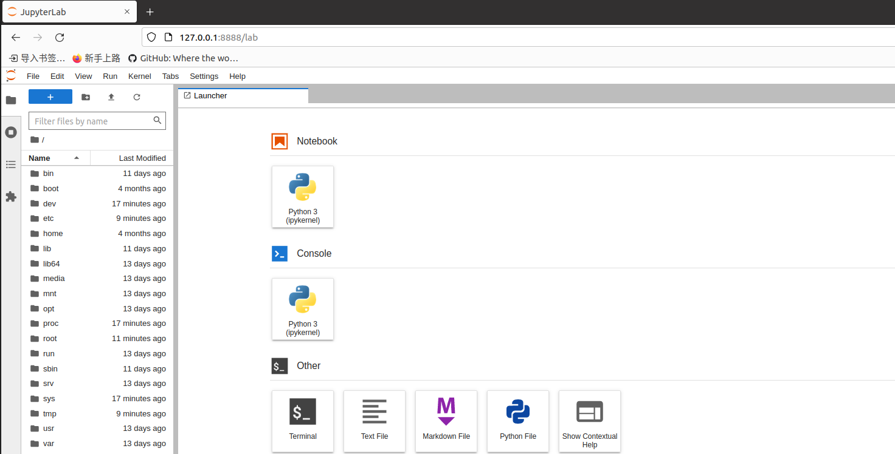

# Linux下配置frp内网穿透


要访问内网资源，内网资源缺少公网ip被墙，现在我们假设需要在内网主机上运行python，我们需要在公网访问到它，并考虑安全性。

# 原理图


# 准备工作

+ **一台公网服务器，以及本地内网需要穿透到的主机**
+ **一个域名，本次配置中的web服务需要注册域名**

+ **下载好了最新版本的frp 发布，如：博主使用的是[`v0.41.0`](https://github.com/fatedier/frp/releases/tag/v0.41.0)👇(现阶段github被墙，科学上网或使用其他方式下载)**

```bash
wget https://github.com/fatedier/frp/releases/download/v0.41.0/frp_0.41.0_linux_amd64.tar.gz
```

​		

**目录树**👇


+ **保证在公网服务器上经过设置的所有端口不被防火墙限制。**

# 搭建流程

## 1.web服务基础版

> 如果需要搭建ssh服务等操作类似，Demo详情见[官方文档](https://gofrp.org/docs/examples/)，此处博主仅进行web服务搭建。

+ ### 含有公网ip的服务器端

  将刚刚下载的文件解压到~/frps下👇

  ```bash
  mkdir ~/frp
  tar zxvf frp_0.41.0_linux_amd64.tar.gz -C ~/frp
  cd ~/frp/frp_0.41.0_linux_amd64
  ```

  然后编辑文件`frps.ini`，写入以下内容👇

  ```ini
  [common]
  ;公网服务器与内网主机通信的端口
  bind_port = 1234
  ;访问公网服务器端口
  vhost_http_port = 4231
  ```

  启动frps服务👇

  ```bash
  ./frps -c ./frps.ini
  ```

  > 

  如显示frps started successfully即为成功，端口也会写明

+ ### 内网主机端

  将刚刚下载的文件解压到~/frps下👇

  ```bash
  mkdir ~/frp
  tar zxvf frp_0.41.0_linux_amd64.tar.gz -C ~/frp
  cd ~/frp/frp_0.41.0_linux_amd64
  ```

  然后编辑文件`frpc.ini`，写入以下内容👇

  ```ini
  [common]
  ;你的服务器ip
  server_addr = xx.xx.xx.xx
  ;公网服务器与主机通信的端口(和服务器端的vhost_http_port一致)
  server_port = 1234
  [web]
  type = http
  ;你想要映射到的内网主机端口，常用的有22（ssh端口）、443等
  local_port = 8888
  ;你的服务器域名
  custom_domains = xxxx.com
  
  
  
  ```

  启动frpc服务👇

  ```bash
  ./frpc -c ./frpc.ini
  ```

  

+ 服务器端反应👇

  

+ 浏览器访问公网域名http://xxxx.com:vhost_http_port端口号👇

  

## 2.web服务Docker版（Jupyter lab款）

> 动机：使用docker提供服务，外网访问的服务在内网主机的docker内运行，相当于做了一层内网隔离，较为安全。

> 配置条件同基础版
>
> + 一台公网服务器，以及本地内网需要穿透到的主机
> + 一个域名，本次配置中的web服务需要注册域名
>
> + 下载好了最新版本的frp 发布，如：博主使用的是[`v0.41.0`](https://github.com/fatedier/frp/releases/tag/v0.41.0)👇(现阶段github被墙，科学上网或使用其他方式下载)
>
> ```bash
> wget https://github.com/fatedier/frp/releases/download/v0.41.0/frp_0.41.0_linux_amd64.tar.gz
> ```
>
> + 保证在公网服务器上经过设置的所有端口不被防火墙限制。

+ 另：需要在内网主机安装docker环境          [`官网安装地址`](https://docs.docker.com/get-docker/)

  1. 安装需要用来使用https利用仓库的包

  ```bash
  sudo apt-get update
  
  sudo apt-get install \
      ca-certificates \
      curl \
      gnupg \
      lsb-release
  ```

  2. 设置稳定存储库

  ```bash
  echo \
    "deb [arch=$(dpkg --print-architecture) signed-by=/usr/share/keyrings/docker-archive-keyring.gpg] https://download.docker.com/linux/ubuntu \
    $(lsb_release -cs) stable" | sudo tee /etc/apt/sources.list.d/docker.list > /dev/null
  ```

  3. 安装docker engine

  ```bash
   sudo apt-get install docker
  ```

### 含有公网ip的服务器端(与基础版一致)

将刚刚下载的文件解压到~/frps下👇

```bash
mkdir ~/frp
tar zxvf frp_0.41.0_linux_amd64.tar.gz -C ~/frp
cd ~/frp/frp_0.41.0_linux_amd64
```

然后编辑文件`frps.ini`，写入以下内容👇

```ini
[common]
;公网服务器与内网主机通信的端口
bind_port = 1234
;访问公网服务器端口
vhost_http_port = 4231
```

启动frps服务👇

```bash
./frps -c ./frps.ini
```


如显示frps started successfully即为成功，端口也会写明


### 内网主机端

#### 到dockerhub寻找合适的仓库[`dockerhub`](https://hub.docker.com/)

这里选择unbuntu作为我们的基础镜像

```bash
sudo docker pull python

sudo docker pull ubuntu
```


> 本文中docker 使用的一些命令
>
> 拉取镜像命令
>
> sudo docker pull  `镜像名`
>
> 通过Dockerfile构建镜像命令
>
> sudo docker build -t  
>
> 查看镜像命令 `目标镜像名` .
>
> sudo docker images
>
> 删除镜像命令
>
> sudo docker image rm `镜像名`
>
> 进入运行中的docker 容器，退出时不关闭容器
>
> sudo docker exec -it `容器名` /bin/sh
>
> 其中 `bin/sh`是指令运行器在镜像中的位置，可以使用以下命令查看
>
> 
>
> sudo docker inspect  `容器名` 或者 `镜像名`
>
> 删除所有容器
>
> sudo docker  container prune
>
> sudo docker system prune --volumes
>
> sudo docker system prune  --all
>
> 停用所有并删除所有，上面那条命令删除不了在运行的容器(需要多重复运行回车几次就干净了)
>
> sudo docker stop $(sudo docker ps -q) & sudo docker rm $(sudo docker ps -aq)

使用该镜像创建容器，起名为jupyterlab，并将8888端口映射到内网主机

```bas
sudo docker run -p 8888:8888 --name jupyterlab -itd python 
```

注:`-d`可以省略来调试无法启动的信息，正式使用在本次配置中需要加上。

查看是否在运行

```bash
sudo docker ps -a
```


Up表示在正常运行

#### 进入容器内

```bash
sudo docker exec -it jupyterlab /bin/bash
```


###### 源更新

```bash
apt-get update
```

##### 安装基础工具

```bash
apt install git vim curl nodejs
```

##### 安装python依赖

```bash
由于选择的是python仓库，不需要考虑python的依赖问题
```

##### 在容器内安装pyenv

```bash
curl -L https://github.com/pyenv/pyenv-installer/raw/master/bin/pyenv-installer | bash
```

##### 重启shell

```bash
exec $SHELL
```

##### 配置pyenv环境

```bash
echo 'export PATH="$HOME/.pyenv/bin:$PATH"' >> ~/.bashrc
echo 'eval "$(pyenv init -)"' >> ~/.bashrc
echo 'eval "$(pyenv virtualenv-init -)"' >> ~/.bashrc
source ~/.bashrc
```

##### 使用pyenv安装python3.4.10并建立jupyterlab虚拟环境，这是一个很推荐使用的python环境管理软件，之前的博客中有介绍使用。([传送门](https://dp0d.cn/env_management/#%E9%A3%9F%E7%94%A8%E6%96%B9%E6%B3%95))

> 查看可安装的python版本命令
>
> pyenv install -l

```bash
pyenv install 3.10.4
pyenv virtualenv 3.10.4 jupyterlab
pyenv global jupyterlab

pip install update pip
pip install jupyterlab

```

生成jupyter lab的登陆口令

```bash
jupyter lab password
```

输入你想要的口令，如：2933194thg309rgbn13495y1tb1

启动jupyter lab, 让它在后台运行 ～

```bash
nohup jupyter lab --allow-root --no-browser --ip '*' --port '8888' > ~/.jupyter/jupyterlab.log 2>&1 & 
```

查看它的运行状态

```bash
 ps -a
```


乖乖在后台呆着

更好一点，设置jupyter服务并让它开机自启动

增加system配置，创建并编辑名为jupyterlab的服务

```bash
sudo vi /etc/systemd/system/jupyterlab.service
```

注意ExecStart一定要精确到jupyterlab的执行文件，后续可以自行添加指定端口等命令-p等，指定启动路径直接跟在后面就好了。

```service
[Unit]
Description=jupyterlab service
After=network.target

[Service]
Type=simple
User=oliver
ExecStart=/home/oliver/.pyenv/versions/jupyterlab/bin/jupyter-lab p 9001 /home/

Restart=on-failure
RestartPreventExitStatus=23

[Install]
WantedBy=multi-user.target
```

然后保存退出，继续执行如下命令

```bash
sudo systemctl daemon-reload
```

```bash
sudo systemctl enable jupyterlab
```

```bash
sudo systemctl start jupyterlab
```

```bash
sudo systemctl status jupyterlab
```


ok，服务设置完成

#### 然后退出但不关闭这个容器，使用快捷键Ctrl+Q+P


浏览器访问127.0.0.1:8888


输入刚刚的密码2933194thg309rgbn13495y1tb1



进来了，证明这时我们的jupyter还在容器后台乖乖呆着。，因为端口映射出来了，访问在主机8888端口相当于访问docker容器的8888端口。

#### 继续配置我们的frpc

##### frpc.ini里的配置和基础版的一样

```bash
cd ~/frp/frp_0.41.0_linux_amd64/

./frpc -c ./frpc.ini

```


ok,服务起来了

在网址中输入我们的http://域名xxx.com:4321


ok,访问到了

然后输入我们的jupyter口令2933194thg309rgbn13495y1tb1


OK，通了

大功告成～

##### 附加篇，按需取用

https://blog.csdn.net/weixin_43975924/article/details/104046790

###### SSH映射

情景1：用户通过主机A访问C


待续……


